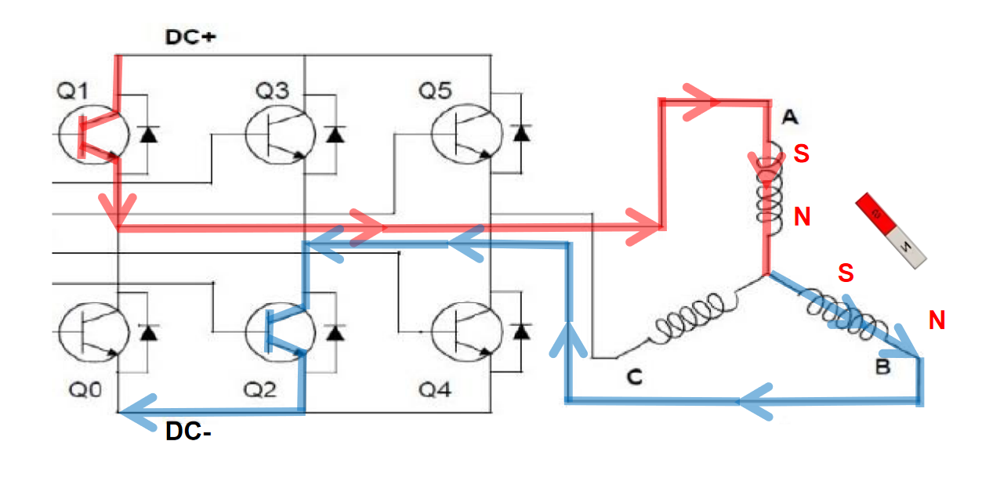
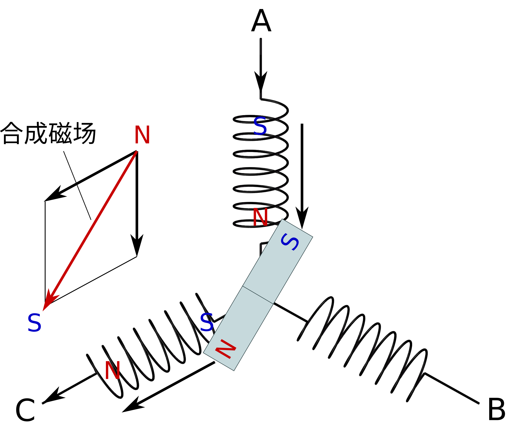
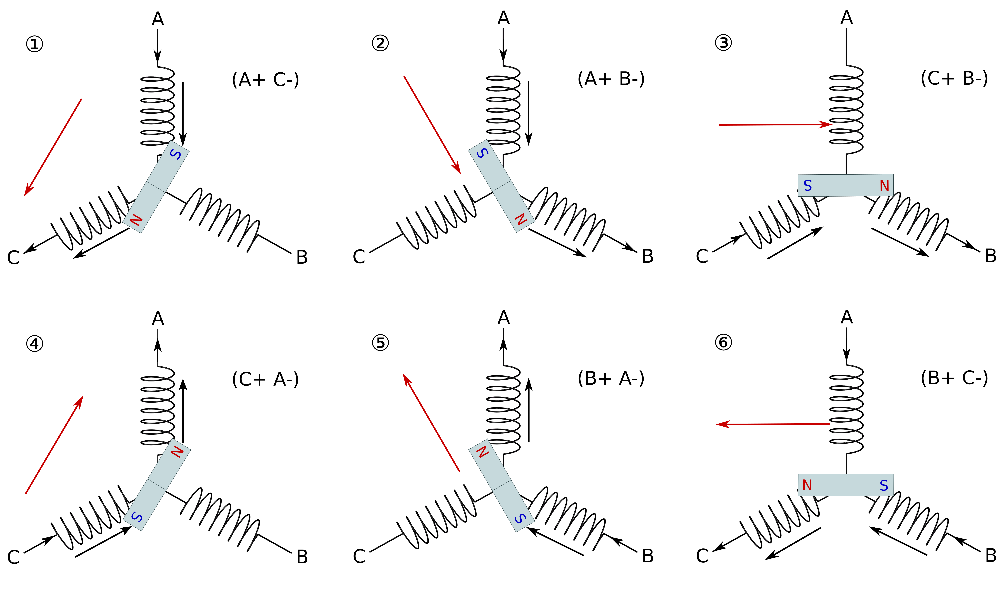

# 无刷电机硬件控制原理

无刷电机没有了有刷电机里的电刷，它不能够如同有刷电机那样采用机械结构就可以进行电流的换向， 而是必须通过采用如MOS这样的器件实现电子换向，MOS本质上就是可以理解为一种开关，可以像水龙头控制水流通断一样控制电流通断。

通过控制不同MOS管的通断组合, 电机线圈电流大小和方向就能够被改变。

通过对三相交替通电 (A+ C-) \text{(A+ C-)}(A+ C-), (A+ B-) \text{(A+ B-)}(A+ B-), (C+ B-) \text{(C+ B-)}(C+ B-), (C+ A-) \text{(C+ A-)}(C+ A-), (B+ A-) \text{(B+ A-)}(B+ A-), (B+ C-) \text{(B+ C-)}(B+ C-), 完成磁场旋转. 每一步只改变其中一极的导通状态, 共六步来完成定子合成磁场旋转一周, 即每步磁场旋转 60° —— 该方法被称为 “六步换向法”. 如下图所示六步换向法的基本原理

因此，我们就可以总结出一条规律：对电机的控制实际上就是对MOS管开关规律的控制。而MOS管的开关规律是需要用到单片机程序进行控制的，因此这就引出了我们的FOC控制算法，FOC控制就是一种对电机运动模型进行抽象化和简化，进而有规律控制各个MOS管开关和通断的过程。