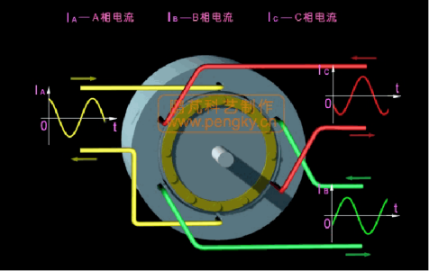
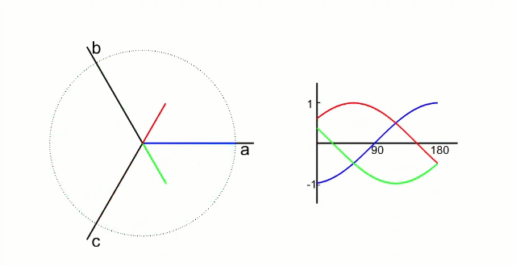
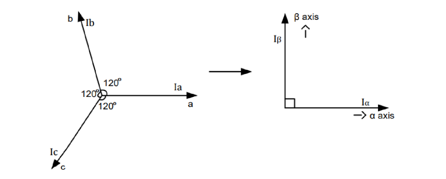
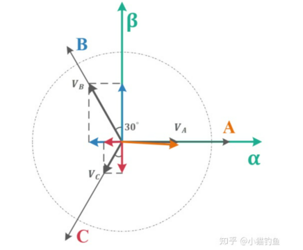
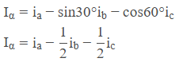
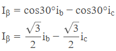
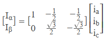
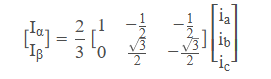
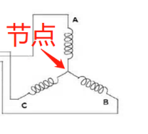

# 克拉克变换
我们知道，交替开关的MOS管可以实现电机的转动，而这些交替开关的MOS管是以极其快的速度在周期性进行的，把这些周期性的开启和关断过程联系起来，并且对其各个相进行单独观察，就可以得到三个相A、B、C的电流随时间变换的曲线，如下图所示，他们之间存在120°的相位差。

我们只要能够控制这个相位差为120°的sin状波形，就能够实现针对电机的控制。

克拉克变换，实际上就是降维解耦的过程，把难以辨明和控制的三相相位差120°电机波形降维为两维矢量。

1. 第一就是把三相随时间变换的，相位差为120°的电流波形抽象化为三个间隔120°的矢量。
2. 第二就是利用三角函数对矢量进行降维，降维到两个坐标轴，从此复杂的三相变化问题就降解为了α-β坐标轴的坐标上的数值变化问题。

把这三个矢量进行投影的坐标轴。只要我们把三个矢量都投影到坐标轴上，那么，一个三矢量问题就变成一个二维坐标平面问题。

显然，针对α-β坐标系中α轴，有：

针对α-β坐标系中β轴，有

把上面的投影结果列成矩阵形式，有：

## 克拉克变换的等辐值形式

上面的步骤都很简单，但是我们会发现，往往最终论文或者资料上克拉克变换的体现形式都不是上面这样子，而是会加上一个系数，如 $\frac{2}{3}$（等幅值变换系数），或者 $\sqrt{\frac{2}{3}}$（等功率变换系数）。分别对应两个变换方式，分别为等功率（系数：$\sqrt{\frac{2}{3}}$）变换方式和等幅值（系数：$\frac{2}{3}$）变换方式。这里仅讨论等幅值变换加上系数后，原本的投影式变为：

这就是克拉克变换的等辐值形式

何为等幅值变换？用α相电流输入1A电流的特例来举例，当电流输入时候，根据基尔霍夫电流定律（电路中任一个节点上，在任意时刻，流入节点的电流之和等于流出节点的电流之和，如下图），有：

**ia​+ib+ic​=0**

设定$i_\mathrm{a}$为-1，则根据上面的式子，有$i_\mathrm{b}$和$i_\mathrm{c}$为$\frac{1}{2}$，列成矩阵形式后，如下所示：
$$
\begin{bmatrix}
i_\mathrm{a} \\
i_\mathrm{b} \\
i_\mathrm{c}
\end{bmatrix}
=
\begin{bmatrix}
-1 \\
\dfrac{1}{2} \\
\dfrac{1}{2}
\end{bmatrix}
$$

将这个$i_\mathrm{a},i_\mathrm{b},i_\mathrm{c}$的参数带入到我们上面的直接投影式子中，得到：
$$
\begin{align*}
\begin{bmatrix}
i_\alpha \\
i_\beta
\end{bmatrix}
&=
\begin{bmatrix}
1 & -\frac12 & \frac12 \\
0 & \frac{\sqrt{3}}{2} & -\frac{\sqrt{3}}{2}
\end{bmatrix}
\begin{bmatrix}
i_\mathrm{a} \\
i_\mathrm{b} \\
i_\mathrm{c}
\end{bmatrix} \\
&=
\begin{bmatrix}
1 & -\frac12 & -\frac12 \\
0 & \frac{\sqrt{3}}{2} & -\frac{\sqrt{3}}{2}
\end{bmatrix}
\begin{bmatrix}
-1 \\
\frac12 \\
\frac12
\end{bmatrix} \\
&=
\begin{bmatrix}
-\frac32 \\
0
\end{bmatrix}
\end{align*}
$$

这就看出问题了，显然，尽管矢量a与$\alpha$轴重合，但是由于b、c相电流投影的存在，导致在a相输入1A电流，反应在$\alpha$轴上的电流并不是等值的1A，而是$-\frac{3}{2}$。

因此，为了让式子等幅值，即使得a相1A时，反应在$\alpha$轴上的电流也是1A，我们就得乘上系数$\frac{2}{3}$，针对上面的投影式乘上$\frac{2}{3}$后，式子变换为：
$$
\begin{bmatrix}
I_\alpha \\
I_\beta
\end{bmatrix}
=
\frac{2}{3}
\begin{bmatrix}
1 & -\frac{1}{2} & -\frac{1}{2} \\
0 & \frac{\sqrt{3}}{2} & -\frac{\sqrt{3}}{2}
\end{bmatrix}
\begin{bmatrix}
-1 \\
\frac{1}{2} \\
\frac{1}{2}
\end{bmatrix}
=
\frac{2}{3}
\begin{bmatrix}
-\frac{3}{2} \\
0
\end{bmatrix}
=
\begin{bmatrix}
-1 \\
0
\end{bmatrix}
$$

这就是克拉克变换的等幅值表现形式。

基于等幅值变换，我们就能够得到$\alpha$、$\beta$相位与$i_\mathrm{a},i_\mathrm{b},i_\mathrm{c}$的关系，已知等幅值变换式：
$$
\begin{bmatrix}
I_\alpha \\
I_\beta
\end{bmatrix}
=
\frac{2}{3}
\begin{bmatrix}
1 & -\frac{1}{2} & -\frac{1}{2} \\
0 & \frac{\sqrt{3}}{2} & -\frac{\sqrt{3}}{2}
\end{bmatrix}
\begin{bmatrix}
i_\mathrm{a} \\
i_\mathrm{b} \\
i_\mathrm{c}
\end{bmatrix}
$$

移项
$$
I_\alpha = \frac{2}{3}\left(i_\mathrm{a} - \frac{1}{2}i_\mathrm{b} - \frac{1}{2}i_\mathrm{c}\right)
$$
$$
I_\alpha = \frac{2}{3}\left[i_\mathrm{a} - \frac{1}{2}(i_\mathrm{b} + i_\mathrm{c})\right]
$$

又根据上面所提到的基尔霍夫电流定律：
$$
i_\mathrm{a} + i_\mathrm{b} + i_\mathrm{c} = 0
$$
$$
\frac{1}{2}i_\mathrm{a} = -\frac{1}{2}(i_\mathrm{b} + i_\mathrm{c})
$$
$$
I_\alpha = \frac{2}{3}\left[i_\mathrm{a} + \frac{1}{2}i_\mathrm{a}\right]
$$
$$
I_\alpha = \frac{2}{3} \times \frac{3}{2}i_\mathrm{a}
$$
$$
I_\alpha = i_\mathrm{a}
$$

通过上述步骤，成功推导$I_\alpha = i_\mathrm{a}$。进一步的，可求$I_\beta$，已知：
$$
\begin{align*}
I_\beta &= \frac{2}{3} \times \left( \frac{\sqrt{3}}{2}i_\mathrm{b} - \frac{\sqrt{3}}{2}i_\mathrm{c} \right) \\
&= \frac{\sqrt{3}}{3} \times (i_\mathrm{b} - i_\mathrm{c}) \\
&= \frac{1}{\sqrt{3}} \times (i_\mathrm{b} - i_\mathrm{c})
\end{align*}
$$

又根据上面所提到的基尔霍夫电流定律：
$$
i_\mathrm{a} + i_\mathrm{b} + i_\mathrm{c} = 0
$$
$$
i_\mathrm{c} = -(i_\mathrm{a} + i_\mathrm{b})
$$
$$
\begin{align*}
I_\beta &= \frac{1}{\sqrt{3}} \times (i_\mathrm{b} - i_\mathrm{c}) \\
&= \frac{1}{\sqrt{3}} \times (i_\mathrm{b} + i_\mathrm{a} + i_\mathrm{b}) \\
&= \frac{1}{\sqrt{3}} \times (2i_\mathrm{b} + i_\mathrm{a})
\end{align*}
$$

综合上述步骤，我们已经得到了$i_\mathrm{a},i_\mathrm{b},i_\mathrm{c}$电流与$I_\alpha,I_\beta$电流的关键关系式，总结如下：
$$
\begin{cases}
I_\alpha = i_\mathrm{a} \\
I_\beta = \dfrac{1}{\sqrt{3}} \times (2i_\mathrm{b} + i_\mathrm{a})
\end{cases}
$$

可以看出，在式子中，我们消去了变量$i_\mathrm{c}$，这是因为由于基尔霍夫电流定律的存在，我们并不需要知道所有三相电流，我们只需要知道两相电流就能够求解得到另外一相的电流，反映在硬件上，我们就可以省去一路的电流传感器！节省了成本！

