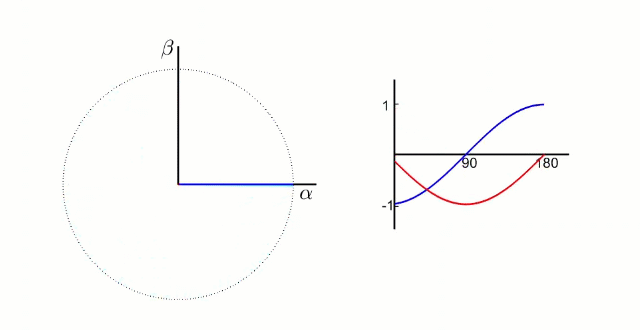
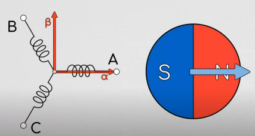
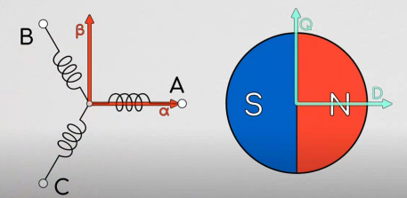
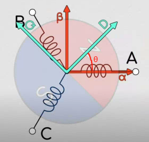
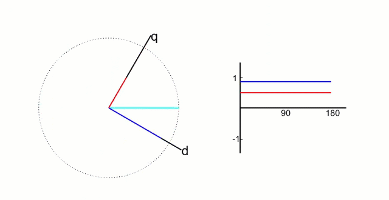

# 帕克变换

由克拉克变换，实际上我们已经成功对电机的正弦驱动三相曲线进行降维度，使之变成了一个两轴坐标问题，并且得到其转换关系。但是只有它是不够的，我们还需要将这个理论和旋转电机对应起来，也就是建立电机旋转时的数学模型

根据克拉克变换后我们得到了αβ坐标系

## αβ 坐标系
由静止三相坐标系$ABC$变换到静止坐标系$\alpha\beta$的过程称之为Clarke变换；在$\alpha\beta$静止坐标系中，$\alpha$轴和$\beta$轴的相位差为$90^\circ$，且$\alpha$、$\beta$的大小是随时间变化的正弦波形，具体如下图所示；

## 帕克变换

由克拉克变换，实际上我们已经成功对电机的正弦驱动三相曲线进行降维度，使之变成了一个两轴坐标问题，并且得到其转换关系。但是只有它是不够的，我们还需要将这个理论和旋转电机对应起来，也就是建立电机旋转时的数学模型。

我们需要知道能够使得电机旋转的$I_\alpha$和$I_\beta$电流输入规律，如果我们可以知道这个能够使得电机旋转的$I_\alpha$和$I_\beta$电流输入规律，我们就可以通过克拉克逆变换，把这个旋转情况下的$I_\alpha$和$I_\beta$逆变换为$i_\mathrm{a},i_\mathrm{b},i_\mathrm{c}$三相电流波形，从而就实现了用把$i_\mathrm{a},i_\mathrm{b},i_\mathrm{c}$降维后的$I_\alpha$和$I_\beta$实现对电机的控制，那么问题就没有原来我们想的直接控制$i_\mathrm{a},i_\mathrm{b},i_\mathrm{c}$来控制电机旋转来得复杂了。

**帕克变换**就是能够帮助我们求得各种旋转情况下的$I_\alpha$和$I_\beta$。

其实整个帕克变换的思路很简单，首先，我们把电机的定子线圈上固定一个$I_\alpha-I_\beta$坐标系，如下图左边的图所示，这时候，我们在坐标系的右边放上一个转子，如下图右边所示，如果此时转子被吸引且不动，那么在$I_\alpha-I_\beta$坐标系中就一定有一个$I_\alpha$和$I_\beta$值是能够对应转子现在的状态的。

但是，显然，我们的问题不是不动那么简单，在实际的应用中，我们的转子是在转动的，因此，对应转子状态的$I_\alpha$和$I_\beta$值实际上在一直变化，变化的东西是不好描述而且是讨厌的，如最开始，我们很讨厌$i_\mathrm{a}, i_\mathrm{b}, i_\mathrm{c}$三相相位差$120^\circ$的变化波形，我们用克拉克变换对它进行了降维描述。

可是在这里，我们发现降维后尽管少了一个变量，但是只要电机转动，$I_\alpha$和$I_\beta$就依然在一直变化，依然很讨厌，那么这时候，懒惰的人类就又开始想办法，有没有办法能够用一个定值来描述无刷电机的旋转呢？也就是说，能不能对这个电机系统进行进一步的降维，使得我们甚至不用考虑变化的$I_\alpha,I_\beta$，只需要有一个定值就能够描述整个电机系统的转动状态？

答案是有！帕克变换就是想带我们做这件事！！

帕克在我们刚刚固定在电机定子上的$I_\alpha-I_\beta$坐标系上，另外新建了一个坐标系，我们称之为$I_\mathrm{q}-I_\mathrm{d}$坐标系，这个坐标系是可以随电机转子转动的！它与电机转子固联！！如下图所示：

其中，$I_\mathrm{q}-I_\mathrm{d}$坐标系随转子转动，D轴在此处设定为指向电机的N极，$I_\mathrm{q}-I_\mathrm{d}$坐标系因转动而造成的与$I_\alpha-I_\beta$坐标系的差角$\theta$，就被称为**电角度**！

那么，很轻松的，还是利用简单的三角函数构建的旋转矩阵，在知道电角度的前提下，我们很容易就能够把
$i_\alpha-i_\beta$ 坐标系上的值映射（旋转）到 $i_\mathrm{d}-i_\mathrm{q}$ 坐标系上！式子如下：

$$
\begin{bmatrix}
i_\mathrm{d} \\
i_\mathrm{q}
\end{bmatrix}
=
\begin{bmatrix}
\cos\theta & \sin\theta \\
-\sin\theta & \cos\theta
\end{bmatrix}
\begin{bmatrix}
i_\alpha \\
i_\beta
\end{bmatrix}
$$

因此，在知道电角度的前提下，我们就可以用 $i_\mathrm{q},i_\mathrm{d}$ 坐标系上的定值来描述电机的旋转！这正是我们一直渴望的电机旋转数学模型！

根据矩阵乘法，取逆，我们可进行**帕克逆变换**，也就是知道 $i_\mathrm{q},i_\mathrm{d}$ 值和电角度的前提下，反求 $i_\alpha,i_\beta$，式子如下：

$$
\begin{bmatrix}
i_\alpha \\
i_\beta
\end{bmatrix}
=
\begin{bmatrix}
\cos\theta & \sin\theta \\
-\sin\theta & \cos\theta
\end{bmatrix}^{-1}
\begin{bmatrix}
i_\mathrm{d} \\
i_\mathrm{q}
\end{bmatrix}
$$

写成等式结果：
$$
\begin{aligned}
i_\alpha &= i_\mathrm{d}\cos\theta - i_\mathrm{q}\sin\theta \\
i_\beta &= i_\mathrm{q}\cos\theta + i_\mathrm{d}\sin\theta
\end{aligned}
$$
在实际的FOC应用中，电角度是实时由编码器求出的，因此是已知的。$I_\mathrm{q}$和$I_\mathrm{d}$可以合成一个矢量，加上电角度（旋转）的存在，因此可以看成一个旋转的矢量。在通过$I_\mathrm{q},I_\mathrm{d}$和电角度求得$I_\alpha$和$I_\beta$后，我们就可以通过前面提到的克拉克逆变换求得$i_\mathrm{a},i_\mathrm{b},i_\mathrm{c}$的波形，这正是FOC的基本过程！

通常在简单的FOC应用中，**我们只需要控制$I_\mathrm{q}$的电流大小，而把$I_\mathrm{d}$设置为0。此时，$I_\mathrm{q}$的大小间接就决定了定子三相电流的大小，进而决定了定子产生磁场的强度**。进一步我们可以说，它决定了电机产生的力矩大小！

而$i_\mathrm{q}$是旋转的矢量；在前面说了，同时$I_\mathrm{q}$又会间接影响磁场的强度，这正是FOC的名称**磁场定向控制**的由来。

## dq 坐标系
αβ 坐标系 经过**帕克变换**后得到dq坐标系

dq 坐标系相对于定子来说是旋转的坐标系，旋转的角速度和转子旋转的角速度相同，所以，相对于转子来说，dq 坐标系就是静止的坐标系；而 $i_\mathrm{d}$ 和 $i_\mathrm{q}$ 则是恒定不变的两个值，具体如下图所示；

