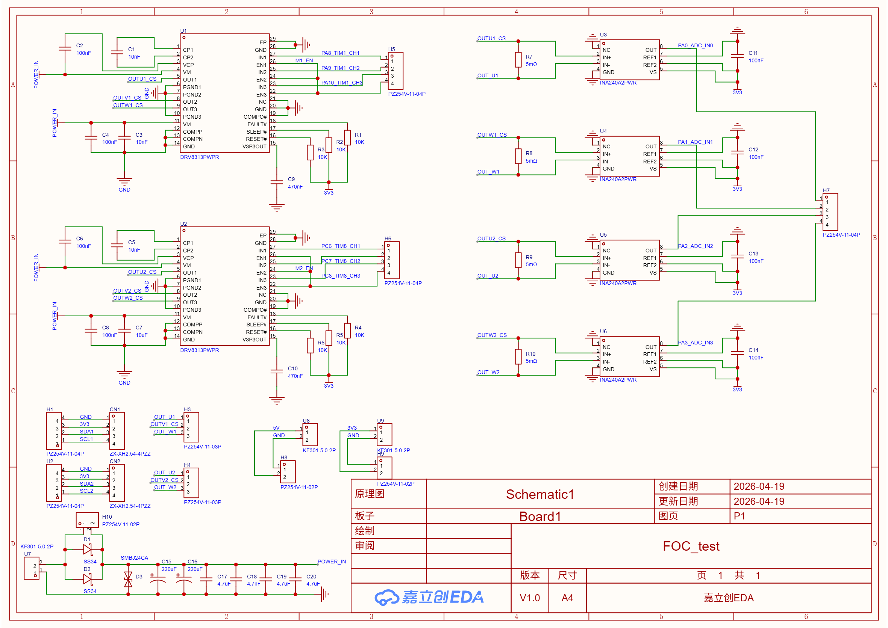

# FOC_test 双路无刷电机驱动板 电路总结

## 一、电路概述
本电路为**双路三相无刷电机FOC驱动测试板**，采用嘉立创EDA设计，版本V1.0，A4幅面。
整体架构基于TI官方驱动与采样芯片，实现两路独立的三相电机驱动与电流采样，适用于磁场定向控制（FOC）算法开发与验证。

## 二、核心驱动单元（2路独立三相桥）
- **主控芯片**：2片 **DRV8313PWPR**（U1、U2）
  - TI出品集成式三相半桥驱动IC，内置3路N沟道功率MOSFET
  - 工作电压8~60V，单通道峰值输出电流2.5A
  - 集成过流、短路、欠压、过热保护，`nFAULT`引脚输出故障状态
  - 内置3.3V LDO，可为外围电路供电
- **控制信号**：
  - 第1路驱动接入 `TIM1` 通道（PA8/PA9/PA10）
  - 第2路驱动接入 `TIM8` 通道（PC6/PC7/PC8）
  - `EN` 引脚为驱动使能，`SLEEP/RESET` 引脚配置工作模式
- **外围电路**：每路驱动配置自举电容、电源滤波电容、V3P3输出滤波电容

## 三、电流采样单元（4路高精度采样）
- **采样芯片**：4片 **INA240A2PWR**（U3~U6）
  - 带PWM抑制功能的高精度电流检测放大器，固定增益 50V/V
  - 共模电压范围 -4V~80V，可有效抑制电机PWM开关尖峰干扰
  - 失调电压低至±25μV，适用于小采样电阻的高精度检测
- **采样方案**：
  - 每路三相驱动配置 **2路低侧电流采样**，采样电阻阻值 5mΩ
  - 采样电压经INA240放大后输出至MCU ADC引脚（PA0~PA3）
  - 依托基尔霍夫电流定律，两相采样即可推算第三相电流，满足FOC闭环控制需求

## 四、电源输入与保护单元
- **输入接口**：KF301-5.0 接线端子接入直流母线电源
- **保护电路**：
  - 2颗 SS34 肖特基二极管组成**防反接保护**
  - SMBJ24CA 型TVS二极管实现**过压/浪涌防护**
- **滤波网络**：220μF电解电容 + 多颗4.7μF陶瓷电容组成多级滤波，抑制纹波与开关噪声
- **状态指示**：D3 电源指示灯

## 五、外部接口单元
| 接口类型 | 规格 | 功能 |
| :--- | :--- | :--- |
| 电机输出接口 | PH2.54-4P（H5、H6） | 两路三相电机U/V/W输出 |
| 控制/通信接口 | XH2.54-4P（CN1、CN2） | 引出I2C等信号，支持上位机或霍尔传感器 |
| 调试接口 | PH2.54-4P（H7） | 引出ADC采样信号与3.3V电源，方便测试 |
| 电源引出端子 | KF301 | 5V、3.3V电源对外输出 |

## 六、设计特点
1.  **双路独立驱动**：可同时驱动两台三相无刷电机，适配双轴控制场景
2.  **完整FOC链路**：MCU输出PWM → DRV8313功率放大 → 电机运行 → 电流采样放大 → ADC反馈，构成完整电流闭环
3.  **高集成度**：驱动芯片内置功率管与保护电路，外围元件精简
4.  **硬件保护完善**：集成防反接、过压、过流、过热等多重保护