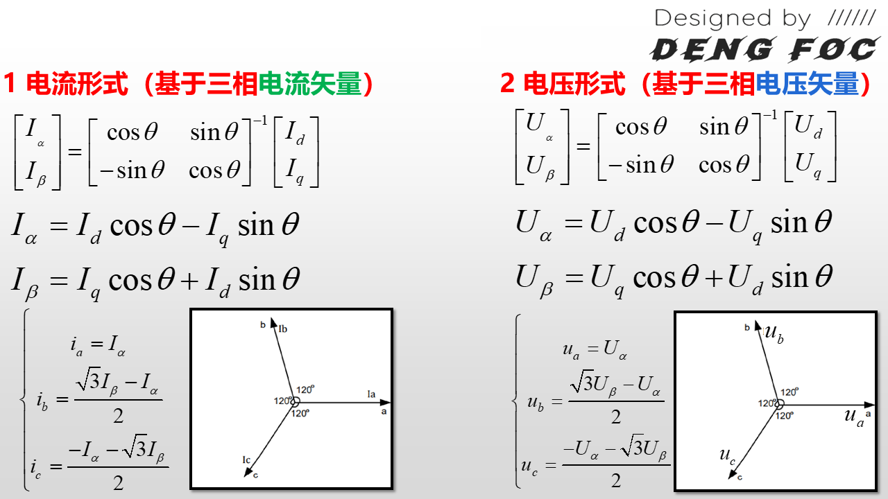
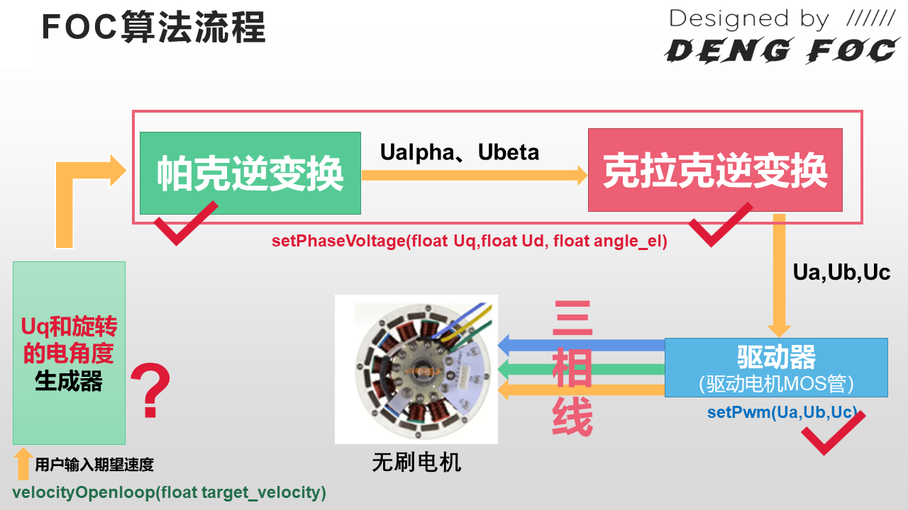
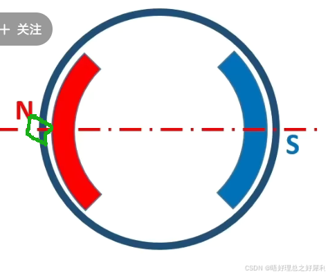
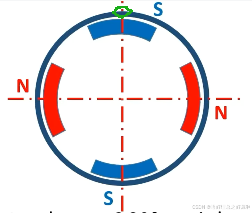
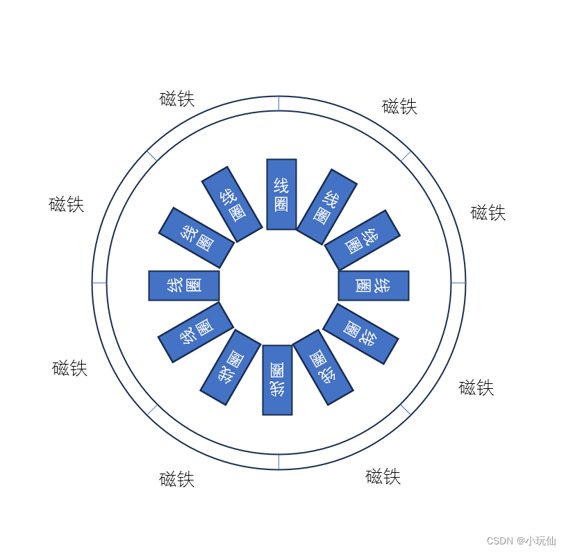
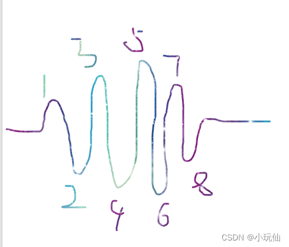

# 开环速度控制

我们所有的推导其实都是根据电流矢量，如果把每相的电流矢量都乘上其相电阻 $R$（相电阻就是每相线圈所带的电阻），那会发生什么情况呢？没错，根据欧姆定律，它就会变成每相的电压矢量，存在 $u_\mathrm{a}, u_\mathrm{b}, u_\mathrm{c}$，它们都是直接由左下角的图的每个相位乘上相电阻 $R$ 得来的。

而无刷电机的电流矢量和电压矢量其实没有任何的区别，只是它们的幅值不同！



因此，实际上，在电流矢量情况下的克拉克变换和帕克变换，和电压矢量情况下的克拉克变换和帕克变换，推导过程是完全一致的，只是符号不同，你可以看到，上图左边是基于电流矢量推导而来的FOC算法流程，这个就是上节几节课的内容，相信大家已经很熟悉；而上图右边就是基于电压矢量推导而来的FOC算法流程，可以看到，除了符号不同以外，其他的一切都相同！

那么为什么要在今天，在讲述FOC代码时给大家介绍这种电压矢量下的FOC算法过程呢？这是因为，我们的代码实际上需要用到的是电压形式的公式。因为电流值控制对于硬件电路来说，相比于电压来说要难控制得多，常见的无刷电机控制芯片和电路也只能够接受 $u_\mathrm{a}, u_\mathrm{b}, u_\mathrm{c}$ 电压控制信号，而不能直接的控制 $i_\mathrm{a}, i_\mathrm{b}, i_\mathrm{c}$，控制 $i_\mathrm{a}, i_\mathrm{b}, i_\mathrm{c}$ 必须在控制 $u_\mathrm{a}, u_\mathrm{b}, u_\mathrm{c}$ 的基础上通过各相的电流传感器作闭环才能进一步的进行控制，关于怎么控制电流这个在后面的课程中会进一步提。



## 电角度,机械角度,极对数

**在帕克变换中我们提到了电角度，在实际应用中与机械角度息息相关**


1. **机械角度**：就是转子转的多少实际物理角度，可以用量角器量出来的，一圈是360°，半圈180°
2. **电角度**：在定子上选一个点，这个点的磁场变化（转子是永磁体，它转动产生的磁场），N-S是180°，N-S-N是360°。与对极数有关。

例如：
只有一对极NS，在定子上选一个点，它的磁场变化只能是有原来的N-S-N，也就是360°，机械角度只能只可转一圈也是360°。选绿色圈圈为定点，磁场变化：N-S-N，360°。



如果是两对极，机械角度仍然是360°（转一圈就只有360°），绿色圈圈的点的磁场变化S-N-S-N-S，720°



**总结规律：对极数*机械角度=电角度，可以这么理解多少机械角度，能产生多少电角度**

3. **极对数**
在了解电机极对数之前，先来了解电机极数，电机极数就是电机的磁极个数，也就是磁铁的个数，极对数是磁极数除以2。
举个例子对于三相无刷电机，如下图



磁极数为磁铁个数：8，极对数为8除以2等于4极对
除了以上判断极对数还有两种方法：

1. 给电机做上标记然后给电机任意两相通1A的电流（如测量相电阻为1欧姆则通1v的电压），用手拨动电机转动一周，感觉到阻力的次数就是电机的极对数，如果感受到两次阻力就是2极对。

2. 用示波器探头夹任意两相，地接其中一相，探头接另外一相，给电机做上标记，转动一周，查看波形的波峰数就是极对数，波峰波谷总数是电机的极数。



波峰数只看上面的个数为4，即为4对极
极数看波峰+波谷 = 8，即级数为8，极对数为8/2 = 4极对 

## DWT定时器

获取经过的时间，在获取速度进行速度闭环和开环控制累加机械角度时用到
```
/**
 * @brief 初始化DWT定时器（用于微秒级高精度计时）
 * 
 * DWT（Data Watchpoint and Trace）是Cortex-M内核的调试单元
 * 包含一个32位循环计数器，每个时钟周期递增
 */
void DWT_Init(void) {
    // 使能DWT调试单元
    CoreDebug->DEMCR |= CoreDebug_DEMCR_TRCENA_Msk;
    // 清零循环计数器
    DWT->CYCCNT = 0;
    // 使能循环计数器
    DWT->CTRL |= DWT_CTRL_CYCCNTENA_Msk;
}
/**
 * @brief 获取当前微秒时间
 * @return 当前时间（微秒）
 * 
 * 基于DWT循环计数器实现，精度为1个时钟周期
 * 对于168MHz的STM32F407，1微秒 = 168个时钟周期
 */
uint32_t micros(void) {
    return (uint32_t)(DWT->CYCCNT / (SystemCoreClock / 1000000U));
}

```

## 角度归一化和浮点数限幅

```
/**
 * @brief 角度归一化到 0~2PI 范围
 * @param angle 输入角度（弧度）
 * @return 归一化后的角度（0~2PI）
 */
float _normalizeAngle(float angle){
    float a = fmodf(angle, 2.0f * PI);
    return a >= 0 ? a : (a + 2.0f * PI);
}

/**
 * @brief 浮点数限幅函数
 * @param x   输入值
 * @param min 最小值
 * @param max 最大值
 * @return 限幅后的值
 */
float constrain_f(float x, float min, float max){
    
    if(x > max) return max;
    if(x < min) return min;
    return x;
    
}
```

## _electricalAngleq求电角度

```
// 电角度求解
float _electricalAngle(float shaft_angle, int pole_pairs) {
  return (shaft_angle * pole_pairs); // 机械角度*极对数
}
```

## setPwm设置PWM输出
```
/**
 * @brief 设置PWM输出
 *        将三相电压转换为PWM占空比并写入定时器
 * @param Ua A相电压（V）
 * @param Ub B相电压（V）
 * @param Uc C相电压（V）
 * 
 * 注意：本函数实现SPWM调制，输入电压范围应为0~voltage_power_supply
 */
void setPwm(float Ua,float Ub,float Uc)
{
	 // 电压限幅 
		Ua = constrain_f(Ua,0.0f,voltage_limit);
	  Ub = constrain_f(Ub,0.0f,voltage_limit);
	  Uc = constrain_f(Uc,0.0f,voltage_limit);
	
	 // 电压转0~1占空比
	 	float dc_a = constrain_f( Ua / voltage_power_supply ,0.0f ,1.0f);
		float dc_b = constrain_f( Ub / voltage_power_supply ,0.0f ,1.0f);
		float dc_c = constrain_f( Uc / voltage_power_supply ,0.0f ,1.0f);
	
	  // ARR = PWM_MAX_CNT
		const uint32_t PWM_MAX_CNT = __HAL_TIM_GET_AUTORELOAD(&htim2);
		
	  // 计算占空比数值
		uint32_t cmp_a = (uint32_t)(dc_a * PWM_MAX_CNT);
		uint32_t cmp_b = (uint32_t)(dc_b * PWM_MAX_CNT);
		uint32_t cmp_c = (uint32_t)(dc_c * PWM_MAX_CNT);
	
		// 写入比较寄存器
		__HAL_TIM_SET_COMPARE(&htim2,TIM_CHANNEL_1,cmp_a);
	  __HAL_TIM_SET_COMPARE(&htim2,TIM_CHANNEL_2,cmp_b);
	  __HAL_TIM_SET_COMPARE(&htim2,TIM_CHANNEL_3,cmp_c);
		
}
```


## setTorque FOC核心控制函数

```
/**
 * @brief 设置转矩，FOC核心控制函数
 *        实现Park逆变换与Clarke逆变换，设置三相输出电压
 * @param Uq       q轴电压（转矩分量，单位V）
 * @param Ud       d轴电压（励磁分量，通常为0，单位V）
 * @param angle_el 电角度（单位弧度）
 * @param sensor   传感器结构体指针
 * 
 * 变换流程：
 * 1. Park逆变换：(Uq, Ud) -> (ualpha, ubeta)
 * 2. Clarke逆变换：(ualpha, ubeta) -> (Ua, Ub, Uc)
 */
void setTorque (float Uq,float Ud,float angle_el)
{
	angle_el = _normalizeAngle(angle_el);
	
	// 帕克逆变换
	float ualpha = -Uq * sin(angle_el);
	float ubeta  =  Uq * cos(angle_el);
	
	// 克拉克逆变换 + 直流偏置
	float Ua = ualpha + voltage_power_supply/2;
	float Ub = (sqrt(3) * ubeta -  ualpha)/2 + voltage_power_supply/2;
	float Uc = (-ualpha - sqrt(3) * ubeta)/2 + voltage_power_supply/2;
	
	// 设置PWM输出
	setPwm(Ua,Ub,Uc);

}

```


## velocityOpenloop开环运动代码

```
float velocityOpenloop(float target_velocity){
  unsigned long now_us = micros();  //获取从开启芯片以来的微秒数，它的精度是 4 微秒。 micros() 返回的是一个无符号长整型（unsigned long）的值
  
  //计算当前每个Loop的运行时间间隔
  float Ts = (now_us - open_loop_timestamp) * 1e-6f;

  //由于 micros() 函数返回的时间戳会在大约 70 分钟之后重新开始计数，在由70分钟跳变到0时，TS会出现异常，因此需要进行修正。如果时间间隔小于等于零或大于 0.5 秒，则将其设置为一个较小的默认值，即 1e-3f
  if(Ts <= 0 || Ts > 0.5f) Ts = 1e-3f;

  // 通过乘以时间间隔和目标速度来计算需要转动的机械角度，存储在 shaft_angle 变量中。在此之前，还需要对轴角度进行归一化，以确保其值在 0 到 2π 之间。
  shaft_angle = _normalizeAngle(shaft_angle + target_velocity*Ts);

  //以目标速度为 10 rad/s 为例，如果时间间隔是 1 秒，则在每个循环中需要增加 10 * 1 = 10 弧度的角度变化量，才能使电机转动到目标速度。
  //如果时间间隔是 0.1 秒，那么在每个循环中需要增加的角度变化量就是 10 * 0.1 = 1 弧度，才能实现相同的目标速度。因此，电机轴的转动角度取决于目标速度和时间间隔的乘积。

  // 使用早前设置的voltage_power_supply的1/3作为Uq值，这个值会直接影响输出力矩
  // 最大只能设置为Uq = voltage_power_supply/2，否则ua,ub,uc会超出供电电压限幅
  float Uq = voltage_power_supply/3;
  setTorque(Uq,  0, _electricalAngle(shaft_angle, pole_pairs));

  open_loop_timestamp = now_us;  //用于计算下一个时间间隔
  return Uq;
}

```


## 在main函数中使用
```
// 转子机械轴角度（单位：弧度）
float shaft_angle = 0.0f;
// 开环控制时间戳（用于计算控制周期、累加角度）
uint32_t open_loop_timestamp = 0;
// 零电角度偏移（电机零点校准值，单位：弧度）
float zero_electric_angle = 0; 
// 母线电源电压（单位：V）
float voltage_power_supply = 12.6f; 
// 输出电压限幅值（单位：V）
float voltage_limit = 10.0f;
// 电机极对数
const int pole_pairs = 7;


int main(void)
{
    
    .....

    while(1)
    {
        velocityOpenloop(10);
    }

    ......
}

//开环控制，电机控制极不稳定，噪音大，且抖动剧烈


```