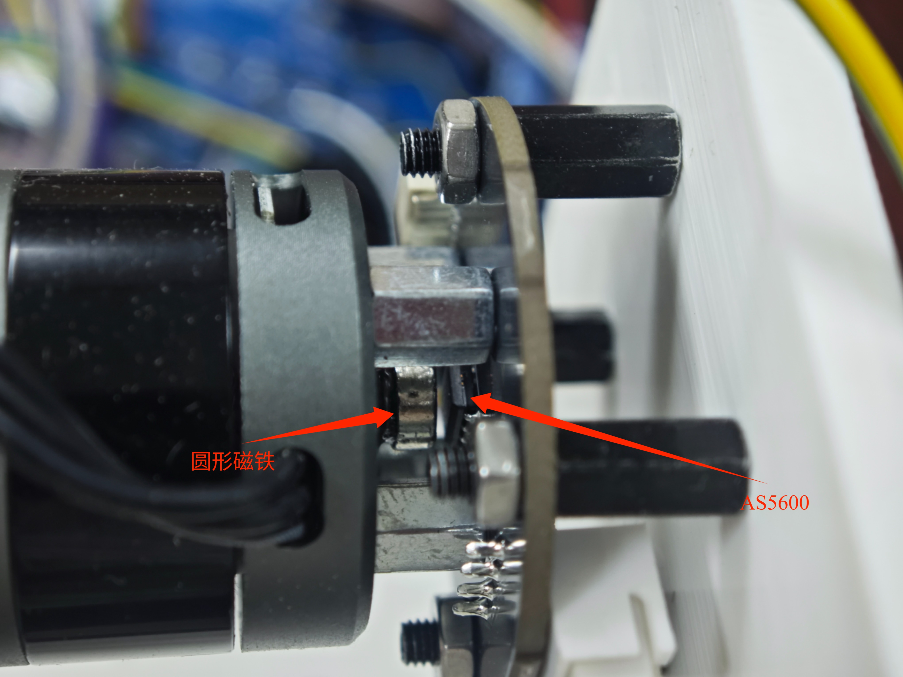
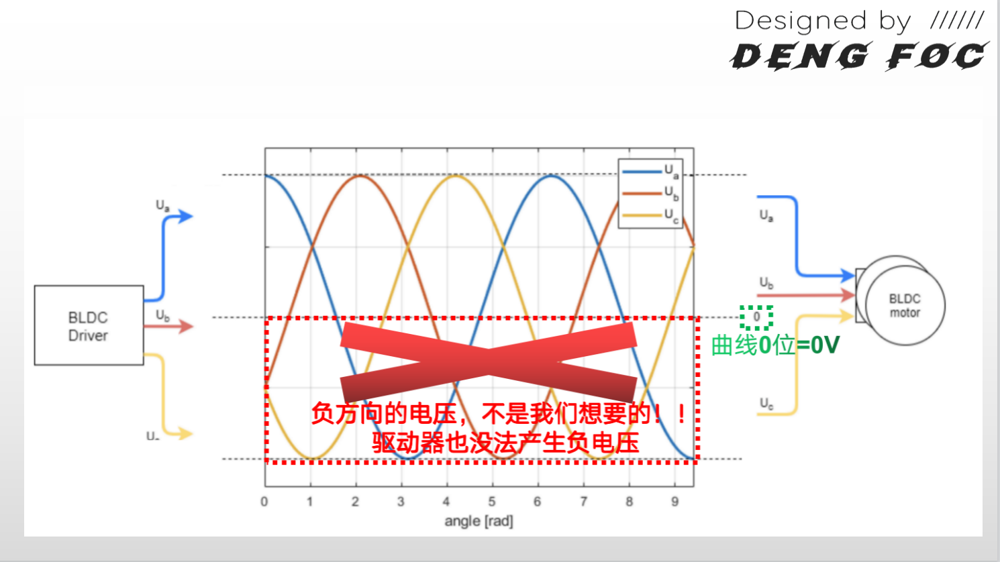
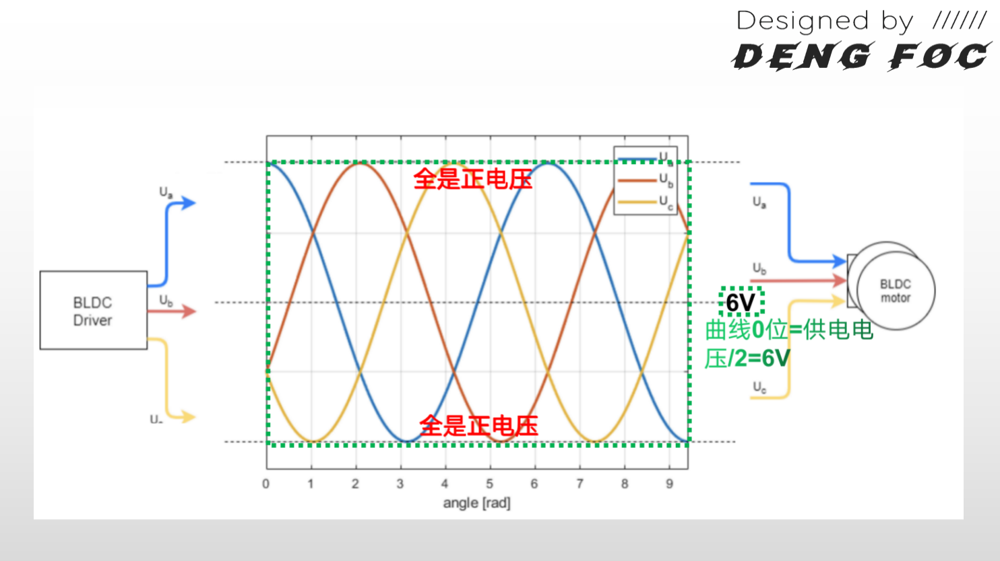
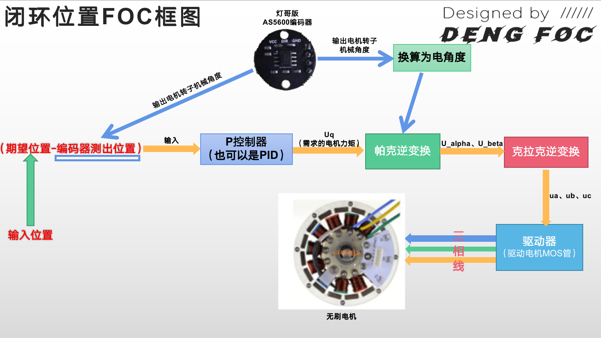

# 闭环位置控制
## PID控制基础
学习FOC闭环控制，就必须先学习PID控制请先自行在网上学习PID控制，资料很多。


## AS5600磁编码器

AS5600 在 FOC 系统中承担转子位置反馈的核心角色：

1. 通过 I²C 读取原始机械角度，换算为弧度制机械轴角度
2. 机械角度乘以电机极对数，叠加零电角度偏移，得到 FOC 所需的实时电角度
3. 电角度作为帕克变换 / 逆帕克变换的旋转坐标基准，实现精准的磁场定向控制
4. 对角度做时间差分可计算转子转速，用于速度环闭环调节




### AS5600数据结构体

```
/**
 * @brief AS5600磁编码器传感器结构体
 * 用于存储传感器状态和测量数据
 */
typedef struct Sensor_AS5600 {
    int Mot_Num;                    // 电机编号
    float angle_prev;               // 上一次角度值（机械角度，0~2PI）
    uint32_t angle_prev_ts;         // 上一次角度测量时间戳（微秒）
    float vel_angle_prev;           // 上一次速度计算时的角度值
    uint32_t vel_angle_prev_ts;     // 上一次速度计算时的时间戳
    int32_t full_rotations;         // 完整旋转圈数（用于多圈角度累计）
    int32_t vel_full_rotations;     // 速度计算时的完整旋转圈数
    I2C_HandleTypeDef* i2c_handle;  // I2C句柄
} Sensor_AS5600_t;

```

### AS5600.c
```
/**
 * @brief 写入单个寄存器
 * @param reg 寄存器地址
 * @param value 写入值
 * @return HAL状态
 */
static unsigned char write_reg(unsigned char reg, unsigned char value) {
    return HAL_I2C_Mem_Write(&hi2c1, Slave_Addr, reg, I2C_MEMADD_SIZE_8BIT, &value, 1, 50);
}

/**
 * @brief 写入多个寄存器
 * @param reg 起始寄存器地址
 * @param value 数据缓冲区
 * @param len 数据长度
 * @return HAL状态
 */
static unsigned char write_regs(unsigned char reg, unsigned char *value, unsigned char len) {
    return HAL_I2C_Mem_Write(&hi2c1, Slave_Addr, reg, I2C_MEMADD_SIZE_8BIT, value, len, 50);
}

/**
 * @brief 读取多个寄存器
 * @param i2c_handle I2C句柄
 * @param reg 起始寄存器地址
 * @param buf 数据缓冲区
 * @param len 读取长度
 * @return HAL状态
 */
static unsigned char read_reg(I2C_HandleTypeDef* i2c_handle, unsigned char reg, unsigned char* buf, unsigned short len) {
    return HAL_I2C_Mem_Read(i2c_handle, Slave_Addr, reg, I2C_MEMADD_SIZE_8BIT, buf, len, 50);
}

/**
 * @brief 初始化AS5600传感器
 * @param sensor 传感器结构体指针
 * @param Mot_Num 电机编号
 * @param i2c_handle I2C句柄
 */
void Sensor_AS5600_init(Sensor_AS5600_t* sensor, int Mot_Num, I2C_HandleTypeDef* i2c_handle) {
    sensor->Mot_Num = Mot_Num;
    sensor->i2c_handle = i2c_handle;
    sensor->angle_prev = 0.0f;
    sensor->angle_prev_ts = 0;      // 修复：使用整数0而不是0.0f
    sensor->vel_angle_prev = 0.0f;
    sensor->vel_angle_prev_ts = 0;  // 修复：使用整数0而不是0.0f
    sensor->full_rotations = 0;
    sensor->vel_full_rotations = 0;
}

/**
 * @brief 获取AS5600原始角度
 * @param sensor 传感器结构体指针
 * @return 原始角度（弧度），范围0~2PI
 * 
 * 从AS5600读取12位原始角度值，转换为弧度
 */
double Sensor_AS5600_getSensorAngle(Sensor_AS5600_t* sensor) {
    uint8_t temp[2] = {0};
    read_reg(sensor->i2c_handle, Angle_Hight_Register_Addr, temp, 2);

    // 合并高低字节，AS5600返回12位角度值（0~4095）
    int16_t in_angle = ((int16_t)temp[0] << 8) | temp[1];
    
    // 转换为弧度（0~2PI）
    float angle_rad = (float)in_angle * RAD_2PI / AS5600_CPR;

    return angle_rad;
}

/**
 * @brief 更新传感器角度数据（处理圈数累加）
 * @param sensor 传感器结构体指针
 * 
 * 检测角度跳变（超过0.8*2PI），判断是否跨圈
 * 当角度从接近2PI跳到接近0时，说明正向转了一圈
 * 当角度从接近0跳到接近2PI时，说明反向转了一圈
 */
void Sensor_AS5600_update(Sensor_AS5600_t* sensor) {
    // 先获取时间戳，确保时间测量的准确性
    uint32_t now_ts = micros();
    
    // 获取当前角度
    float val = Sensor_AS5600_getSensorAngle(sensor);
    
    // 计算角度变化量
    float d_angle = val - sensor->angle_prev;
    
    // 检测圈数变化（角度跳变超过0.8*2PI认为是跨圈）
    if (fabs(d_angle) > (0.8f * RAD_2PI)) {
        // 正向跨越（从大角度跳到小角度）：d_angle < 0，圈数+1
        // 反向跨越（从小角度跳到大角度）：d_angle > 0，圈数-1
        sensor->full_rotations += (d_angle > 0) ? -1 : 1;
    }
    
    // 更新状态
    sensor->angle_prev = val;
    sensor->angle_prev_ts = now_ts;
}

/**
 * @brief 获取总角度（累计圈数的总角度）
 * @param sensor 传感器结构体指针
 * @return 总角度（弧度），范围无限制
 */
float Sensor_AS5600_getAngle(Sensor_AS5600_t* sensor) {
    return (float)sensor->full_rotations * RAD_2PI + sensor->angle_prev;
}

/**
 * @brief 获取机械角度（单圈角度）
 * @param sensor 传感器结构体指针
 * @return 机械角度（弧度），范围0~2PI
 */
float Sensor_AS5600_getMechanicalAngle(Sensor_AS5600_t* sensor) {
    return sensor->angle_prev;
}

/**
 * @brief 获取当前角速度
 * @param sensor 传感器结构体指针
 * @return 角速度（rad/s），正值表示正向旋转，负值表示反向旋转
 * 
 * 通过两次角度测量的差值计算角速度
 * 使用时间戳确保计算的准确性
 */
float Sensor_AS5600_getVelocity(Sensor_AS5600_t* sensor) {
    // 计算时间间隔（秒）
    float Ts = (float)(sensor->angle_prev_ts - sensor->vel_angle_prev_ts) * 1e-6f;
    
    // 时间异常处理
    if (Ts <= 0.0f) {
        Ts = 1e-3f;
    }
    
    // 计算角度变化量（包括圈数变化）
    float angle_diff = (float)(sensor->full_rotations - sensor->vel_full_rotations) * RAD_2PI 
                     + (sensor->angle_prev - sensor->vel_angle_prev);
    
    // 计算角速度
    float vel = angle_diff / Ts;
    
    // 更新速度计算的状态变量
    sensor->vel_angle_prev = sensor->angle_prev;
    sensor->vel_full_rotations = sensor->full_rotations;
    sensor->vel_angle_prev_ts = sensor->angle_prev_ts;
    
    return vel;
}

```
## 开环控制说明

我们可以通过供电电压来计算出我们Uq能设定的最大值，以12v供电为例，实际上我们能够设定的Uq最大值仅有12v/2=±6V。为什么是6v？为什么要除2？这时因为，在上一节课中，我们已经把我们的ua,ub,uc曲线移动到供电电压中央，如下图代码所示：

```
// 克拉克逆变换 + 直流偏置
float Ua = ualpha + voltage_power_supply/2;
float Ub = (sqrt(3) * ubeta -  ualpha)/2 + voltage_power_supply/2;
float Uc = (-ualpha - sqrt(3) * ubeta)/2 + voltage_power_supply/2;
```
在加上了供电电压变量voltage_power_supply/2后，实际上ua,ub,uc曲线的0点就由6v开始，而这个移动是必须的，因为不这么移动，ua,ub,uc的正弦波特性会使得驱动出现负电压，如下图所示，这显然不可接受。



那么，移动后，显然ua,ub,uc的变化范围就只有±6了，这也影响到了uq,因此，uq的变化范围也会仅剩下±6，如下图所示：



## 闭环控制




## PID
### PID结构体
```
typedef struct PIDComtroller{
	float P;
	float I;
	float D;
	float output_ramp;// 输出变化率限制
	
	
	float limit;        // 输出限幅
	float error_prev;   // 上一时刻误差
	float output_prev;  // 上一时刻输出
	float integral_prev;// 上一时刻积分值
	uint32_t timestamp_prev; // 上一时刻时间戳
} PIDController_t;
```
### PID.c
```
#include "pid.h"
/**
 * @brief 浮点数限幅函数
 * @param x 输入值
 * @param min 最小值
 * @param max 最大值
 * @return 限幅后的值
 */
static float constrain_f(float x,float min,float max){
	
	if(x>max)return max;
	if(x<min)return min;
	return x;
	
}

void PID_init(PIDController_t* pid, float P, float I, float D, float ramp, float limit) {
    pid->P = P;
    pid->I = I;
    pid->D = D;
    pid->output_ramp = ramp; //输出变化率限制
	
	
    pid->limit = limit;      //输出限幅
    pid->error_prev = 0.0f;  //上一刻误差
    pid->output_prev = 0.0f; //上一刻输出
    pid->integral_prev = 0.0f;//上一刻积分
	
    pid->timestamp_prev = micros(); //上一时刻时间戳
}

// PID计算函数（梯形积分 + 微分 + 积分限幅 + 输出限幅 + 变化率限制）
float PIDcontroller_operator(PIDController_t* pid,float error)
{
	 unsigned long timestamp_now =  micros();  //获取当前时差
	 float Ts = (timestamp_now - pid->timestamp_prev) * 1e-6f ; 
	 if(Ts <=0 || Ts > 0.5f) Ts = 1e-3f;   // 时间异常保护

	 float proportional = pid->P * error;  //P环

	 float integrqal = pid->integral_prev + pid->I*Ts*0.5f*(error + pid->error_prev); //积分
	 integrqal = constrain_f(integrqal,-(pid->limit), pid->limit);//积分限幅

	 float derivative = pid->D *( error - pid->error_prev)/Ts; //D环

	 float output =  proportional +  integrqal + derivative; // 加和

	 output = constrain_f(output,-pid->limit,pid->limit); //输出限幅

	 if(pid->output_ramp > 0)
	 {
		 float output_rate = (output - pid->output_prev)/Ts;
		 if(output_rate > pid->output_ramp)
			  output = pid->output_prev + pid->output_ramp*Ts;
		 else if (output_rate < - pid->output_ramp)
			  output = pid->output_prev - pid->output_ramp*Ts;
	 }

	pid->integral_prev = integrqal;
    pid->output_prev = output;
    pid->error_prev = error;
    pid->timestamp_prev = timestamp_now;

	return output;
}
```
## 增加calibrate_zero_electric_angle零点校准函数
```
// -------------------------- 电角度零点校准 --------------------------
/**
 * @brief 零电角度校准函数
 *        开环拖拽转子到固定电角度，读取机械角度计算零点偏移
 * @param sensor 传感器结构体指针
 * @return 校准后的零电角度偏移（弧度）
 */
float calibrate_zero_electric_angle(Sensor_AS5600_t* sensor)
{
    // 施加固定方向电压，将转子拖拽到对齐位置
    setTorque(3.0f, 0.0f, 3.0f * PI / 2.0f, sensor);

    // 延时等待电机转动到位、静止稳定
    HAL_Delay(2000);

    // 读取当前机械角度，换算为电角度
    float shaft_mech_angle = Sensor_AS5600_getSensorAngle(sensor);
    float current_el_angle = shaft_mech_angle * pole_pairs;
    current_el_angle = _normalizeAngle(current_el_angle);
    
    // 保存为全局零电角度偏移
    zero_electric_angle = current_el_angle;
    
    // 关闭输出，校准完成
    setTorque(0.0f, 0.0f, 0, sensor);
    
    return zero_electric_angle;
}
```
## 更新电角度计算函数

DIR 为电机旋转方向系数 取值为1或-1，设置方向不正确会导致电机剧烈抖动或者导致电机以最大速度运转，

```
-------------------------- 传感器与电角度计算 --------------------------
/**
 * @brief 计算电角度
 *        电角度 = 方向系数 × 极对数 × 机械角度 - 零电角度偏移
 * @param sensor 传感器结构体指针
 * @return 电角度（弧度，范围 0~2PI）
 */
float _electricalAngle(Sensor_AS5600_t* sensor)
{
    return _normalizeAngle((float)(DIR * pole_pairs) * Sensor_AS5600_getMechanicalAngle(sensor) - zero_electric_angle );
}
```

## 位置单闭环力位控制（直接位置环输出电压）

```
/**
 * @brief 位置单闭环力位控制（直接位置环输出电压）
 * @param Target        目标位置
 * @param sensor        传感器结构体指针
 * @param angle_loop_M0 位置环PID控制器
 */
void DFOC_M0_set_Force_Angle(
	    float Target,
		Sensor_AS5600_t* sensor,
		PIDController_t* angle_loop_M0
){
	setTorque(
    PIDcontroller_operator(angle_loop_M0, (Target - DIR * Sensor_AS5600_getAngle(sensor)) * 180.0f / PI ),
    0,
    _electricalAngle(sensor),
    sensor
  );	
}
```

## main中使用

```

PIDController_t angle_loop_M0;
Sensor_AS5600_t S0;

int main()
{
  .....
  Sensor_AS5600_init(&S0,1,&hi2c1);
  PID_init(&angle_loop_M0,1,0,0,1000,50);
  calibrate_zero_electric_angle(&S0);
  
  while(1)
  {
    
    Sensor_AS5600_update(&S0);//角度数据更新

    DFOC_M0_set_Force_Angle(
        Target,
        &S0,
        &angle_loop_M0
    )
  }

}

//Target目标角度


```