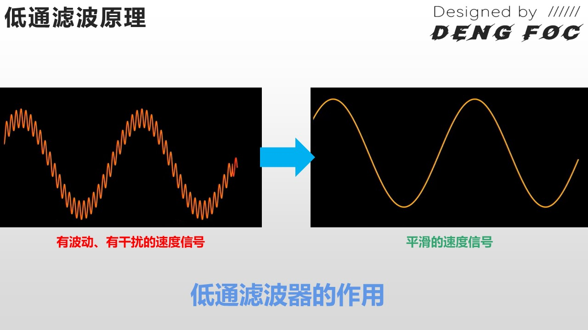
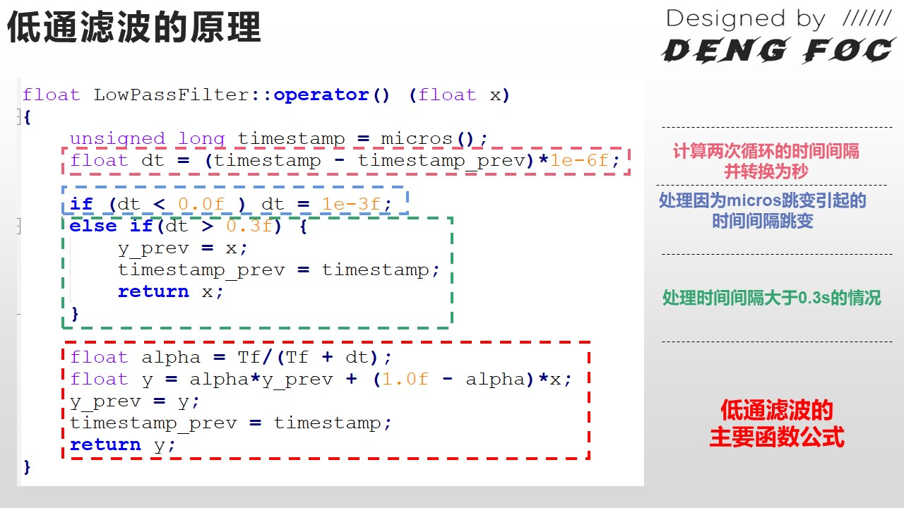

# 闭环速度控制
## 速度低通滤波
在上一节课中，我们as5600除了能取得角度数据外，还获得了转速相关数据
```
/**
 * @brief 更新传感器角度数据（处理圈数累加）
 * @param sensor 传感器结构体指针
 * 
 * 检测角度跳变（超过0.8*2PI），判断是否跨圈
 * 当角度从接近2PI跳到接近0时，说明正向转了一圈
 * 当角度从接近0跳到接近2PI时，说明反向转了一圈
 */
void Sensor_AS5600_update(Sensor_AS5600_t* sensor) {
    // 先获取时间戳，确保时间测量的准确性
    uint32_t now_ts = micros();
    
    // 获取当前角度
    float val = Sensor_AS5600_getSensorAngle(sensor);
    
    // 计算角度变化量
    float d_angle = val - sensor->angle_prev;
    
    // 检测圈数变化（角度跳变超过0.8*2PI认为是跨圈）
    if (fabs(d_angle) > (0.8f * RAD_2PI)) {
        // 正向跨越（从大角度跳到小角度）：d_angle < 0，圈数+1
        // 反向跨越（从小角度跳到大角度）：d_angle > 0，圈数-1
        sensor->full_rotations += (d_angle > 0) ? -1 : 1;
    }
    
    // 更新状态

    sensor->angle_prev = val;   //更新转速  

    sensor->angle_prev_ts = now_ts;
}

```

在速度闭环模式下，如果我们不对速度值进行滤波，电机会发出“吱吱吱”的声音，这就是由于速度值的波动引起的，尽管此时速度是能够被进行闭环控制的，但是这个因为没有滤波导致的“吱吱吱”的声音的扰动实际上十分形象我们的实现效果，也导致了电机的震荡！那么，怎么解决这个问题并且进一步提升电机的控制效果呢？答案就是：滤波！！！滤波有很多种方法，当然，我们就先用最简单的一种方法就可以处理这个简单的场景，那就是：低通滤波。经过了滤波后，电机的控制效果提升很大，基本就没有了“吱吱”声音，而是运动起来既平稳又柔顺。

### 低通滤波原理






#### 低通滤波结构体
```
typedef struct LowPassFilter {
    float Tf;                  /* 时间常数：滤波强度参数，越大越平滑但响应越慢 */
    uint32_t timestamp_prev;  /* 上次执行时间戳（微秒），用于计算 dt */
    float y_prev;             /* 上一次滤波输出值，用于递推计算 */
} LowPassFilter_t;


```

#### lowpass_filter.c
```
void LPF_init(LowPassFilter_t* lpf, float Tf) {
    lpf->Tf = Tf;              /* 时间常数：越大滤波效果越强，响应越慢 */
    lpf->y_prev = 0.0f;       /* 上一次滤波输出值 */
    lpf->timestamp_prev = micros();  /* 上次执行时间戳 */
}


float LowPassFilter_operator(LowPassFilter_t* lpf,float x)
{
	 uint32_t timestamp =  micros();
	 float dt = (timestamp -lpf->timestamp_prev)*1e-6f;
	
	 if(dt < 0.0f) dt = 1e-3f;
	 else if(dt > 0.3f) {
			lpf->y_prev = x;
		  lpf->timestamp_prev = timestamp;
		  return x;
	 }
	 
	 float alpha = lpf->Tf/(lpf->Tf + dt);
	 float y = alpha*lpf->y_prev  + (1.0f - alpha)*x;
	 lpf->y_prev = y;
	 lpf->timestamp_prev = timestamp;
	 return y;
}
```

## 新增信号滤波函数DFOC_M0_Velocity（）
```
// -------------------------- 信号滤波函数 --------------------------
/**
 * @brief 转速采集与低通滤波
 * @param sensor       传感器结构体指针
 * @param M0_Vel_Flt   速度低通滤波器实例
 * @return 滤波后的转速值
 */
float DFOC_M0_Velocity(Sensor_AS5600_t* sensor, LowPassFilter_t* M0_Vel_Flt)
{
  float vel_M0_ori = Sensor_AS5600_getVelocity(sensor);
  float vel_M0_flit = LowPassFilter_operator(M0_Vel_Flt, DIR * vel_M0_ori);
  return vel_M0_flit;
}
```

## 速度单闭环控制函数
```
**
 * @brief 速度单闭环控制
 * @param sensor       传感器结构体指针
 * @param M0_Vel_Flt   速度低通滤波器实例
 * @param vel_loop_M0  速度环PID控制器
 * @param Target       目标转速
 */
void DFOC_M0_setVelocity(
    Sensor_AS5600_t* sensor,
    LowPassFilter_t* M0_Vel_Flt,
    PIDController_t* vel_loop_M0,
    float Target) 
{
    float now_vel = DFOC_M0_Velocity(sensor, M0_Vel_Flt);
    float Uq = PIDcontroller_operator(vel_loop_M0, Target - now_vel);
    
    float angle_el = _electricalAngle(sensor);
    setTorque(Uq, 0.0f, angle_el, sensor);
}

```

## main中使用

```
PIDController_t vel_loop_M0;
Sensor_AS5600_t S0;
LowPassFilter_t M0_Vel_Flt;

int main()
{
  .....

  Sensor_AS5600_init(&S0,1,&hi2c1);
  PID_init(&vel_loop_M0,1,10,0,1000,50); 
  //p控制 ，新增I控制，一般不用D控制，会增大噪音。
  LPF_init(&M0_Vel_Flt,0.01);
  calibrate_zero_electric_angle(&S0);
  while(1)
  {
    
    Sensor_AS5600_update(&S0);//数据更新

    DFOC_M0_setVelocity(
        &S0,
        &M0_Vel_Flt,
        &vel_loop_M0,
        Target) 
  }
}

//Target目标速度 


```