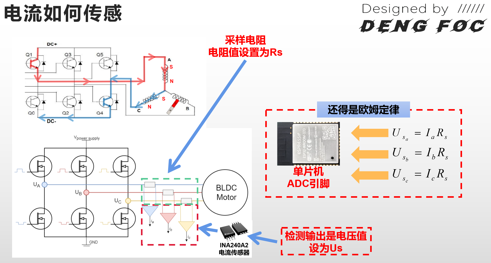

# 闭环电流控制
所谓的电流环的实现目的，主要目的是希望能够通过电流反馈，实现更精确的力矩控制！而电机三相线的电流，在经过一定的算法运算过程后，恰好可以转换为力矩（观测到的力矩）！只要能得到观测值，我们就能够对力矩进行闭环（只需要用我们的期望力矩减去观测到的力矩，得到期望力矩与观测力矩之差，并且把它放在PID里进行输出就行）！


根据前面的知识，假设我们能检测出电机三相线中其中两相的电流 $I_a,I_b$，那么，我们只需要通过之前提到的克拉克变换就可以求出 $I_\alpha$ 和 $I_\beta$：

$$
\begin{cases}
I_\alpha = i_a \\[6pt]
I_\beta = \dfrac{1}{\sqrt{3}} \times (2i_b + i_a)
\end{cases}
$$

进一步的，通过帕克变换，$I_\alpha$ 和 $I_\beta$ 可以换算得到 $I_q,I_d$：

$$
\begin{bmatrix}
i_d \\
i_q
\end{bmatrix}
=
\begin{bmatrix}
\cos\theta & \sin\theta \\
-\sin\theta & \cos\theta
\end{bmatrix}
\begin{bmatrix}
i_\alpha \\
i_\beta
\end{bmatrix}
$$

其中，角度 $\theta$ 被称为**电角度**！这是在前面的课程中已经讲过的概念了。而 $I_q$ 在一定程度上是能够代表电机力矩的，只需要电机的KV值，就能够通过下面的式子把 $I_q$ 换算成电机力矩：

```
Torque [N.m] = 8.27 * Iq [A] / KV.
```
因此，实际上，想要控制力矩，我们只需要控制这个电流检测出来的
I
q
I 
q
​
 值能够达到我们设定的期望I_q_ref值就行，我们可以用我们速度闭环课程中提到的PID算法来进行电流力矩的闭环：
```
Uq=PID(I_q_ref-I_q)
```

其中，$I_q$ 就是传感器观测的电机q轴电流（观测力矩），$I_{q\_ref}$ 是我们的期望q轴电流（期望力矩），两者经过PID算法运算后输出能对电机进行控制的 $U_q$ 值，最后通过之前课程的内容就可以驱动电机运动。当 $(I_{q\_ref}-I_q)<0$ 时，证明实际力矩大于期望力矩，此时 $U_q$ 会变小，电机输出力会变小；反之，当 $(I_{q\_ref}-I_q)>0$ 时，证明实际力矩小于期望力矩，此时 $U_q$ 会变大，电机输出力会变大，在有反馈的情况下，电机最终能够稳定在你设定的力矩之中！这就是电流闭环的原理！

明确了所有的程序思路和过程后，你就可以发现，其实整个事情的重点，就在于怎么通过硬件获取 $I_a$ 和 $I_b$！



早在第一课，我们就已经讲过了如图中框着的电路，只需要交替的开关MOS管，我们就能够实现电机的转动，而我们的电流传感，正是在这个基础的电路上进行升级，我们一起来看看上图。

上图下面的电路，就是对上图上面的电路进行升级得到的，可以看到，MOS管部分的电路其实是完全一样的，唯一的区别，就是每根相线上串联了一个采样电阻和接入了一个电流传感器，就像一个万用表一样。而它的采样方式其实非常的简单，它正是利用了欧姆定律来实现了采样。当相线中通过电流的时候，这个电流会经过这个采样电阻，而根据我们初中学习的欧姆定律，当电流经过采样电阻之后，电流×电阻就可以得到电压。那么，我们只需要用一个传感器，让单片机把这个电压检测出来，再在算法里面除去采样电阻的电阻值，就可以在算法中还原其相线上的电流值！

而这个传感器，就正是我们上图中所示的这个INA240A2电流传感器，尽管它被称为电流传感器，但是实际上它传递给单片机的却是电压值，那是因为单片机的IO引脚的ADC功能（数模转换）只能识别电压值而不能识别电流值，因此它只能通过电压值来让单片机完成检测。

当这个传感器得到的电压值输入了单片机中后，我们再通过上图“软件中通过欧姆定律还原出电流”框中所示的欧姆定律公式，我们就可以还原出 $I_a,I_b,I_c$ 三相电流！取其中的两相，运用本文上半部分所提到的算法方法，我们就可以实现电流力矩闭环！

接下来，我们就来看看怎么通过代码实现这个功能吧！

## 新增电压采集
```
	HAL_ADC_Start_DMA(&hadc1, (uint32_t*)adc_buffer, 200);//ADC DMA
```
### calibrateOffsets 零点偏移

```

/**
 * @brief 电机零电角度自动校准函数
 *        开环施加固定矢量拖拽转子至d轴对齐，计算编码器零点偏移量zero_electric_angle
 * @param sensor AS5600磁编码器实例指针
 * @return 校准完成后的零电角度偏移（弧度，0~2PI）
 */
float calibrate_zero_electric_angle(Sensor_AS5600_t* sensor)
{
    // 1. 可选：编码器初始化（当前代码已提前完成初始化，注释备用）
    // BeginSensor(); 初始化AS5600传感器，本项目上电已完成

    // 2. 施加固定d轴电压矢量，将转子拖拽至电气零点对齐位置
    // Uq=0V Ud=3V，电角度固定3π/2，矢量对准d轴（永磁体磁场方向）
    setTorque(3.0f, 0.0f, 3.0f * PI / 2.0f, sensor);

    // 延时2s，等待电机转子稳定、机械抖动消除
    HAL_Delay(2000);

    // 3. 读取当前编码器机械角度，换算电角度
    float shaft_mech_angle = Sensor_AS5600_getSensorAngle(sensor);
    // 机械角度 × 极对数 = 原始电角度
    float current_el_angle = shaft_mech_angle * pole_pairs;
    // 将电角度归一到 0~2π 区间
    current_el_angle = _normalizeAngle(current_el_angle);
    
    // 4. 将计算得到的偏移存入全局变量，作为后续FOC角度补偿
    zero_electric_angle = current_el_angle;
    
    // 5. 输出零电压，释放电机转矩
    setTorque(0.0f, 0.0f, 0, sensor);

    // 打印校准后的零点偏移值，调试用
    //printf("电角度校准偏移值: %.4f rad\r\n", zero_electric_angle);
    
    return zero_electric_angle;
}

```


### inlineCurrent.c
```
#include "inlineCurrent.h"
#include "stdio.h"

// ADC采样缓冲区，存储原始ADC采样值
extern uint16_t adc_buffer[];

// A/B两相电流零点偏移ADC均值（电机零电流时ADC基准值）
float offset_ia = 0;
float offset_ib = 0;

// 输出三相相电流（单位：A）
float current_a = 0;
float current_b = 0;
float current_c = 0;

/**
 * @brief 电流零点偏移校准
 *        电机静止无电流时采集ADC基准值，消除硬件零点漂移
 */
void calibrateOffsets(void)
{
    float adc_ch0_avg = 0.0f;
    float adc_ch1_avg = 0.0f;

    // 连续采集100组双通道ADC数据累加求平均
    for (uint16_t i = 0; i < 200; i += 2)
    {
        adc_ch0_avg += adc_buffer[i];
        adc_ch1_avg += adc_buffer[i + 1];
    }
    // 计算零电流基准偏移ADC值
    offset_ia = adc_ch0_avg / 100.0f;
    offset_ib = adc_ch1_avg / 100.0f;

    // 打印零电流对应的传感器输出电压
    printf("IA零点电压: %.2f V | IB零点电压: %.2f V \r\n ",
           offset_ia * 3.3f / 4095.0f,
           offset_ib * 3.3f / 4095.0f);
}

/**
 * @brief 读取两相真实相电流
 *        硬件：5mΩ采样电阻 + INA240A2（增益50倍），STM32 12bit ADC(0~4095对应0~3.3V)
 *        公式：I = V_sensor / (R_shunt * Gain)
 */
void getPhaseCurrents(void)
{
    float adc_ch0_avg = 0.0f;
    float adc_ch1_avg = 0.0f;

    // 多次采样降噪，减去零点偏移，得到差值ADC
    for (uint16_t i = 0; i < 200; i += 2)
    {
        adc_ch0_avg += adc_buffer[i] - offset_ia;
        adc_ch1_avg += adc_buffer[i + 1] - offset_ib;
    }
    // 求平均ADC差值
    adc_ch0_avg /= 100.0f;
    adc_ch1_avg /= 100.0f;

    // 1.ADC原始值 → 传感器输出电压(0~3.3V)
    adc_ch0_avg = adc_ch0_avg * 3.3f / 4095.0f;
    adc_ch1_avg = adc_ch1_avg * 3.3f / 4095.0f;

    // 2.电压还原相电流 I = V / (Rshunt * Gain)
    // Rshunt=0.005Ω，INA240A2增益=50
    adc_ch0_avg = adc_ch0_avg / (0.005f * 50.0f);
    adc_ch1_avg = adc_ch1_avg / (0.005f * 50.0f);

    // 符号取反，匹配电机电流方向定义
    current_a = adc_ch0_avg * -1.0f; // 电流方向需要测试，否则无法进行闭环控制 
    current_b = adc_ch1_avg * -1.0f; //

    // 基尔霍夫电流定律，推算C相电流 Ia+Ib+Ic=0
    current_c = -(current_a + current_b);
}
```

### cal_Iq_Id电流变换函数

```
extern float current_a;
extern float current_b;
//克拉克变换和帕克变换
float cal_Iq_Id(float angle_el)
{
	float I_alpha = current_a;
  float I_beta = _1_SQRT3 * current_a + _2_SQRT3 * current_b;
	
  float ct = cos(angle_el);
  float st = sin(angle_el);	

  float I_q = I_beta * ct - I_alpha * st;

  return I_q;	
}
```


### DFOC_M0_Current电流低通滤波
```
//===================================================
// 获取电机实际电流
//===================================================
// 返回值：经过滤波处理的q轴电流（A）
float DFOC_M0_Current(Sensor_AS5600_t* sensor,LowPassFilter_t* M0_Current_Flt)
{
  // 1. 获取原始三相电流并计算Iq
  float I_q_M0_ori = cal_Iq_Id(_electricalAngle(sensor));

  // 2. 通过低通滤波器平滑电流信号
  float I_q_M0_flit = LowPassFilter_operator(M0_Current_Flt,I_q_M0_ori);
	
  return I_q_M0_flit;
}

```

## 电流单闭环控制
```
/**
	电流闭环控制
*/
void DFOC_M0_setUq(
    Sensor_AS5600_t* sensor,
    LowPassFilter_t* M0_Current_Flt,
    PIDController_t* current_loop_M0,
    float Target) 
{
    float now_current = DFOC_M0_Current(sensor, M0_Current_Flt);
	  
	float now_current_D =Target -  now_current;
	  
    float Uq = PIDcontroller_operator(current_loop_M0, Target - now_current);
    
    float angle_el = _electricalAngle(sensor);
    
    setTorque_M0(Uq, 0.0f, angle_el, sensor);
}

```

## 在main中使用

```
PIDController_t current_loop_M0;
Sensor_AS5600_t S0;
LowPassFilter_t M1_current_Flt;

int main()
{
  .....

  Sensor_AS5600_init(&S0,1,&hi2c1);

  PID_init(&current_loop_M0,1,10,0,1000,50); //p控制 ，新增I控制，一般不用D控制，会增大噪音。
  
  LPF_init(&M1_current_Flt,0.01);
  calibrate_zero_electric_angle(&S0);

  while(1)
  {
    
    Sensor_AS5600_update(&S0);//数据更新

    void DFOC_M0_setUq(
        &S0,
        &M1_current_Flt,
        &current_loop_M0,
        Target)
  }
}

```