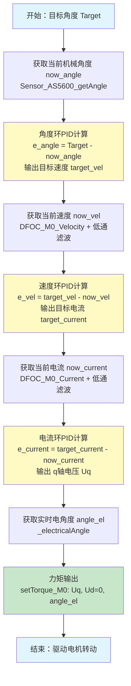

# 闭环角度,速度,电流三环控制

三个闭环控制本质上是PID环的嵌套

1. 外环（角度环）：给定目标角度，与编码器采集的实际角度做偏差，PID 输出期望转速；
2. 中环（速度环）：期望转速与滤波后的实际转速做偏差，PID 输出期望 q 轴转矩电流；
3. 内环（电流环）：期望 q 轴电流与采样变换后的实际 q 轴电流做偏差，PID 输出 q 轴控制电压 Uq；
4. FOC 坐标变换输出：结合实时电角度执行 Park、Clarke 逆变换，生成三相 SPWM 电压驱动电机。

同理，我们可以进行，速度加角度，速度加电流，角度加电流，等等双环控制。调试PID时，我们先从内环开始慢慢调试

```
/**
  * @brief  角度环 + 速度环 + 电流环 串级闭环控制
  * @param  Target: 目标角度
  */
void DFOC_M0_set_Velocity_Angle_Current(
    Sensor_AS5600_t* sensor,
    LowPassFilter_t* M0_Vel_Flt,
    LowPassFilter_t* M0_Current_Flt,
    PIDController_t* angle_loop_M0,
    PIDController_t* vel_loop_M0,
    PIDController_t* current_loop_M0,
    float Target
) {
    
    now_angle = Sensor_AS5600_getAngle(sensor);//获取当前角度
    float target_vel = PIDcontroller_operator(angle_loop_M0, Target - now_angle); // 2. 角度环计算 → 输出目标速度
    
    float now_vel = DFOC_M0_Velocity(sensor, M0_Vel_Flt);// 当前速度
    float target_current = PIDcontroller_operator(vel_loop_M0, target_vel - now_vel);//速度环PID -> 输出目标电流，
    
	  float now_current = DFOC_M0_Current(sensor, M0_Current_Flt); //获取当前电流
	  Uq = PIDcontroller_operator(current_loop_M0, target_current - now_current);
	
    float angle_el = _electricalAngle(sensor); // 4. 获取实时电角度
    
    setTorque_M0(Uq, 0.0f, angle_el, sensor); // 5. 输出力矩
}
```




## 在main中使用
```
Sensor_AS5600_t S0;

PIDController_t current_loop_M0;
LowPassFilter_t M1_current_Flt;

PIDController_t vel_loop_M0;
LowPassFilter_t M0_Vel_Flt;

PIDController_t angle_loop_M0;


int main()
{
  .....

    Sensor_AS5600_init(&S0,1,&hi2c1);

    PID_init(&vel_loop_M0,0.25,1.2,0,100,1.5);//PID 速度
    PID_init(&angle_loop_M0,1.5,1,0,1000,50); // 角度
    PID_init(&current_loop_M0,5,200,0,10000,4); //电流环

    LPF_init(&M0_Vel_Flt,0.01)
    LPF_init(&M1_current_Flt,0.01);
    
    calibrate_zero_electric_angle(&S0);
    while(1)
    {
        
        Sensor_AS5600_update(&S0);//数据更新
        getPhaseCurrents();  

        DFOC_M0_set_Velocity_Angle_Current(
                        &S0,
                        &M0_Vel_Flt,
                        &M0_Current_Flt,
                        &angle_loop_M0,
                        &vel_loop_M0,
                        &current_loop_M0,
                        Target
        )
    }
}

```