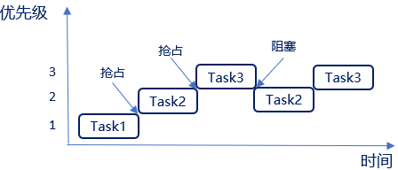
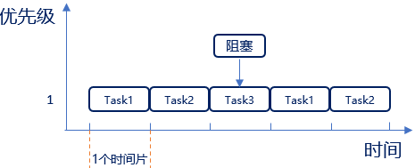
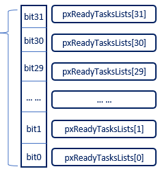

# FREERTOS基础知识
## 任务调度简介
调度器就是使用相关的调度算法来决定当前需要执行的哪个任务
FreeRTOS 一共支持三种任务调度方式： 

1. **抢占式调度**  主要是针对优先级不同的任务，每个任务都有一个优先级，优先级高的任务可以抢占优先级低的任务
2. **时间片调度**  主要针对优先级相同的任务，当多个任务的优先级相同时， 任务调度器会在每一次系统时钟节拍到的时候切换任务。
3. **协程式调度**  当前执行任务将会一直运行，同时高优先级的任务不会抢占低优先级任务FreeRTOS现在虽然还支持，但是官方已经表示不再更新协程式调度
### 抢占式调度
<font color=red>**1、高优先级任务，优先执行，高优先级任务不停止，低优先级任务无法执行，被抢占的任务将会进入就绪态**</font>

运行条件：
1. 创建三个任务：Task1、Task2、Task3
2. Task1、Task2、Task3的优先级分别为1、2、3；在FreeRTOS中任务设置的数值越大，优先级越高，所以TASK3的优先级最高


运行过程如下：
1. 首先Task1在运行中，在这个过程中Task2就绪了，在抢占式调度器的作用下Task2会抢占Task1的运行
2. Task2运行过程中，Task3就绪了，在抢占式调度器的作用下Task3会抢占Task2的运行
3. Task3运行过程中，Task3阻塞了（系统延时或等待信号量等），此时就绪态中，优先级最高的任务Task2执行
4. Task3阻塞解除了（延时到了或者接收到信号量），此时Task3恢复到就绪态中，抢占TasK2的运行
### 时间片调度
<font color=red>**同等优先级任务轮流地享有相同的 CPU 时间(可设置)， 叫时间片，在FreeRTOS中，一个时间片就等于SysTick 中断周期**</font>

运行条件：
1. 创建三个任务：Task1、Task2、Task3
2. 2、Task1、Task2、Task3的优先级均为1；即3个任务同等优先级

运行过程如下：
1. 首先Task1运行完一个时间片后，切换至Task2运行
2. Task2运行完一个时间片后，切换至Task3运行
3. Task3运行过程中（还不到一个时间片），Task3阻塞了（系统延时或等待信号量等），此时直接切换到下一个任务Task1
4. Task1运行完一个时间片后，切换至Task2运行
   
<font color=red>**同等优先级任务，轮流执行；时间片流转,一个时间片大小，取决为滴答定时器中断周期,注意没有用完的时间片不会再使用，下次任务Task3得到执行还是按照一个时间片的时钟节拍运行**</font>

## 任务状态
1. **运行态**：正在执行的任务，该任务就处于运行态，注意在STM32中，同一时间仅一个任务处于运行态
2. **就绪态**：如果该任务已经能够被执行，但当前还未被执行，那么该任务处于就绪态
3. **阻塞态**：如果一个任务因延时或等待外部事件发生，那么这个任务就处于阻塞态 
4. **挂起态**：类似暂停，调用函数 vTaskSuspend() 进入挂起态，需要调用解挂函数vTaskResume()才可以进入就绪态

四种任务状态之间的转换图：

```Mermaid
flowchart LR

    S[任务创建起点] --> R[就绪态]
    
    %% 就绪态 <-> 运行态
    R <--> Run[运行态]
    
    %% 运行态 → 阻塞态
    Run -- 调用会发生阻塞的API函数 --> Block[阻塞态]
    %% 阻塞态 → 就绪态
    Block -- 等待事件满足 --> R
    
    %% 任意状态调用vTaskSuspend() → 挂起态
    R -- vTaskSuspend() --> Sus[挂起态]
    Run -- vTaskSuspend() --> Sus
    Block -- vTaskSuspend() --> Sus
    %% 挂起态 → 就绪态
    Sus -- vTaskResume() --> R
```
1. 仅就绪态可转变成运行态
2. 其他状态的任务想运行，必须先转变成就绪态

FreeRTOS中无非就四种状态，运行态，就绪态、阻塞态、挂起态
这四种状态中，除了运行态，其他三种任务状态的任务都有其对应的任务状态列表 
1. 就绪列表：pxReadyTasksLists[x]，其中x代表任务优先级数值



1. 阻塞列表：pxDelayedTaskList
2. 挂起列表：xSuspendedTaskList

调度器总是在所有处于就绪列表的任务中，选择具有最高优先级的任务来执行，如果task1、task2、task3，优先级均为1呢？相同优先级的任务会连接在同一个就绪列表上


