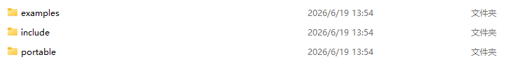
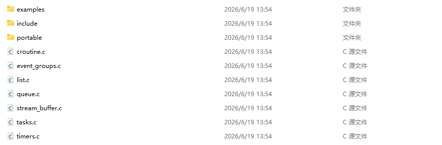
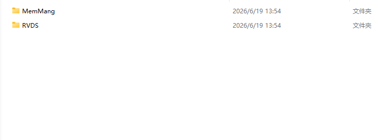
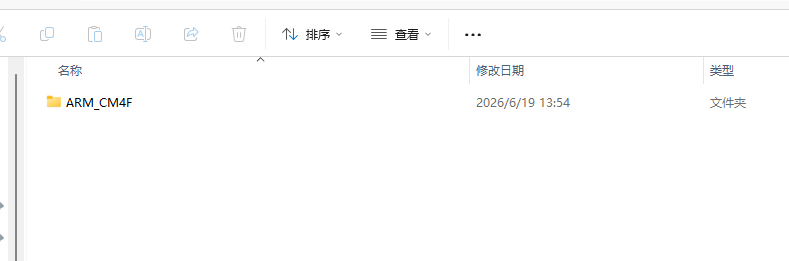
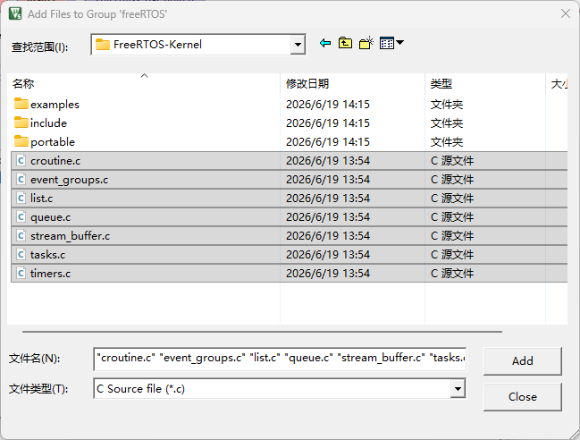
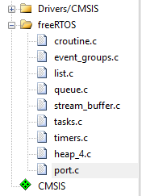
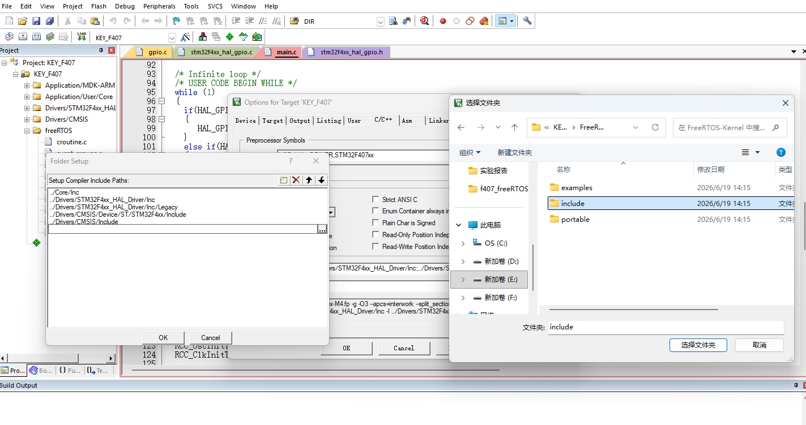
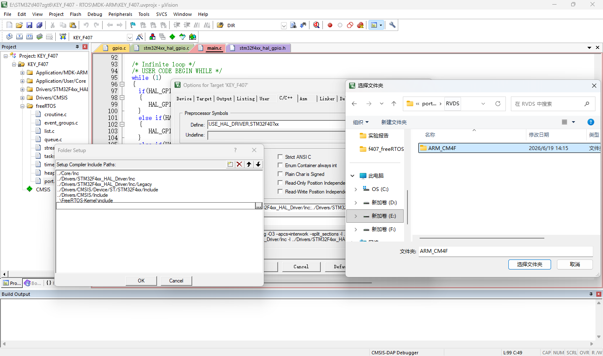
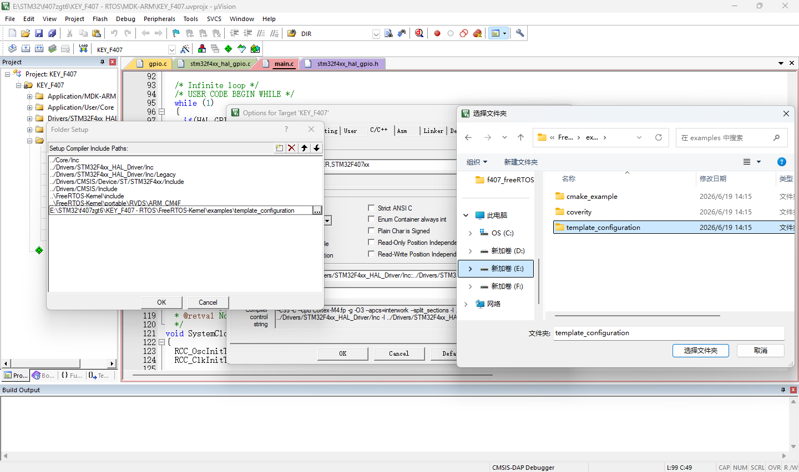
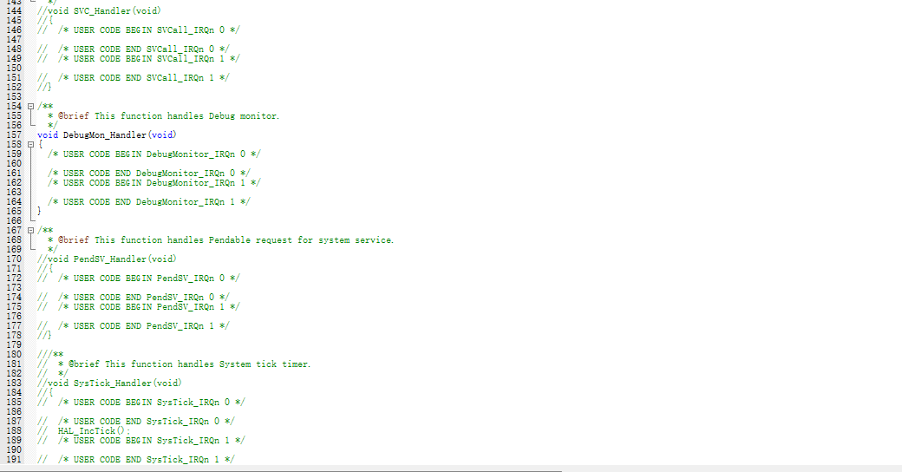

# FREERTOS移植步骤
## 获取FreeRTOS源码
源码获取：FreeRTOS官网：https://www.freertos.org/

## FreeRTOS手把手移植
解压源码后到路径"FreeRTOSv202604.00-LTS\FreeRTOS-LTS\FreeRTOS\FreeRTOS-Kernel"




| **目录名称**| **功能作用** |
| ----------- | ----------- |
| example     | FreeRTOSConfig配置例程|
| include	 | 头文件，包含使用即可|
| portable| 不同环境下选择的内核不同|


<font color=red>**删除其余文件，保留需要用到的.c文件**</font>




进入portable文件夹只保留MemMang文件和RVDS文件，其余文件全部删掉


当精简完只有MemMang文件和RVDS文件的时候，我们先进入MemMang文件，这里是内存管理内核部分，常用的是heap4文件，如果需要切换 直接保留需要的即可，这里我们只用heap4


随后我们来到RVDS文件，这里的文件对应不同的内核，这里我们选用的是STM32F407ZGT6单片机，内核架构是Cortex-M4，带浮点数版本，所以选择ARM_CM4F ，如果是STM32F103，选择M3即可


打开keil，确保你的工程文件能够正常编译，并且把FreeRTOS-Kernel文件放到keil工程目录下

移植部分内核文件



接下来移植RVDS文件和MemMang文件，因为之前已经做过裁剪，所以直接选择即可。MemMang文件中的heap_4.c 和 RVDS\ARM_CM4F文件中的port.c

**最后一共有9个.c文件**



<font color=red>**包含.h文件**</font>



随后我们在包含portable\RVDS\ARM_CM4F路径中的文件



最后我们把examples\template_configuration文件中的FreeRTOSConfig.h包含进来



FreeRTOSConfig.h文件替换，打开FreeRTOSConfig.h文件，直接把如下的代码对该文件进行替换即可，博主已经对文件进行了修改。
```
#ifndef FREERTOS_CONFIG_H
#define FREERTOS_CONFIG_H
 
/* 头文件 */
#include "stm32f4xx.h"
#include <stdint.h>
#include <stdio.h>
#include <stdbool.h>
 
extern uint32_t SystemCoreClock;
 
/* 基础配置项 */
#define configUSE_PREEMPTION                            1                       /* 1: 抢占式调度器, 0: 协程式调度器, 无默认需定义 */
#define configUSE_PORT_OPTIMISED_TASK_SELECTION         1                       /* 1: 使用硬件计算下一个要运行的任务, 0: 使用软件算法计算下一个要运行的任务, 默认: 0 */
#define configUSE_TICKLESS_IDLE                         0                       /* 1: 使能tickless低功耗模式, 默认: 0 */
#define configCPU_CLOCK_HZ                              SystemCoreClock         /* 定义CPU主频, 单位: Hz, 无默认需定义 */
//#define configSYSTICK_CLOCK_HZ                          (configCPU_CLOCK_HZ / 8)/* 定义SysTick时钟频率，当SysTick时钟频率与内核时钟频率不同时才可以定义, 单位: Hz, 默认: 不定义 */
#define configTICK_RATE_HZ                              1000                    /* 定义系统时钟节拍频率, 单位: Hz, 无默认需定义 */
#define configMAX_PRIORITIES                            10                      /* 定义最大优先级数, 最大优先级=configMAX_PRIORITIES-1, 无默认需定义 */
#define configMINIMAL_STACK_SIZE                        128                     /* 定义空闲任务的栈空间大小, 单位: Word, 无默认需定义 */
#define configMAX_TASK_NAME_LEN                         16                      /* 定义任务名最大字符数, 默认: 16 */
#define configUSE_16_BIT_TICKS                          0                       /* 1: 定义系统时钟节拍计数器的数据类型为16位无符号数, 无默认需定义 */
#define configIDLE_SHOULD_YIELD                         1                       /* 1: 使能在抢占式调度下,同优先级的任务能抢占空闲任务, 默认: 1 */
#define configUSE_TASK_NOTIFICATIONS                    1                       /* 1: 使能任务间直接的消息传递,包括信号量、事件标志组和消息邮箱, 默认: 1 */
#define configTASK_NOTIFICATION_ARRAY_ENTRIES           1                       /* 定义任务通知数组的大小, 默认: 1 */
#define configUSE_MUTEXES                               1                       /* 1: 使能互斥信号量, 默认: 0 */
#define configUSE_RECURSIVE_MUTEXES                     1                       /* 1: 使能递归互斥信号量, 默认: 0 */
#define configUSE_COUNTING_SEMAPHORES                   1                       /* 1: 使能计数信号量, 默认: 0 */
#define configUSE_ALTERNATIVE_API                       0                       /* 已弃用!!! */
#define configQUEUE_REGISTRY_SIZE                       8                       /* 定义可以注册的信号量和消息队列的个数, 默认: 0 */
#define configUSE_QUEUE_SETS                            1                       /* 1: 使能队列集, 默认: 0 */
#define configUSE_TIME_SLICING                          1                       /* 1: 使能时间片调度, 默认: 1 */
#define configUSE_NEWLIB_REENTRANT                      0                       /* 1: 任务创建时分配Newlib的重入结构体, 默认: 0 */  
#define configENABLE_BACKWARD_COMPATIBILITY             0                       /* 1: 使能兼容老版本, 默认: 1 */
#define configNUM_THREAD_LOCAL_STORAGE_POINTERS         0                       /* 定义线程本地存储指针的个数, 默认: 0 */
#define configSTACK_DEPTH_TYPE                          uint16_t                /* 定义任务堆栈深度的数据类型, 默认: uint16_t */
#define configMESSAGE_BUFFER_LENGTH_TYPE                size_t                  /* 定义消息缓冲区中消息长度的数据类型, 默认: size_t */
 
/* 内存分配相关定义 */
#define configSUPPORT_STATIC_ALLOCATION                 0                       /* 1: 支持静态申请内存, 默认: 0 */
#define configSUPPORT_DYNAMIC_ALLOCATION                1                       /* 1: 支持动态申请内存, 默认: 1 */
#define configTOTAL_HEAP_SIZE                           ((size_t)(30 * 1024))   /* FreeRTOS堆中可用的RAM总量, 单位: Byte, 无默认需定义 */
#define configAPPLICATION_ALLOCATED_HEAP                0                       /* 1: 用户手动分配FreeRTOS内存堆(ucHeap), 默认: 0 */
#define configSTACK_ALLOCATION_FROM_SEPARATE_HEAP       0                       /* 1: 用户自行实现任务创建时使用的内存申请与释放函数, 默认: 0 */
 
/* 钩子函数相关定义 */
#define configUSE_IDLE_HOOK                             0                       /* 1: 使能空闲任务钩子函数, 无默认需定义  */
#define configUSE_TICK_HOOK                             0                       /* 1: 使能系统时钟节拍中断钩子函数, 无默认需定义 */
#define configCHECK_FOR_STACK_OVERFLOW                  0                       /* 1: 使能栈溢出检测方法1, 2: 使能栈溢出检测方法2, 默认: 0 */
#define configUSE_MALLOC_FAILED_HOOK                    0                       /* 1: 使能动态内存申请失败钩子函数, 默认: 0 */
#define configUSE_DAEMON_TASK_STARTUP_HOOK              0                       /* 1: 使能定时器服务任务首次执行前的钩子函数, 默认: 0 */
 
/* 运行时间和任务状态统计相关定义 */
#define configGENERATE_RUN_TIME_STATS                   0                       /* 1: 使能任务运行时间统计功能, 默认: 0 */
#if configGENERATE_RUN_TIME_STATS
#include "./BSP/TIMER/btim.h"
#define portCONFIGURE_TIMER_FOR_RUN_TIME_STATS()        ConfigureTimeForRunTimeStats()
extern uint32_t FreeRTOSRunTimeTicks;
#define portGET_RUN_TIME_COUNTER_VALUE()                FreeRTOSRunTimeTicks
#endif
#define configUSE_TRACE_FACILITY                        1                       /* 1: 使能可视化跟踪调试, 默认: 0 */
#define configUSE_STATS_FORMATTING_FUNCTIONS            1                       /* 1: configUSE_TRACE_FACILITY为1时，会编译vTaskList()和vTaskGetRunTimeStats()函数, 默认: 0 */
 
/* 协程相关定义 */
#define configUSE_CO_ROUTINES                           0                       /* 1: 启用协程, 默认: 0 */
#define configMAX_CO_ROUTINE_PRIORITIES                 2                       /* 定义协程的最大优先级, 最大优先级=configMAX_CO_ROUTINE_PRIORITIES-1, 无默认configUSE_CO_ROUTINES为1时需定义 */
 
/* 软件定时器相关定义 */
#define configUSE_TIMERS                                1                               /* 1: 使能软件定时器, 默认: 0 */
#define configTIMER_TASK_PRIORITY                       ( configMAX_PRIORITIES - 1 )    /* 定义软件定时器任务的优先级, 无默认configUSE_TIMERS为1时需定义 */
#define configTIMER_QUEUE_LENGTH                        5                               /* 定义软件定时器命令队列的长度, 无默认configUSE_TIMERS为1时需定义 */
#define configTIMER_TASK_STACK_DEPTH                    ( configMINIMAL_STACK_SIZE * 2) /* 定义软件定时器任务的栈空间大小, 无默认configUSE_TIMERS为1时需定义 */
 
/* 可选函数, 1: 使能 */
#define INCLUDE_vTaskPrioritySet                        1                       /* 设置任务优先级 */
#define INCLUDE_uxTaskPriorityGet                       1                       /* 获取任务优先级 */
#define INCLUDE_vTaskDelete                             1                       /* 删除任务 */
#define INCLUDE_vTaskSuspend                            1                       /* 挂起任务 */
#define INCLUDE_xResumeFromISR                          1                       /* 恢复在中断中挂起的任务 */
#define INCLUDE_vTaskDelayUntil                         1                       /* 任务绝对延时 */
#define INCLUDE_vTaskDelay                              1                       /* 任务延时 */
#define INCLUDE_xTaskGetSchedulerState                  1                       /* 获取任务调度器状态 */
#define INCLUDE_xTaskGetCurrentTaskHandle               1                       /* 获取当前任务的任务句柄 */
#define INCLUDE_uxTaskGetStackHighWaterMark             1                       /* 获取任务堆栈历史剩余最小值 */
#define INCLUDE_xTaskGetIdleTaskHandle                  1                       /* 获取空闲任务的任务句柄 */
#define INCLUDE_eTaskGetState                           1                       /* 获取任务状态 */
#define INCLUDE_xEventGroupSetBitFromISR                1                       /* 在中断中设置事件标志位 */
#define INCLUDE_xTimerPendFunctionCall                  1                       /* 将函数的执行挂到定时器服务任务 */
#define INCLUDE_xTaskAbortDelay                         1                       /* 中断任务延时 */
#define INCLUDE_xTaskGetHandle                          1                       /* 通过任务名获取任务句柄 */
#define INCLUDE_xTaskResumeFromISR                      1                       /* 恢复在中断中挂起的任务 */
 
/* 中断嵌套行为配置 */
#ifdef __NVIC_PRIO_BITS
    #define configPRIO_BITS __NVIC_PRIO_BITS
#else
    #define configPRIO_BITS 4
#endif
 
#define configLIBRARY_LOWEST_INTERRUPT_PRIORITY         15                  /* 中断最低优先级 */
#define configLIBRARY_MAX_SYSCALL_INTERRUPT_PRIORITY    5                   /* FreeRTOS可管理的最高中断优先级 */
#define configKERNEL_INTERRUPT_PRIORITY                 ( configLIBRARY_LOWEST_INTERRUPT_PRIORITY << (8 - configPRIO_BITS) )
#define configMAX_SYSCALL_INTERRUPT_PRIORITY            ( configLIBRARY_MAX_SYSCALL_INTERRUPT_PRIORITY << (8 - configPRIO_BITS) )
#define configMAX_API_CALL_INTERRUPT_PRIORITY           configMAX_SYSCALL_INTERRUPT_PRIORITY
 
/* FreeRTOS中断服务函数相关定义 */
#define xPortPendSVHandler PendSV_Handler
#define vPortSVCHandler SVC_Handler
#define xPortSysTickHandler SysTick_Handler
 
 
/* 断言 */
#define vAssertCalled(char, int) printf("Error: %s, %d\r\n", char, int)
#define configASSERT( x ) if( ( x ) == 0 ) vAssertCalled( __FILE__, __LINE__ )
 
 
#endif /* FREERTOS_CONFIG_H */
```

 替换后编译效果，会提示有三个报错，我们需要进入stm32f4xx_it.c文件，将SVC_Handler 、 PendSV_Handler 、 SysTick_Handler中断服务函数注释掉（删除也可以），这是因为RTOS切换过程中，需要用到这三个中断服务函数，在port文件中对三个函数进行了改写，如想了解更多，请查看博主主页



编译没问题就成功了
## 系统配置文件说明


## 内核源文件（.c）与头文件（.h）说明

### .c 源文件

FreeRTOS 内核由多个功能独立的源文件组成，移植时可根据需要裁剪：

| 源文件 | 作用 | 是否必须 |
| ------ | ---- | -------- |
| `tasks.c` | **任务管理核心**。实现任务的创建、删除、挂起、恢复、延时、优先级修改等所有任务相关 API。是 FreeRTOS 最核心的文件，包含了调度器的核心逻辑 | **必须** |
| `list.c` | **链表数据结构**。实现双向循环链表，是 FreeRTOS 内部最基础的数据结构。就绪列表（`pxReadyTasksLists`）、阻塞列表（`pxDelayedTaskList`）、挂起列表（`xSuspendedTaskList`）均由链表实现 | **必须** |
| `queue.c` | **队列与信号量**。实现队列、互斥信号量、计数信号量、递归互斥信号量、队列集。队列是 FreeRTOS 任务间通信的核心机制，信号量本质也是一种特殊的队列 | **必须** |
| `timers.c` | **软件定时器**。实现 `xTimerCreate()` 等软件定时器 API，需要 `configUSE_TIMERS = 1`。定时器回调在独立的"定时器服务任务"中执行 | 可选 |
| `event_groups.c` | **事件标志组**。实现 `xEventGroupCreate()` 等 API，用于任务等待多个事件位的组合条件（AND/OR）。适合多事件同步场景 | 可选 |
| `stream_buffer.c` | **流缓冲区**。实现 `xStreamBufferCreate()` / `xMessageBufferCreate()` 等 API，提供 FIFO 字节流传输。适合传感器数据流等场景 | 可选 |
| `croutine.c` | **协程**。实现协程式任务调度，已被官方弃用，不建议在新项目中使用 | 可选（不推荐） |
| `port.c` | **硬件移植层**。实现与具体 CPU 架构相关的底层代码：任务上下文切换（`PendSV_Handler`）、启动首个任务（`SVC_Handler`）、系统节拍中断（`SysTick_Handler`）、临界区保护等。需根据芯片内核选择对应版本（如 ARM_CM4F） | **必须** |
| `heap_4.c` | **内存管理方案 4**。实现 `pvPortMalloc()` 和 `vPortFree()`，采用首次适应算法 + 相邻空闲块合并，是动态内存分配时最常用的方案。FreeRTOS 提供 5 种内存管理方案（heap_1 ~ heap_5），可根据场景选择 | **必须**（动态分配时） |

> **移植时共 9 个 .c 文件**（基于 STM32F407 + Cortex-M4F），其中 tasks.c、list.c、queue.c、port.c、heap_4.c 为必须保留的核心文件。

---

### 5 种内存管理方案对比

| 方案 | 特点 | 适用场景 |
| ---- | ---- | -------- |
| `heap_1.c` | 只分配不释放，实现最简单，内存使用确定 | 应用只创建任务、从不删除 |
| `heap_2.c` | 支持释放但不合并相邻空闲块，可能存在碎片 | 已被 heap_4 取代，不推荐 |
| `heap_3.c` | 封装标准 `malloc()`/`free()`（线程安全包装） | 需要系统自带的 malloc |
| `heap_4.c` | **最常用**。支持释放 + 相邻空闲块合并，抗碎片能力好 | 通用场景，大部分项目首选 |
| `heap_5.c` | 在 heap_4 基础上支持跨多个不连续内存区域分配 | 系统有多块分散的 RAM |

---

### .h 头文件

FreeRTOS 头文件分为三类：**内核公共头文件**、**移植层头文件**、**用户配置头文件**。

| 头文件路径 | 包含的关键 .h 文件 | 作用 |
| ---------- | ----------------- | ---- |
| `include/` | `FreeRTOS.h`、`task.h`、`queue.h`、`semphr.h`、`timers.h`、`event_groups.h`、`stream_buffer.h`、`message_buffer.h` | **内核 API 声明**。使用 FreeRTOS 的入口，包含各功能模块的函数原型、结构体定义和宏定义 |
| `portable/RVDS/ARM_CM4F/` | `portmacro.h` | **移植层类型定义**。定义与硬件相关的数据类型（`TickType_t`、`BaseType_t` 等）、中断临界区宏（`portENTER_CRITICAL()`、`portEXIT_CRITICAL()`）、堆栈增长方向等 |
| 工程目录下 | `FreeRTOSConfig.h` | **用户配置文件**。用户自行维护，通过宏定义裁剪和配置 FreeRTOS 功能，详见上节 |

### 各公共头文件功能速查

| 头文件 | 主要作用 |
| ------ | -------- |
| `FreeRTOS.h` | 总入口头文件，包含基础类型定义和全局配置宏映射 |
| `task.h` | 任务管理 API 声明：`xTaskCreate()`、`vTaskDelay()`、`vTaskSuspend()` 等 |
| `queue.h` | 队列 API 声明：`xQueueCreate()`、`xQueueSend()`、`xQueueReceive()` 等 |
| `semphr.h` | 信号量 API 声明：`xSemaphoreCreateBinary()`、`xSemaphoreTake()`、`xSemaphoreGive()` 等。注意：信号量底层基于队列实现 |
| `timers.h` | 软件定时器 API 声明：`xTimerCreate()`、`xTimerStart()`、`xTimerStop()` 等 |
| `event_groups.h` | 事件标志组 API 声明：`xEventGroupCreate()`、`xEventGroupSetBits()`、`xEventGroupWaitBits()` 等 |
| `stream_buffer.h` | 流缓冲区 API 声明：`xStreamBufferCreate()`、`xStreamBufferSend()`、`xStreamBufferReceive()` 等 |
| `message_buffer.h` | 消息缓冲区 API 声明（基于流缓冲区的变种，适合变长消息传输） |

> **使用方式**：在用户代码中只需 `#include "FreeRTOS.h"` 和 `#include "task.h"` 即可使用任务相关 API，需要队列/信号量时再包含 `queue.h` / `semphr.h`。

