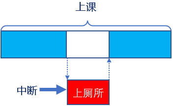
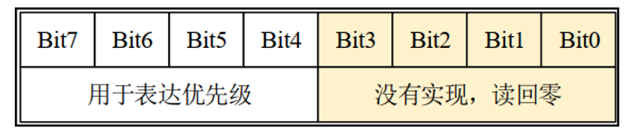
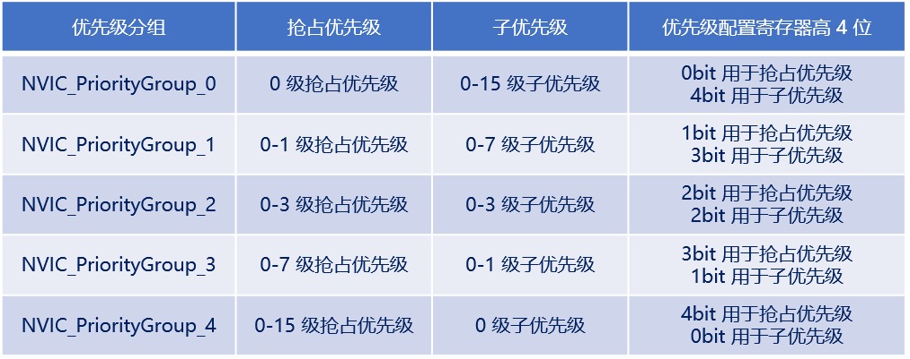
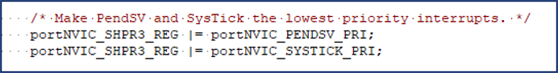
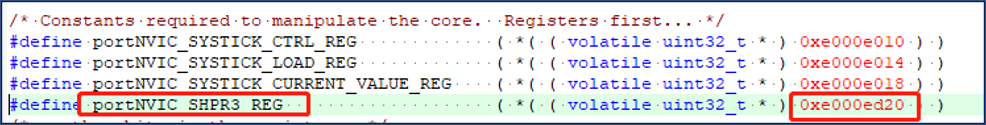
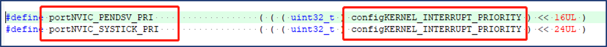
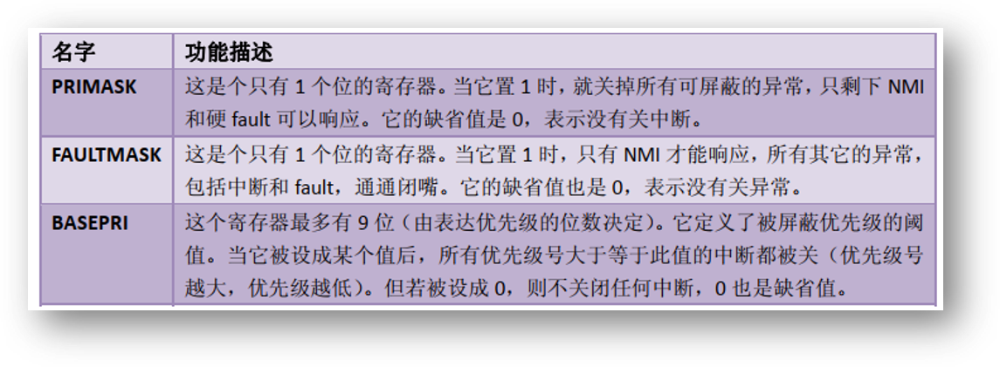
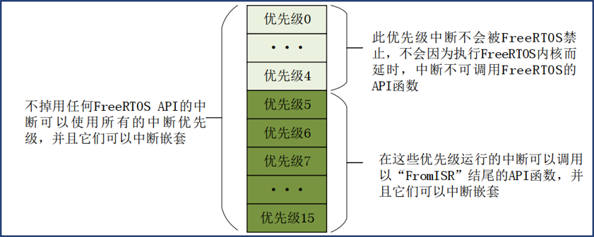

# FreeRTOS中断管理
## 什么是中断？（了解）
简介：让CPU打断正常运行的程序，转而去处理紧急的事件（程序），就叫中断



中断执行机制，可简单概括为三步：

| 步骤 | 流程说明 |
| ---- | ---- |
| 1、中断请求 | 外设产生中断请求（GPIO外部中断、定时器中断等） |
| 2、响应中断 | CPU停止执行当前程序，转而去执行中断处理程序（ISR） |
| 3、退出中断 | 执行完毕，返回被打断的程序处，继续往下执行 |

## 中断优先级分组设置（熟悉）

ARM Cortex-M 使用了 8 位宽的寄存器来配置中断的优先等级，这个寄存器就是中断优先级配置寄存器,但STM32，只用了中断优先级配置寄存器的高4位 [7 : 4]，所以STM32提供了最大16级的中断优先等级



STM32 的中断优先级可以分为抢占优先级和子优先级 
**抢占优先级**：抢占优先级高的中断可以打断正在执行但抢占优先级低的中断 
**子优先级**：当同时发生具有相同抢占优先级的两个中断时，子优先级数值小的优先执行,
<font color=red>**中断优先级数值越小越优先**</font>
## 中断相关寄存器（熟悉）

一共有 5 种分配方式，对应着中断优先级分组的 5 个组 



通过调用函数HAL_NVIC_SetPriorityGrouping(NVIC_PRIORITYGROUP_4）即可完成设置

**特点：**
1. 低于configMAX_SYSCALL_INTERRUPT_PRIORITY优先级的中断里才允许调用FreeRTOS 的API函数
2. 建议将所有优先级位指定为抢占优先级位，方便FreeRTOS管理
3. 中断优先级数值越小越优先，任务优先级数值越大越优先

### FreeRTOS如何配置PendSV和Systick中断优先级？








<font color=red>**所以：PendSV和SysTick设置最低优先级，设置最低：保证系统任务切换不会阻塞系统其他中断的响应**</font>

### 中断相关寄存器（熟悉）

三个中断屏蔽寄存器，分别为 PRIMASK、 FAULTMASK 和BASEPRI 



FreeRTOS所使用的中断管理就是利用的BASEPRI这个寄存器
BASEPRI：屏蔽优先级低于某一个阈值的中断
比如： BASEPRI设置为0x50，代表中断优先级在5~15内的均被屏蔽，0~4的中断优先级正常执行

**BASEPRI：屏蔽优先级低于某一个阈值的中断，当设置为0时，则不关闭任何中断**
当BASEPRI设置为0x50时：



**在中断服务函数中调度FreeRTOS的API函数需注意：**
1. 中断服务函数的优先级需在FreeRTOS所管理的范围内
2. 在中断服务函数里边需调用FreeRTOS的API函数，必须使用带"FromISR"后缀的函数

## FreeRTOS中断管理实验（掌握）
1. 实验目的：学会使用FreeRTOS的中断管理！
本实验会使用两个定时器，一个优先级为4，一个优先级为6，注意：系统所管理的优先级范围：5~15，
现象：两个定时器每1s，打印一段字符串，当关中断时，停止打印，开中断时持续打印。
2.  2、实验设计：将设计2个任务：start_task、task1

| 任务名称 | 功能说明 |
| ---- | ---- |
| `start_task` | 用来创建task1任务 |
| `task1` | 中断测试任务，任务中将调用关中断和开中断函数来体现对中断的管理作用 |

**代码**
```
#include "main.h"          // HAL库主头文件
#include "cmsis_os.h"      // CMSIS-RTOS 封装层头文件
#include "tim.h"           // 定时器驱动头文件（TIM2、TIM3）
#include "usart.h"         // 串口驱动头文件（用于printf输出）
#include "gpio.h"          // GPIO驱动头文件

#include <stdio.h>         // 标准输入输出库（printf需要）
#include "freertos.h"      // FreeRTOS 核心头文件
#include "delay.h"         // 延时函数库（提供 delay_ms 毫秒级延时）

        void freertos_demo(void);            // FreeRTOS 演示入口函数声明

/* USER CODE BEGIN PD */
// ==================== start_task 任务配置 ====================
#define START_TASK_PRIO 1                    // 任务优先级（最低）
#define START_TASK_STACK_SIZE 128            // 任务栈大小（单位：字）
TaskHandle_t start_task_handler;             // 任务句柄
void start_task( void * pvParameters );      // 任务函数声明

// ==================== task1 任务配置（中断管理测试） ====================
#define TASK1_PRIO 2                         // 任务优先级
#define TASK1_STACK_SIZE 128                 // 任务栈大小
TaskHandle_t task1_handler;                  // 任务句柄
void task1( void * pvParameters );           // 任务函数声明

// ==================== 系统初始化函数声明 ====================
void SystemClock_Config(void);               // 系统时钟配置（由CubeMX生成）
void MX_FREERTOS_Init(void);                 // FreeRTOS初始化（由CubeMX生成）

// ==================== 主函数 ====================
int main(void)
{
  HAL_Init();                    // HAL库初始化
  delay_init(180);               // 延时函数初始化（参数为系统主频，单位MHz）
  SystemClock_Config();          // 配置系统时钟
  MX_GPIO_Init();                // 初始化GPIO
  MX_USART1_UART_Init();         // 初始化串口1（用于printf输出）
  MX_TIM2_Init();                // 初始化定时器2（用于产生周期性中断）
  MX_TIM3_Init();                // 初始化定时器3（用于产生周期性中断）
  HAL_TIM_Base_Start_IT(&htim3); // 启动定时器3的中断模式（每1s触发一次中断）
  HAL_TIM_Base_Start_IT(&htim2); // 启动定时器2的中断模式（每1s触发一次中断）
  freertos_demo();               // 创建任务并启动FreeRTOS调度器
  while (1)                      // 正常情况下不会执行到这里
  {

    /* USER CODE END WHILE */

    /* USER CODE BEGIN 3 */
  }
  /* USER CODE END 3 */
}

/* USER CODE BEGIN 4 */
// ==================== FreeRTOS 演示入口函数 ====================
void freertos_demo(void)
{
     // 使用动态方式创建 start_task 任务
     xTaskCreate((TaskFunction_t       ) start_task,
                                (char *                ) "start_task",
                                (configSTACK_DEPTH_TYPE) START_TASK_STACK_SIZE,
                                (void *                ) NULL,
                                (UBaseType_t           ) START_TASK_PRIO,
                                (TaskHandle_t *        ) &start_task_handler );

                                vTaskStartScheduler(); // 启动任务调度器

}

// ==================== start_task 任务函数 ====================
// 功能：在临界区内创建 task1，完成后删除自身
void start_task( void * pvParameters )
{
     taskENTER_CRITICAL();  // 进入临界区——禁止任务调度，确保 task1 创建完毕后才被调度

     // 动态创建 task1 —— 中断管理测试任务
     xTaskCreate((TaskFunction_t       ) task1,
                                (char *                ) "task1",
                                (configSTACK_DEPTH_TYPE) TASK1_STACK_SIZE,
                                (void *                ) NULL,
                                (UBaseType_t           ) TASK1_PRIO,
                                (TaskHandle_t *        ) &task1_handler );

     taskEXIT_CRITICAL();   // 退出临界区

   vTaskDelete(NULL);       // 删除自身（start_task 已完成使命）

}

// ==================== task1 任务函数（中断管理测试） ====================
// 功能：每1s打印一次心跳，每5s执行一次关中断→延时5s→开中断的操作
//       关中断期间，定时器中断被屏蔽，串口停止打印"4 working"和"5 working"
//       开中断后，中断恢复正常，串口继续打印
void task1( void * pvParameters )
{
     uint8_t task1_num = 0;              // 计数器变量，用于每5次循环触发一次关/开中断操作
     while(1)
     {

             if(++task1_num == 5)        // 每5次循环（即每5秒）执行一次关/开中断
             {
                  printf("guan \r\n");   // 串口提示：即将关闭中断
                  portDISABLE_INTERRUPTS(); // 关中断——通过操作 BASEPRI 寄存器
                                            // 屏蔽优先级 5~15 的中断（FreeRTOS 管理范围）
                                            // 注意：优先级 0~4 的中断不受影响！
                  //HAL_Delay(5000);      // HAL_Delay 使用 SysTick，关中断后 SysTick 不工作
                                            // 因此 HAL_Delay 会死等！必须使用软件延时替代
                  delay_ms(5000);         // 软件延时5000ms（不使用SysTick，不依赖中断）
                                            // 在这5秒内，定时器中断被屏蔽，串口停止打印
                  printf("kai\r\n");      // 串口提示：即将开启中断
                  portENABLE_INTERRUPTS();  // 开中断——将 BASEPRI 恢复为 0
                                            // 所有被屏蔽的中断恢复正常，定时器继续触发
                  task1_num = 0 ;         // 计数器清零，重新开始计数
             }
              vTaskDelay(1000);           // 阻塞延时1000个tick（即1秒）
     }
}
// ==================== 定时器中断回调函数 ====================
// 功能：定时器2和定时器3的中断服务回调（由 HAL_TIM_IRQHandler 调用）
//       定时器3每1s打印 "5 working"，定时器2每1s打印 "4 working"
//       当 task1 调用 portDISABLE_INTERRUPTS() 后，这两个打印会停止
//       TIM6 用于 HAL 库的系统节拍（SysTick 的替代），不受关中断影响
void HAL_TIM_PeriodElapsedCallback(TIM_HandleTypeDef *htim)
{
  /* USER CODE BEGIN Callback 0 */
        // 定时器3中断：打印 "5 working"
        // 注意：TIM3 的中断优先级为 6（在 FreeRTOS 管理范围 5~15 内）
        //       因此 portDISABLE_INTERRUPTS() 时此中断会被屏蔽
        if (htim->Instance == TIM3)
      {
        printf("5 working!!!!!\r\n");
      }
        // 定时器2中断：打印 "4 working"
        // 注意：TIM2 的中断优先级为 4（不在 FreeRTOS 管理范围 5~15 内）
        //       因此 portDISABLE_INTERRUPTS() 时此中断不会被屏蔽！依然正常触发
        if (htim->Instance == TIM2)
      {
        printf("4 working!!!!!\r\n");
      }
  /* USER CODE END Callback 0 */
  // 定时器6中断：HAL 库的系统节拍（替代 SysTick，用于 HAL_Delay 等）
  // TIM6 的优先级通常最高，不受 BASEPRI 屏蔽影响
  if (htim->Instance == TIM6)
  {
    HAL_IncTick();           // 增加 HAL 的节拍计数器
  }
}

```
