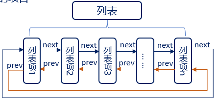
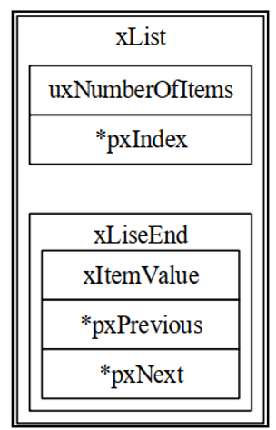
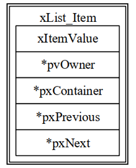
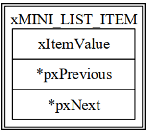
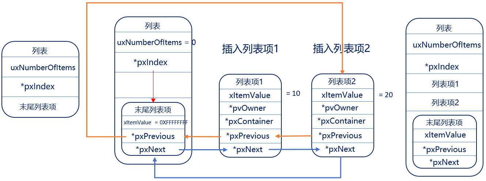
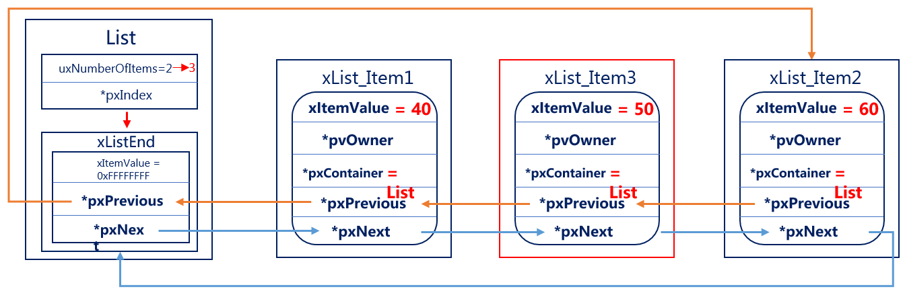
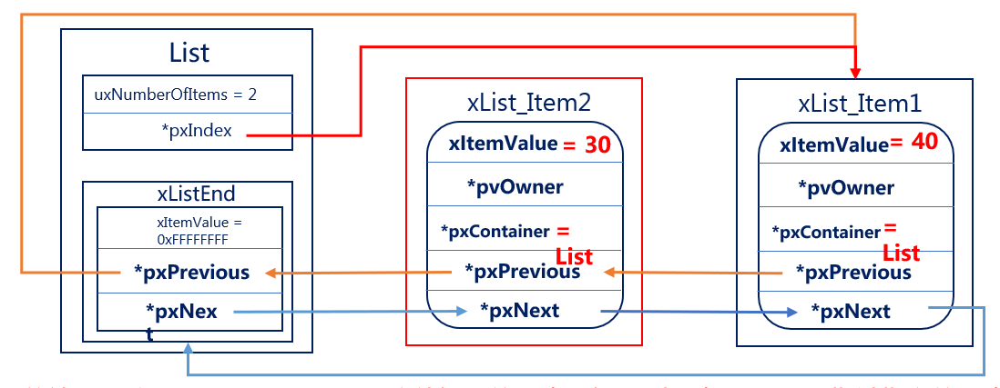

# FreeRTOS的列表和列表项
## 列表和列表项的简介（熟悉）

列表是 FreeRTOS 中的一个数据结构，概念上和链表有点类似，列表被用来跟踪 FreeRTOS中的任务



1. 列表相当于链表，列表项相当于节点，FreeRTOS 中的列表是一个双向环形链表 
2. 列表的特点：列表项间的地址非连续的，是人为的连接到一起的。列表项的数目是由后期添加的个数决定的，随时可以改变

3. 数组的特点：数组成员地址是连续的，数组在最初确定了成员数量后期无法改变

**在OS中任务的数量是不确定的，并且任务状态是会发生改变的，所以非常适用列表(链表)这种数据结构**

有关于列表的东西均在文件 list.c 和 list.h 中，首先我们先看下在list.h中的，列表相关结构体：

```
typedef struct xLIST
 {
        listFIRST_LIST_INTEGRITY_CHECK_VALUE	  /* 校验值 */
        volatile UBaseType_t uxNumberOfItems;	  /* 列表中的列表项数量 */
        ListItem_t * configLIST_VOLATILE pxIndex  /* 用于遍历列表项的指针 */
        MiniListItem_t xListEnd					  /* 末尾列表项 */
        listSECOND_LIST_INTEGRITY_CHECK_VALUE     /* 校验值 */
 } List_t;
 
```

<font color=red>**列表结构示意图:**</font>



1. 在该结构体中， 包含了两个宏，这两个宏是确定的已知常量， FreeRTOS通过检查这两个常量的值，
来判断列表的数据在程序运行过程中，是否遭到破坏 ，该功能一般用于调试， 默认是不开启的 

2. 成员uxNumberOfItems，用于记录列表中列表项的个数（不包含 xListEnd）
3. 成员 pxIndex 用于指向列表中的某个列表项，一般用于遍历列表中的所有列表项 
4. 成员变量 xListEnd 是一个迷你列表项，排在最末尾 

### 列表项

列表项是列表中用于存放数据的地方，在 list.h 文件中，有列表项的相关结构体定义：

```
 struct xLIST_ITEM
 {
        listFIRST_LIST_ITEM_INTEGRITY_CHECK_VALUE			/* 用于检测列表项的数据完整性 */
        configLIST_VOLATILE TickType_t xItemValue			/* 列表项的值 */
        struct xLIST_ITEM * configLIST_VOLATILE pxNext		/* 下一个列表项 */
        struct xLIST_ITEM * configLIST_VOLATILE pxPrevious  /* 上一个列表项 */
        void * pvOwner						                /* 列表项的拥有者 */
        struct xLIST * configLIST_VOLATILE pxContainer;     /* 列表项所在列表 */
        listSECOND_LIST_ITEM_INTEGRITY_CHECK_VALUE			/* 用于检测列表项的数据完整性 */
 };typedef struct xLIST_ITEM ListItem_t; 	
```
<font color=red>**列表项结构示意图:**</font>



1. 成员变量 xItemValue 为列表项的值，这个值多用于按升序对列表中的列表项进行排序 
2. 成员变量 pxNext 和 pxPrevious 分别用于指向列表中列表项的下一个列表项和上一个列表项 
3. 成员变量 pxOwner 用于指向包含列表项的对象（通常是任务控制块） 
4. 成员变量 pxContainer 用于指向列表项所在列表。 

### 迷你列表项

迷你列表项也是列表项，但迷你列表项仅用于标记列表的末尾和挂载其他插入列表中的列表项 

```
struct xMINI_LIST_ITEM
{
    listFIRST_LIST_ITEM_INTEGRITY_CHECK_VALUE 			/* 用于检测数据完整性 */
    configLIST_VOLATILE TickType_t xItemValue;		    /* 列表项的值 */
    struct xLIST_ITEM * configLIST_VOLATILE pxNext;		/* 上一个列表项 */
    struct xLIST_ITEM * configLIST_VOLATILE pxPrevious; /* 下一个列表项 */
};
typedef struct xMINI_LIST_ITEM MiniListItem_t;

```

<font color=red>**迷你列表项结构示意图:**</font>



1. 成员变量 xItemValue 为列表项的值，这个值多用于按升序对列表中的列表项进行排序 
2. 成员变量 pxNext 和 pxPrevious 分别用于指向列表中列表项的下一个列表项和上一个列表项 
3. 迷你列表项只用于标记列表的末尾和挂载其他插入列表中的列表项，因此不需要成员变量 pxOwner 和 pxContainer，以节省内存开销

### 列表和列表项的关系



## 列表相关API函数介绍（掌握）

| 函数 | 描述 |
| ---- | ---- |
| `vListInitialise()` | 初始化列表 |
| `vListInitialiseItem()` | 初始化列表项 |
| `vListInsertEnd()` | 列表末尾插入列表项 |
| `vListInsert()` | 列表插入列表项 |
| `uxListRemove()` | 列表移除列表项 |


### 初始化列表vListInitialise（）

```
void vListInitialise(List_t * const pxList){	
    pxList->pxIndex = ( ListItem_t * ) &( pxList->xListEnd );
    pxList->xListEnd.xItemValue = portMAX_DELAY;
	pxList->xListEnd.pxNext = ( ListItem_t * ) &( pxList->xListEnd );	
	pxList->xListEnd.pxPrevious = ( ListItem_t * ) &( pxList->xListEnd );	
	pxList->uxNumberOfItems = ( UBaseType_t ) 0U;
	listSET_LIST_INTEGRITY_CHECK_1_VALUE( pxList );	listSET_LIST_INTEGRITY_CHECK_2_VALUE( pxList );
}

```

### 函数 vListInitialiseItem() 

```
void vListInitialiseItem( ListItem_t * const pxItem ){
    /* 初始化时，列表项所在列表设为空 */
    pxItem->pxContainer = NULL;
    /* 初始化用于检测列表项数据完整性的校验值 */
    listSET_FIRST_LIST_ITEM_INTEGRITY_CHECK_VALUE( pxItem ); 	              listSET_SECOND_LIST_ITEM_INTEGRITY_CHECK_VALUE( pxItem );
} 
//pxltem 初始化列表项
```

### 函数vListInsert() 

此函数用于将待插入列表的列表项按照列表项值升序进行排序，有序地插入到列表中 

```
void vListInsert  (  List_t * const pxList ,   ListItem_t * const pxNewListItem  )

```

| 形参 | 描述 |
| ---- | ---- |
| `pxList` | 列表 |
| `pxNewListItem` | 待插入列表项 |

```
void vListInsert( List_t * const pxList, ListItem_t * const pxNewListItem ) 
{
    ListItem_t * pxIterator; 
    const TickType_t  xValueOfInsertion  =  pxNewListItem->xItemValue; 	/* 获取列表项的数值依据数值升序排列 */
    listTEST_LIST_INTEGRITY( pxList ); 						/* 检查参数是否正确 */
    listTEST_LIST_ITEM_INTEGRITY( pxNewListItem ); 				/* 如果待插入列表项的值为最大值 */ 
    if( xValueOfInsertion == portMAX_DELAY )
    { 
        pxIterator = pxList->xListEnd.pxPrevious; 				/* 插入的位置为列表 xListEnd 前面 */ 
    } else 
    {
        for(  pxIterator = ( ListItem_t * ) &( pxList->xListEnd ); 			/*遍历列表中的列表项，找到插入的位置*/ 
                 pxIterator->pxNext->xItemValue <= xValueOfInsertion; 
                 pxIterator = pxIterator->pxNext  ) { }
    } 
    pxNewListItem->pxNext = pxIterator->pxNext;					/* 将待插入的列表项插入指定位置 */ 
    pxNewListItem->pxNext->pxPrevious = pxNewListItem; 
    pxNewListItem->pxPrevious = pxIterator; 
    pxIterator->pxNext = pxNewListItem; 
    pxNewListItem->pxContainer = pxList; 						/* 更新待插入列表项所在列表 */ 
    ( pxList->uxNumberOfItems )++;							/* 更新列表中列表项的数量 */ 
}

```



### 函数 vListInsertEnd() 
```
void vListInsertEnd (  List_t * const pxList ,   ListItem_t * const pxNewListItem  )
{
     省略部分非关键代码 … …	
     /* 获取列表 pxIndex 指向的列表项 */	
     ListItem_t * const pxIndex = pxList->pxIndex;

     /* 更新待插入列表项的指针成员变量 */	
     pxNewListItem->pxNext = pxIndex;	
     pxNewListItem->pxPrevious = pxIndex->pxPrevious;

     /* 更新列表中原本列表项的指针成员变量 */
     pxIndex->pxPrevious->pxNext = pxNewListItem;	
     pxIndex->pxPrevious = pxNewListItem;

     /* 更新待插入列表项的所在列表成员变量 */	
     pxNewListItem->pxContainer = pxList;

     /* 更新列表中列表项的数量 */	
    ( pxList->uxNumberOfItems )++;
} 

```

| 形参 | 描述 |
| ---- | ---- |
| `pxList` | 列表 |
| `pxNewListItem` | 待插入列表项 |

此函数用于将待插入列表的列表项插入到列表 pxIndex 指针指向的列表项前面，是一种无序的插入方法 



### 函数 uxListRemove() 

```
UBaseType_t  uxListRemove (   ListItem_t *  const    pxItemToRemove ) 
//此函数用于将列表项从列表项所在列表中移除
```
| 形参 | 描述 |
| ---- | ---- |
| `pxLipxItemToRemove` | 待移除的列表项 |

返回值为整数，待移除列表项移除后，所在列表剩余列表项的数量

```
UBaseType_t uxListRemove( ListItem_t * const pxItemToRemove ) 
{
    List_t * const pxList = pxItemToRemove->pxContainer; 

    /* 从列表中移除列表项 */ 
    pxItemToRemove->pxNext->pxPrevious = pxItemToRemove->pxPrevious;
    pxItemToRemove->pxPrevious->pxNext = pxItemToRemove->pxNext; 	
    /*如果 pxIndex 正指向待移除的列表项 */ 
    if( pxList->pxIndex == pxItemToRemove ) 
    {
        /*pxIndex 指向上一个列表项*/ 
        pxList->pxIndex = pxItemToRemove->pxPrevious;
    } else 
    { 
        mtCOVERAGE_TEST_MARKER(); 
    } 

    /*将待移除的列表项的所在列表指针清空*/ 
    pxItemToRemove->pxContainer = NULL;

    /*更新列表中列表项的数量*/ 
    ( pxList->uxNumberOfItems )--; 

    /*返回移除后的列表中列表项的数量*/ 
    return pxList->uxNumberOfItems; 
}

```
## 列表项的插入和删除实验（掌握）
1. 实验目的：学会对FreeRTOS 列表和列表项的操作函数使用，并观察运行结果和理论分
析是否一致
2. 实验设计：将设计三个任务：start_task、task1、task2

| 任务名称 | 功能说明 |
| ---- | ---- |
| `start_task` | 用来创建其他的2个任务 |
| `task1` | 实现LED0每500ms闪烁一次，用来提示系统正在运行 |
| `task2` | 调用列表和列表项相关API函数，并且通过串口输出相应的信息，进行观察 |

**代码**
```
//列表项的插入和删除
void task2( void * pvParameters )
{
	
     vListInitialise(&TestList);	  /*初始化列表*/
	 vListInitialiseItem(&ListItem1); /* 初始化列表项1 */
	 vListInitialiseItem(&ListItem2); /* 初始化列表项2 */
	 vListInitialiseItem(&ListItem3); /* 初始化列表项3 */
	 ListItem1.xItemValue = 40;       
	 ListItem2.xItemValue = 60;
	 ListItem3.xItemValue = 50;
	
	printf("/**************第二步：打印列表和列表项的地址**************/\r\n");
    printf("项目\t\t\t地址\r\n");
    printf("TestList\t\t0x%p\t\r\n", &TestList);
    printf("TestList->pxIndex\t0x%p\t\r\n", TestList.pxIndex);
    printf("TestList->xListEnd\t0x%p\t\r\n", (&TestList.xListEnd));
    printf("ListItem1\t\t0x%p\t\r\n", &ListItem1);
    printf("ListItem2\t\t0x%p\t\r\n", &ListItem2);
    printf("ListItem3\t\t0x%p\t\r\n", &ListItem3);
    printf("/**************************结束***************************/\r\n");
	
	
	printf("\r\n/*****************第三步：列表项1插入列表******************/\r\n");
    vListInsert((List_t*    )&TestList,         /* 列表 */
                (ListItem_t*)&ListItem1);       /* 列表项 */
    printf("项目\t\t\t\t地址\r\n");
    printf("TestList->xListEnd->pxNext\t0x%p\r\n", (TestList.xListEnd.pxNext));
    printf("ListItem1->pxNext\t\t0x%p\r\n", (ListItem1.pxNext));
    printf("TestList->xListEnd->pxPrevious\t0x%p\r\n", (TestList.xListEnd.pxPrevious));
    printf("ListItem1->pxPrevious\t\t0x%p\r\n", (ListItem1.pxPrevious));
    printf("/**************************结束***************************/\r\n");
		
		/* 第四步：列表项2插入列表 */
    printf("\r\n/*****************第四步：列表项2插入列表******************/\r\n");
    vListInsert((List_t*    )&TestList,         /* 列表 */
                (ListItem_t*)&ListItem2);       /* 列表项 */
    printf("项目\t\t\t\t地址\r\n");
    printf("TestList->xListEnd->pxNext\t0x%p\r\n", (TestList.xListEnd.pxNext));
    printf("ListItem1->pxNext\t\t0x%p\r\n", (ListItem1.pxNext));
    printf("ListItem2->pxNext\t\t0x%p\r\n", (ListItem2.pxNext));
    printf("TestList->xListEnd->pxPrevious\t0x%p\r\n", (TestList.xListEnd.pxPrevious));
    printf("ListItem1->pxPrevious\t\t0x%p\r\n", (ListItem1.pxPrevious));
    printf("ListItem2->pxPrevious\t\t0x%p\r\n", (ListItem2.pxPrevious));
    printf("/**************************结束***************************/\r\n");
		
		/* 第五步：列表项3插入列表 */
    printf("\r\n/*****************第五步：列表项3插入列表******************/\r\n");
    vListInsert((List_t*    )&TestList,         /* 列表 */
                (ListItem_t*)&ListItem3);       /* 列表项 */
    printf("项目\t\t\t\t地址\r\n");
    printf("TestList->xListEnd->pxNext\t0x%p\r\n", (TestList.xListEnd.pxNext));
    printf("ListItem1->pxNext\t\t0x%p\r\n", (ListItem1.pxNext));
    printf("ListItem2->pxNext\t\t0x%p\r\n", (ListItem2.pxNext));
    printf("ListItem3->pxNext\t\t0x%p\r\n", (ListItem3.pxNext));
    printf("TestList->xListEnd->pxPrevious\t0x%p\r\n", (TestList.xListEnd.pxPrevious));
    printf("ListItem1->pxPrevious\t\t0x%p\r\n", (ListItem1.pxPrevious));
    printf("ListItem2->pxPrevious\t\t0x%p\r\n", (ListItem2.pxPrevious));
    printf("ListItem3->pxPrevious\t\t0x%p\r\n", (ListItem3.pxPrevious));
    printf("/**************************结束***************************/\r\n");
		
		/* 第六步：移除列表项2 */
    printf("\r\n/*******************第六步：移除列表项2********************/\r\n");
    uxListRemove((ListItem_t*   )&ListItem2);   /* 移除列表项 */
    printf("项目\t\t\t\t地址\r\n");
    printf("TestList->xListEnd->pxNext\t0x%p\r\n", (TestList.xListEnd.pxNext));
    printf("ListItem1->pxNext\t\t0x%p\r\n", (ListItem1.pxNext));
    printf("ListItem3->pxNext\t\t0x%p\r\n", (ListItem3.pxNext));
    printf("TestList->xListEnd->pxPrevious\t0x%p\r\n", (TestList.xListEnd.pxPrevious));
    printf("ListItem1->pxPrevious\t\t0x%p\r\n", (ListItem1.pxPrevious));
    printf("ListItem3->pxPrevious\t\t0x%p\r\n", (ListItem3.pxPrevious));
    printf("/**************************结束***************************/\r\n");
	
	  /* 第七步：列表末尾添加列表项2 */
    printf("\r\n/****************第七步：列表末尾添加列表项2****************/\r\n");
    TestList.pxIndex = &ListItem1;
    vListInsertEnd((List_t*     )&TestList,     /* 列表 */
                   (ListItem_t* )&ListItem2);   /* 列表项 */
    printf("项目\t\t\t\t地址\r\n");
    printf("TestList->pxIndex\t\t0x%p\r\n", TestList.pxIndex);
    printf("TestList->xListEnd->pxNext\t0x%p\r\n", (TestList.xListEnd.pxNext));
    printf("ListItem1->pxNext\t\t0x%p\r\n", (ListItem1.pxNext));
    printf("ListItem2->pxNext\t\t0x%p\r\n", (ListItem2.pxNext));
    printf("ListItem3->pxNext\t\t0x%p\r\n", (ListItem3.pxNext));
    printf("TestList->xListEnd->pxPrevious\t0x%p\r\n", (TestList.xListEnd.pxPrevious));
    printf("ListItem1->pxPrevious\t\t0x%p\r\n", (ListItem1.pxPrevious));
    printf("ListItem2->pxPrevious\t\t0x%p\r\n", (ListItem2.pxPrevious));
    printf("ListItem3->pxPrevious\t\t0x%p\r\n", (ListItem3.pxPrevious));
    printf("/************************实验结束***************************/\r\n");
	while(1)
	 {	
		  vTaskDelay(1000);
	 }
}

```

