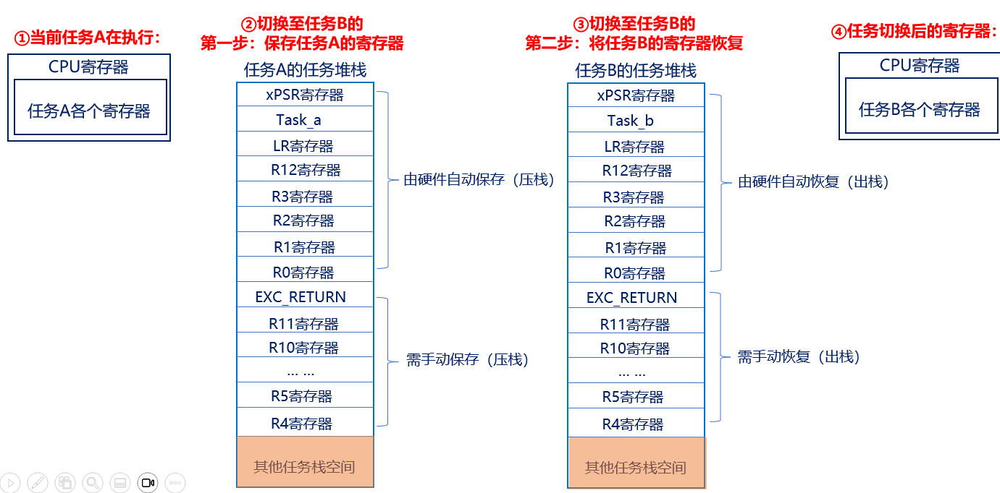

# 任务调度
## 开启任务调度器（熟悉）
### vTaskStartScheduler() 
作用：用于启动任务调度器，任务调度器启动后， FreeRTOS 便会开始进行任务调度 
该函数内部实现，如下：
1. 创建空闲任务
2. 如果使能软件定时器，则创建定时器任务
3. 关闭中断，防止调度器开启之前或过程中，受中断干扰，会在运行第一个任务时打开中断
4. 初始化全局变量，并将任务调度器的运行标志设置为已运行
5. 初始化任务运行时间统计功能的时基定时器 
6. 调用函数 xPortStartScheduler() 
### xPortStartScheduler() 
作用：该函数用于完成启动任务调度器中与硬件架构相关的配置部分，以及启动第一个任务 
该函数内部实现，如下：
1. 检测用户在 FreeRTOSConfig.h 文件中对中断的相关配置是否有误 
2. 配置 PendSV 和 SysTick 的中断优先级为最低优先级
3. 调用函数 vPortSetupTimerInterrupt()配置 SysTick
4. 初始化临界区嵌套计数器为 0 
5. 调用函数 prvEnableVFP()使能 FPU
6. 调用函数 prvStartFirstTask()启动第一个任务
## 启动第一个任务（熟悉）
1. prvStartFirstTask () 	/* 开启第一个任务 */
2. vPortSVCHandler () 	/* SVC中断服务函数 */
假设我们要启动的第一个任务是任务A，那么就需要将任务A的寄存器值恢复到CPU寄存器
任务A的寄存器值，在一开始创建任务时就保存在任务堆栈里边！
1. 中断产生时，硬件自动将xPSR，PC(R15)，LR(R14)，R12，R3-R0出/入栈；而R4~R11需要手动出/入栈
2. 进入中断后硬件会强制使用MSP指针 ，此时LR(R14）的值将会被自动被更新为特殊的EXC_RETURN
### prvStartFirstTask () 
用于初始化启动第一个任务前的环境，主要是重新设置MSP 指针，并使能全局中断
1. 什么是MSP指针？
程序在运行过程中需要一定的栈空间来保存局部变量等一些信息。当有信息保存到栈中时，MCU 会自动更新 SP 指针，ARM Cortex-M 内核提供了两个栈空间

| 堆栈指针 | 使用场景说明 |
| ---- | ---- |
| 主堆栈指针（MSP） | 由OS内核、异常服务例程以及所有需要特权访问的应用程序代码来使用 |
| 进程堆栈指针（PSP） | 用于常规的应用程序代码（不处于异常服务例程中时） |

在FreeRTOS中，中断使用MSP（主堆栈），中断以外使用PSP（进程堆栈）

2. 为什么是 0xE000ED08？ 因为需从 0xE000ED08 获取向量表的偏移，为啥要获得向量表呢？因为向量表的第一个是 MSP 指针！取 MSP 的初始值的思路是先根据向量表的位置寄存器 VTOR(0xE000ED08) 来获取向量表存储的地址；在根据向量表存储的地址，来访问第一个元素，也就是初始的 MSP,CM3 允许向量表重定位——从其它地址处开始定位各异常向量 这个就是向量表偏移量寄存器，向量表的起始地址保存的就是主栈指针MSP 的初始值

### vPortSVCHandler ()   
SVC中断只在启动第一次任务时会调用一次，以后均不调用 
当使能了全局中断，并且手动触发 SVC 中断后，就会进入到 SVC 的中断服务函数中 
1. 通过 pxCurrentTCB 获取优先级最高的就绪态任务的任务栈地址，优先级最高的就绪态任务是系统将要运行的任务 。

2. 通过任务的栈顶指针，将任务栈中的内容出栈到 CPU 寄存器中，任务栈中的内容在调用任务创建函数的时候，已初始化，然后设置 PSP 指针 。

3. 通过往 BASEPRI 寄存器中写 0，允许中断。

4. R14 是链接寄存器 LR，在 ISR 中（此刻我们在 SVC 的 ISR 中），它记录了异常返回值 EXC_RETURN,而EXC_RETURN 只有 6 个合法的值（M4、M7），如下表所示： 

| 描述 | 使用浮点单元 | 未使用浮点单元 |
| ---- | ---- | ---- |
| 中断返回后进入Handler模式，并使用MSP | 0xFFFFFFFE1 | 0xFFFFFFFFF1 |
| 中断返回后进入线程模式，并使用MSP | 0xFFFFFFFE9 | 0xFFFFFFFFF9 |
| 中断返回后进入线程模式，并使用PSP | 0xFFFFFFFED | 0xFFFFFFFFFD |

### 出栈/压栈汇编指令详解
 1. 出栈（恢复现场），方向：从下往上（低地址往高地址）：假设r0地址为0x04汇编指令示例：ldmia r0!, {r4-r6}   /* 任务栈r0地址由低到高，将r0存储地址里面的内容手动加载到 CPU寄存器r4、r5、r6 */
 r0地址(0x04)内容加载到r4，此时地址r0 = r0+4  = 0x08
 r0地址(0x08)内容加载到r5，此时地址r0 = r0+4  = 0x0C
 r0地址(0x0C)内容加载到r6，此时地址r0 = r0+4  = 0x10
 2. 压栈（保存现场），方向：从上往下（高地址往低地址）：假设r0地址为0x10汇编指令示例：stmdb r0!, {r4-r6} }   /* r0的存储地址由高到低递减，将r4、r5、r6里的内容存储到r0的任务栈里面。 */
 
 地址：r0 = r0-4  = 0x0C，将r6的内容（寄存器值）存放到r0所指向地址(0x0C)
 地址：r0 = r0-4  = 0x08，将r5的内容（寄存器值）存放到r0所指向地址(0x08)
 地址：r0 = r0-4  = 0x04，将r4的内容（寄存器值）存放到r0所指向地址(0x04)
 
## 任务切换（掌握）
任务切换的本质：就是CPU寄存器的切换。
假设当由任务A切换到任务B时，主要分为两步：
第一步：需暂停任务A的执行，并将此时任务A的寄存器保存到任务堆栈，这个过程叫做保存现场；
第二步：将任务B的各个寄存器值（被存于任务堆栈中）恢复到CPU寄存器中，这个过程叫做恢复现场；
对任务A保存现场，对任务B恢复现场，这个整体的过程称之为：上下文切换




### PendSV中断是如何触发的？
1. 滴答定时器中断调用
2. 执行FreeRTOS提供的相关API函数：portYIELD() 

本质：通过向中断控制和状态寄存器 ICSR 的bit28 写入 1 挂起 PendSV 来启动 PendSV 中断
### 查找最高优先级任务
```
vTaskSwitchContext( )					/* 查找最高优先级任务 */
taskSELECT_HIGHEST_PRIORITY_TASK( )	/* 通过这个函数完成 */
#define taskSELECT_HIGHEST_PRIORITY_TASK()                                                  			 	
    {                                                                                          									
        UBaseType_t uxTopPriority;                                                             		 		 		
        portGET_HIGHEST_PRIORITY( uxTopPriority, uxTopReadyPriority );         			 	
        configASSERT( listCURRENT_LIST_LENGTH( &( pxReadyTasksLists[ uxTopPriority ] ) ) > 0 ); 	
        listGET_OWNER_OF_NEXT_ENTRY( pxCurrentTCB, &( pxReadyTasksLists[ uxTopPriority ] ) );   	
    }
```
## 任务切换汇编代码
```
__asm void xPortPendSVHandler( void )       /* PendSV中断服务函数，用于执行任务上下文切换 */
{
    extern uxCriticalNesting;               /* 引入临界区嵌套计数器（外部变量） */
    extern pxCurrentTCB;                    /* 引入当前任务控制块指针（外部变量） */
    extern vTaskSwitchContext;              /* 引入任务切换函数，用于查找最高优先级就绪任务 */

    PRESERVE8                               /* 指示编译器保持8字节栈对齐（AAPCS要求） */

    /* —————————————— 阶段一：保存当前任务现场（将CPU寄存器压入当前任务栈） —————————————— */

    mrs r0, psp                             /* 将进程堆栈指针PSP读到r0（PSP指向当前任务栈顶） */
    isb                                     /* 指令同步屏障，确保MRS读取完成后再继续 */
    ldr r3, =pxCurrentTCB                   /* r3 = pxCurrentTCB变量的地址（指针的指针） */
    ldr r2, [r3]                            /* r2 = pxCurrentTCB的值，即当前任务的TCB指针 */

    tst r14, #0x10                          /* 测试LR(R14)的bit4：0=使用了FPU，1=未使用FPU */
    it eq                                   /* IT块：如果bit4为0（eq成立），执行下一条VSTMDB指令 */
    vstmdbeq r0!, {s16-s31}                 /* 将高16个浮点寄存器s16~s31压入任务栈（地址递减） */

    stmdb r0!, {r4-r11, r14}                /* 将R4~R11和R14(LR)手动压入任务栈（地址递减） */
                                            /* 注：R0~R3, R12, PC(LR), xPSR已由硬件在异常入口自动压栈 */

    str r0, [r2]                            /* 将更新后的栈顶指针r0保存到TCB的第一个成员(pxTopOfStack) */

    /* —————————————— 阶段二：关中断，查找最高优先级就绪任务 —————————————— */

    stmdb sp!, {r0, r3}                     /* 将r0,r3临时压入主堆栈MSP（保护这两个寄存器值） */
    mov r0, #configMAX_SYSCALL_INTERRUPT_PRIORITY  /* r0 = 可屏蔽中断阈值 */
    msr basepri, r0                         /* 写BASEPRI寄存器，屏蔽优先级低于该阈值的中断 */
    dsb                                     /* 数据同步屏障，确保BASEPRI写入生效 */
    isb                                     /* 指令同步屏障 */
    bl vTaskSwitchContext                   /* 调用任务切换函数，选出最高优先级就绪任务，更新pxCurrentTCB */
    mov r0, #0                              /* r0 = 0 */
    msr basepri, r0                         /* 写BASEPRI为0，重新使能所有中断 */
    ldmia sp!, {r0, r3}                     /* 从主堆栈MSP恢复r0和r3 */

    /* —————————————— 阶段三：恢复新任务现场（从新任务栈出栈到CPU寄存器） —————————————— */

    ldr r1, [r3]                            /* r1 = 更新后的pxCurrentTCB值（新任务的TCB指针） */
    ldr r0, [r1]                            /* r0 = 新任务TCB的第一个成员，即新任务的栈顶指针 */

    ldmia r0!, {r4-r11, r14}                /* 从新任务栈手动出栈R4~R11和R14(LR)（地址递增） */

    tst r14, #0x10                          /* 测试LR的bit4，判断新任务是否使用了FPU */
    it eq                                   /* IT块：如果bit4为0（使用了FPU），执行下一条指令 */
    vldmiaeq r0!, {s16-s31}                 /* 将新任务栈中的浮点寄存器s16~s31出栈恢复 */

    msr psp, r0                             /* 将栈顶指针写回PSP，指向新任务栈中剩余内容（R0~R3等） */
    isb                                     /* 指令同步屏障 */

    #ifdef WORKAROUND_PMU_CM001              /* XMC4000系列MCU的硬件勘误修复（默认不开启） */
        #if WORKAROUND_PMU_CM001 == 1
            push { r14 }                    /* 手动将LR压栈 */
            pop { pc }                      /* 出栈到PC，实现异常返回（替代bx r14的变通方案） */
            nop                             /* 占位NOP，确保指令对齐 */
        #endif
    #endif

    bx r14                                  /* 异常返回：LR中存有EXC_RETURN值(0xFFFFFFFD) */
                                            /* 硬件自动恢复R0~R3,R12,PC,xPSR，并切换到线程模式+PSP */
}
```