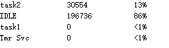

# FreeRTOS任务相关API函数
## FreeRTOS任务相关API函数介绍（熟悉）

| 函数 | 描述 |
| ---- | ---- |
| `uxTaskPriorityGet()` | 获取任务优先级 |
| `vTaskPrioritySet()` | 设置任务优先级 |
| `uxTaskGetNumberOfTasks()` | 获取系统中任务的数量 |
| `uxTaskGetSystemState()` | 获取所有任务状态信息 |
| `vTaskGetInfo()` | 获取指定单个的任务信息 |
| `xTaskGetCurrentTaskHandle()` | 获取当前任务的任务句柄 |
| `xTaskGetHandle()` | 根据任务名获取该任务的任务句柄 |
| `uxTaskGetStackHighWaterMark()` | 获取任务的任务栈历史剩余最小值 |
| `eTaskGetState()` | 获取任务状态 |
| `vTaskList()` | 以“表格”形式获取所有任务的信息 |
| `vTaskGetRunTimeStats()` | 获取任务的运行时间 |

## 任务状态查询API函数实验（掌握）
1. 实验目的：学习 FreeRTOS 任务状态与信息的查询API函数 
2. 实验设计：将设计三个任务：start_task、task1、task2

| 任务名称 | 功能说明 |
| ---- | ---- |
| `start_task` | 用来创建task1和task2任务 |
| `task1` | LED0每500ms闪烁一次，提示程序正在运行 |
| `task2` | 用于展示任务状态信息查询相关API函数的使用 |
```
//实现任务状态查询API
void task2( void * pvParameters )
{
	UBaseType_t priority_num = 0;
	UBaseType_t task_num = 0;
	UBaseType_t task2_num = 0;
	TaskStatus_t * status_arrat;
	TaskStatus_t * status_arrat2;
	TaskHandle_t   task_handle = 0;
	UBaseType_t task_stack_min = 0;
	eTaskState state = 0;
	
	
  priority_num = uxTaskPriorityGet(task1_handler);//获取任务优先级
	printf("task1_priority = %ld\r\n",priority_num);
	priority_num = uxTaskPriorityGet(NULL);//获取任务优先级
	printf("task2_priority = %ld\r\n",priority_num);
	
	vTaskPrioritySet(task2_handler,4); //设置任务优先级
	priority_num = uxTaskPriorityGet(NULL);//获取任务优先级
	printf("task2_change_priority = %ld\r\n",priority_num);
	
	task_num = uxTaskGetNumberOfTasks(); //获取任务数量
	printf("TAsk_num = %ld",task_num);
	
	status_arrat = mymalloc(SRAMIN,(sizeof(TaskStatus_t) * task_num));
	task2_num = uxTaskGetSystemState(status_arrat,task_num,NULL); //获取去全部任务信息
  printf("name\t\tpriority\ttask_name\r\n");
  for(uint8_t i = 0;i<task2_num; i++){
			printf("%s\t\t%ld\t%ld\r\n",status_arrat[i].pcTaskName,
                        status_arrat[i].uxCurrentPriority,
                        status_arrat[i].xTaskNumber);
	}
	
	status_arrat2 = mymalloc(SRAMIN,sizeof(TaskStatus_t));//获取指定任务信息
	vTaskGetInfo( task1_handler,status_arrat2,pdTRUE,eInvalid );
	printf("%s\t\t%ld\t%d\r\n",status_arrat2->pcTaskName,
                    status_arrat2->uxCurrentPriority,
                    status_arrat2->eCurrentState);

	task_handle = xTaskGetHandle("task1");				 //通过任务名字，获取句柄
  printf("task: %#x\r\n",(int)task_handle);
  printf("task2: %#x\r\n",(int)task1_handler);	
	
	state = eTaskGetState( task2_handler );//任务状态
	printf("now =%d \r\n",state);
	
	vTaskList(task_buff);
	printf("%s\r\n",task_buff);
  
	 while(1)
	 {	
		  task_stack_min = uxTaskGetStackHighWaterMark(task2_handler);//堆栈历史剩余最小值
		  printf("task_stack_min == %ld \r\n",task_stack_min);
		  vTaskDelay(1000);
	 }
}
```


## 任务时间统计API函数实验（掌握）
### 时间统计API函数介绍
```
Void    vTaskGetRunTimeStats( char * pcWriteBuffer ) 
    //   pcWriteBuffer 接收任务运行时间信息的缓存指针

```

此函数用于统计任务的运行时间信息，使用此函数需将宏 configGENERATE_RUN_TIME_STAT 、configUSE_STATS_FORMATTING_FUNCTIONS 置1 

| 表头字段 | 含义说明 |
| ---- | ---- |
| Task | 任务名称 |
| Abs Time | 任务实际运行的总时间（绝对时间） |
| % Time | 占总处理时间的百分比 |

## 时间统计API函数使用流程
1. 将宏 configGENERATE_RUN_TIME_STATS 置1 
2. 将宏 configUSE_STATS_FORMATTING_FUNCTIONS  置1 
3. 当将此宏 configGENERATE_RUN_TIME_STAT  置1之后，还需要实现2个宏定义：

**① portCONFIGURE_TIMER_FOR_RUNTIME_STATE() ：用于初始化用于配置任务运行时间统计的时基定时器；**
注意：这个时基定时器的计时精度需高于系统时钟节拍精度的10至100倍！

**② portGET_RUN_TIME_COUNTER_VALUE()：用于获取该功能时基硬件定时器计数的计数值** 

在 FreeRTOSConfig.h 中增加以下几个宏
```
extern uint32_t FreeRTOSRunTimeTicks;

#define configGENERATE_RUN_TIME_STATS            1
#define configUSE_STATS_FORMATTING_FUNCTIONS     1

#define portCONFIGURE_TIMER_FOR_RUN_TIME_STATS configureTimerForRunTimeStats
#define portGET_RUN_TIME_COUNTER_VALUE getRunTimeCounterValue

```
其中我们需要实现 **configureTimerForRunTimeStats** 和 **getRunTimeCounterValue**这两个函数

我们使用定时器7，并配置arr和psc至10微秒中断，在tim.c中，我们实现这两个函数
```

uint32_t FreeRTOSRunTimeTicks = 0;
void configureTimerForRunTimeStats(void)
{
 
	  HAL_TIM_Base_Start_IT(&htim7);
    FreeRTOSRunTimeTicks = 0;
}

unsigned long getRunTimeCounterValue(void)
  {
      return FreeRTOSRunTimeTicks;
  }

```

随后我们在中断回调函数中对FreeRTOSRunTimeTicks实现自加，并在task2中调用时间统计API函数
```

void task2( void * pvParameters )
{
	 while(1)
	 {	
		 if(HAL_GPIO_ReadPin(GPIOE,KEY1_Pin) == GPIO_PIN_RESET)
		 {
			  vTaskGetRunTimeStats(task_buff);
			  printf("%s\r\n",task_buff);
		 }
		 vTaskDelay(10);
	 }
}


void HAL_TIM_PeriodElapsedCallback(TIM_HandleTypeDef *htim)
{
	if (htim->Instance == TIM7)
  {
    FreeRTOSRunTimeTicks++;
  }

}
```

最后接收到了任务运行时间信息



| 任务名称 | 总运行节拍 | CPU占用率 |
|--------|-----------|----------|
| task2   | 305554    | 13%      |
| IDLE    | 196736    | 86%      |
| task1   | 0         | <1%      |
| Tmr Svc | 0         | <1%      |