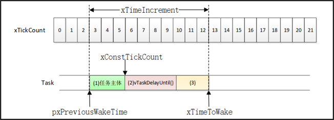

# FreeRTOS时间管理
## 延时函数介绍（了解）

| 函数                  | 描述       |
| --------------------- | ---------- |
| vTaskDelay()          | 相对延时   |
| xTaskDelayUntil()     | 绝对延时   |

**相对延时**：指每次延时都是从执行函数vTaskDelay()开始，直到延时指定的时间结束

**绝对延时**：指将整个任务的运行周期看成一个整体，适用于需要按照一定频率运行的任务

(1)为任务主体，也就是任务真正要做的工作

(2)是任务函数中调用vTaskDelayUntil()对任务进行延时

(3)为其他任务在运行

## 延时函数演示实验（掌握）
1、实验目的：学习 FreeRTOS 相对延时和绝对延时API 函数的使用，并了解其区别 

2、实验设计：将设计三个任务：start_task、task1，task2

| 函数/任务名 | 功能说明 |
| ----------- | -------- |
| start_task  | 用来创建task1和task2任务 |
| task1       | 用于展示相对延时函数vTaskDelay()的使用 |
| task2       | 用于展示绝对延时函数xTaskDelayUntil()的使用 |