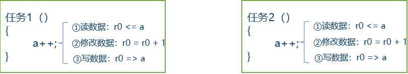
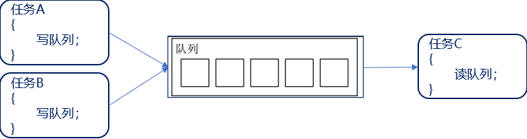
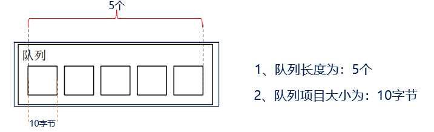
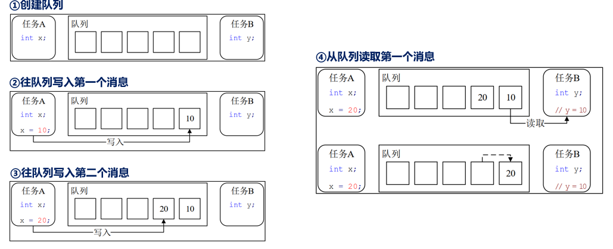
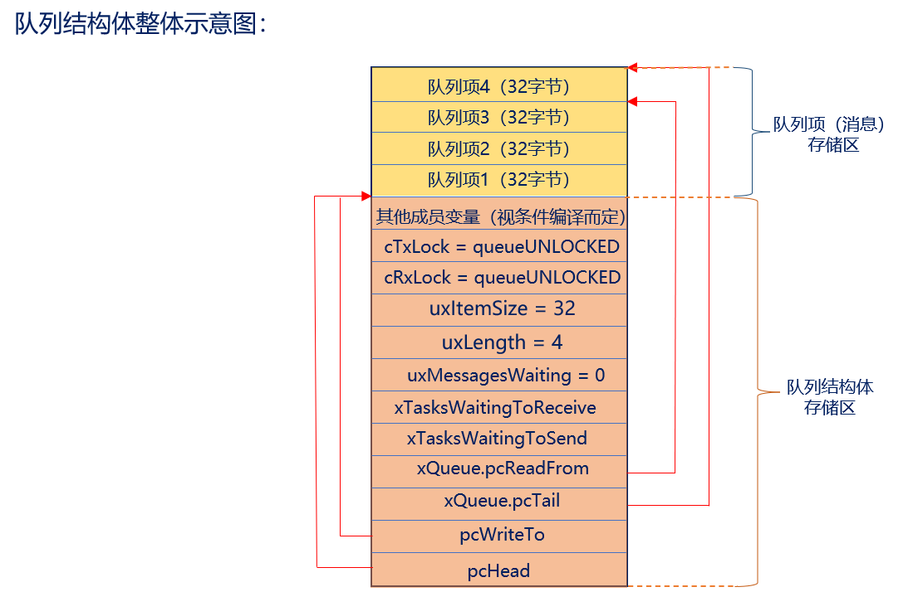

# FreeRTOS消息队列
## 队列简介（了解）
队列是任务到任务、任务到中断、中断到任务数据交流的一种机制（消息传递） 
类似全局变量？假设有一个全局变量a = 0，现有两个任务都在写这个变量a



**全局变量的弊端**：数据无保护，导致数据不安全，当多个任务同时对该变量操作时，数据易受损

使用队列的情况如下：FreeRTOS基于队列， 实现了多种功能，其中包括队列集、互斥信号量、计数型信号量、二值信号量、 递归互斥信号量，因此很有必要深入了解 FreeRTOS 的队列 。



读写队列做好了保护，防止多任务同时访问冲突；
我们只需要直接调用API函数即可，简单易用！


在队列中可以存储数量有限、大小固定的数据。队列中的每一个数据叫做“队列项目”，队列能够存储“队列项目”的最大数量称为队列的长度 




**在创建队列时，就要指定队列长度以及队列项目的大小！**

FreeRTOS队列特点：

| 序号 | 特性分类         | 核心说明                                                                 |
| ---- | ---------------- | ------------------------------------------------------------------------ |
| 1    | 数据入队出队方式 | 默认FIFO先进先出；FreeRTOS支持配置为LIFO后进先出（紧急消息插队）|
| 2    | 数据传递方式     | 默认值拷贝传递；大数据场景推荐传递指针，减少内存拷贝开销                   |
| 3    | 多任务访问       | 队列不属于任意单一任务，所有任务、中断服务函数均可读写队列，自带线程安全   |
| 4    | 出队、入队阻塞   | 读写时可设置阻塞超时：队列满时入队阻塞、队列空时出队阻塞，超时后自动退出等待 |

1. 若阻塞时间为0				：直接返回不会等待；
2. 若阻塞时间为0~port_MAX_DELAY	：等待设定的阻塞时间，若在该时间内还无法入队，超时后直接返回不再等待；
3. 若阻塞时间为port_MAX_DELAY	：死等，一直等到可以入队为止。出队阻塞与入队阻塞类似；

| 阻塞类型 | 触发条件 | 任务链表挂载操作 | 等待链表 |
| ---- | ---- | ---- | ---- |
| 入队阻塞 | 队列已满，任务执行xQueueSend写入失败 | 1. 任务加入延时链表pxDelayedTaskList<br>2. 任务加入等待发送链表 | xTasksWaitingToSend |
| 出队阻塞 | 队列为空，任务执行xQueueReceive读取失败 | 1. 任务加入延时链表pxDelayedTaskList<br>2. 任务加入等待接收链表 | xTasksWaitingToReceive |

当多个任务写入消息给一个“满队列”时，这些任务都会进入阻塞状态，也就是说有多个任务	  在等待同一 个队列的空间。那当队列中有空间时，哪个任务会进入就绪态？

1、优先级最高的任务

2、如果大家的优先级相同，那等待时间最久的任务会进入就绪态

队列操作基本过程



## 队列结构体介绍（熟悉）
### 队列结构体介绍（熟悉）
```
typedef struct QueueDefinition 
{
    int8_t * pcHead					/* 存储区域的起始地址 */
    int8_t * pcWriteTo;        				/* 下一个写入的位置 */
    union
    {
            QueuePointers_t     xQueue; 
    SemaphoreData_t  xSemaphore; 
    } u ;
    List_t xTasksWaitingToSend; 			/* 等待发送列表 */
    List_t xTasksWaitingToReceive;			/* 等待接收列表 */
    volatile UBaseType_t uxMessagesWaiting; 	/* 非空闲队列项目的数量 */
    UBaseType_t uxLength；			/* 队列长度 */
    UBaseType_t uxItemSize;                 		/* 队列项目的大小 */
    volatile int8_t cRxLock; 				/* 读取上锁计数器 */
    volatile int8_t cTxLock；			/* 写入上锁计数器 */
   /* 其他的一些条件编译 */
}
```
1. 当用于队列使用时：
```
typedef struct QueuePointers
{
     int8_t * pcTail; 				/* 存储区的结束地址 */
     int8_t * pcReadFrom;			/* 最后一个读取队列的地址 */
} QueuePointers_t;

```  
2. 当用于互斥信号量和递归互斥信号量时 ：
```
typedef struct SemaphoreData
{
    TaskHandle_t xMutexHolder;		/* 互斥信号量持有者 */
    UBaseType_t uxRecursiveCallCount;	/* 递归互斥信号量的获取计数器 */
}
```
队列结构体整体示意图：



## 队列相关API函数介绍（熟悉）
使用队列的主要流程：创建队列 写队列 读队列。
创建队列相关API函数介绍：
| 函数                      | 描述                 |
| ------------------------- | -------------------- |
| xQueueCreate()            | 动态方式创建队列     |
| xQueueCreateStatic()      | 静态方式创建队列     |

动态和静态创建队列之间的区别：队列所需的内存空间由 FreeRTOS 从 FreeRTOS 管理的堆中分配，而静态创建需要用户自行分配内存。

```
#define xQueueCreate (  uxQueueLength,   uxItemSize  )   						 \						
       xQueueGenericCreate( ( uxQueueLength ), ( uxItemSize ), (queueQUEUE_TYPE_BASE )) 

```

此函数用于使用动态方式创建队列，队列所需的内存空间由 FreeRTOS 从 FreeRTOS 管理的堆中分配 

函数形参
| 形参名         | 描述           |
| -------------- | -------------- |
| uxQueueLength  | 队列长度（最大可存放消息个数） |
| uxItemSize     | 单条消息数据字节大小 |

 返回值
| 返回值   | 描述                                       |
| -------- | ------------------------------------------ |
| NULL     | 队列创建失败（堆内存不足）|
| 非NULL值 | 创建成功，返回QueueHandle_t类型队列句柄 |

前面说 FreeRTOS 基于队列实现了多种功能，每一种功能对应一种队列类型，队列类型的 queue.h 文件中有定义：

```
#define queueQUEUE_TYPE_BASE                  			( ( uint8_t ) 0U )	/* 队列 */
#define queueQUEUE_TYPE_SET                  			( ( uint8_t ) 0U )	/* 队列集 */
#define queueQUEUE_TYPE_MUTEX                 			( ( uint8_t ) 1U )	/* 互斥信号量 */
#define queueQUEUE_TYPE_COUNTING_SEMAPHORE    	( ( uint8_t ) 2U )	/* 计数型信号量 */
#define queueQUEUE_TYPE_BINARY_SEMAPHORE     	( ( uint8_t ) 3U )	/* 二值信号量 */
#define queueQUEUE_TYPE_RECURSIVE_MUTEX       		( ( uint8_t ) 4U )	/* 递归互斥信号量 */

```

### 往队列写入消息API函数

| 函数                          | 描述                                       |
| ----------------------------- | ------------------------------------------ |
| xQueueSend()                  | 往队列的尾部写入消息                       |
| xQueueSendToBack()            | 功能与 xQueueSend() 完全相同               |
| xQueueSendToFront()           | 往队列的头部写入消息（LIFO，紧急消息插队） |
| xQueueOverwrite()             | 覆写队列消息，仅支持队列长度为1的场景      |
| xQueueSendFromISR()           | 中断服务函数中，往队列尾部写入消息          |
| xQueueSendToBackFromISR()     | 功能与 xQueueSendFromISR() 完全相同        |
| xQueueSendToFrontFromISR()    | 中断服务函数中，往队列头部写入消息          |
| xQueueOverwriteFromISR()      | 中断中覆写消息，仅支持队列长度为1的场景     |


```
#define  xQueueSend( xQueue,pvItemToQueue,xTicksToWait  )	
        xQueueGenericSend( ( xQueue ), ( pvItemToQueue ), ( xTicksToWait ),queueSEND_TO_BACK )

#define  xQueueSendToBack(  xQueue,   pvItemToQueue,   xTicksToWait  )					 \    
        xQueueGenericSend( ( xQueue ), ( pvItemToQueue ), ( xTicksToWait ), queueSEND_TO_BACK )

#define  xQueueSendToFront(  xQueue,   pvItemToQueue,   xTicksToWait  ) 					\   
        xQueueGenericSend( ( xQueue ), ( pvItemToQueue ), ( xTicksToWait ), queueSEND_TO_FRONT )
        
#define  xQueueOverwrite(  xQueue,   pvItemToQueue  ) 								\    
        xQueueGenericSend( ( xQueue ), ( pvItemToQueue ), 0, queueOVERWRITE )
```

可以看到这几个写入函数调用的是同一个函数xQueueGenericSend( )，只是指定了不同的写入位置！ 


| 宏定义函数           | 底层通用函数        | 写入模式枚举参数       | 阻塞参数xTicksToWait | 核心行为说明 |
| -------------------- | ------------------- | ---------------------- | -------------------- | ------------ |
| xQueueSend()         | xQueueGenericSend() | queueSEND_TO_BACK      | 用户自定义传入       | 尾部入队（标准FIFO），队列满时阻塞等待 |
| xQueueSendToBack()   | xQueueGenericSend() | queueSEND_TO_BACK      | 用户自定义传入       | 和xQueueSend完全等价，尾部入队 |
| xQueueSendToFront()  | xQueueGenericSend() | queueSEND_TO_FRONT     | 用户自定义传入       | 头部入队（LIFO插队），紧急消息优先读取 |
| xQueueOverwrite()    | xQueueGenericSend() | queueOVERWRITE         | 固定传0（不阻塞）| 仅单长度队列可用，队列满直接覆盖旧数据，永不阻塞 |

队列一共有 3 种写入位置 ：
```
#define queueSEND_TO_BACK       ( ( BaseType_t ) 0 )/* 写入队列尾部 */

#define queueSEND_TO_FRONT      ( ( BaseType_t ) 1 )/* 写入队列头部 */

#define queueOVERWRITE          ( ( BaseType_t ) 2 )/* 覆写队列*/

```

注意：覆写方式写入队列，只有在队列的队列长度为 1 时，才能够使用 

往队列写入消息函数入口参数解析：
```
BaseType_t     xQueueGenericSend(  
                QueueHandle_t 	xQueue,					      
                const void * const 	pvItemToQueue,					       
                TickType_t 		xTicksToWait,					       
                const BaseType_t 	xCopyPosition   
); 
```
xQueueGenericSend() 形参
| 形参名           | 描述                         |
| ---------------- | ---------------------------- |
| xQueue           | 待写入的队列（队列句柄）|
| pvItemToQueue    | 待写入消息（数据源指针）|
| xTicksToWait     | 阻塞超时时间（单位：系统tick）|
| xCopyPosition    | 写入的位置（队尾/队头/覆写）|

 返回值
| 返回值         | 描述                 |
| -------------- | -------------------- |
| pdTRUE         | 队列写入成功         |
| errQUEUE_FULL  | 队列已满，写入失败   |

从队列读取消息API函数：
| 函数                          | 描述                                           |
| ----------------------------- | ---------------------------------------------- |
| xQueueReceive()               | 任务中读取队头消息，读取后删除该消息           |
| xQueuePeek()                  | 任务中读取队头消息，读取后保留消息不删除       |
| xQueueReceiveFromISR()        | 中断内读取队头消息，读取后删除该消息           |
| xQueuePeekFromISR()           | 中断内读取队头消息，读取后保留消息不删除       |

```
BaseType_t    xQueueReceive( QueueHandle_t   xQueue,  void *   const pvBuffer,  TickType_t   xTicksToWait )
```
此函数用于在任务中，从队列中读取消息，并且消息读取成功后，会将消息从队列中移除。 

| 形参名         | 描述                 |
| -------------- | -------------------- |
| xQueue         | 待读取的队列句柄     |
| pvBuffer       | 消息读取缓存区指针   |
| xTicksToWait   | 队列为空时阻塞超时时间 |

| 返回值   | 描述         |
| -------- | ------------ |
| pdTRUE   | 消息读取成功 |
| pdFALSE  | 读取失败（队列空且超时） |

```
BaseType_t   xQueuePeek( QueueHandle_t   xQueue,   void * const   pvBuffer,   TickType_t   xTicksToWait )
```
此函数用于在任务中，从队列中读取消息， 但与函数 xQueueReceive()不同，此函数在成功读取消息后，并不会移除已读取的消息！ 

| 形参名         | 描述                 |
| -------------- | -------------------- |
| xQueue         | 待读取的队列         |
| pvBuffer       | 信息读取缓冲区       |
| xTicksToWait   | 阻塞超时时间         |

| 返回值   | 描述     |
| -------- | -------- |
| pdTRUE   | 读取成功 |
| pdFALSE  | 读取失败 |

## 队列操作实验（掌握）
1. 实验目的：学习 FreeRTOS 的队列相关API函数的使用 ，实现队列的入队和出队操作。
2. 实验设计：将设计四个任务：start_task、task1、task2、task3

| 函数/任务名 | 功能说明 |
| ----------- | -------- |
| start_task  | 程序入口，创建 task1、task2、task3 三个业务任务 |
| task1       | 按键检测任务：<br>1. KEY0/KEY1按下：将键值**值拷贝**入队 `key_queue`<br>2. KEY_UP按下：将大数据缓冲区**指针地址**入队 `big_data_queue` |
| task2       | 按键消费任务：阻塞读取 `key_queue` 键值消息，打印收到的按键编号 |
| task3       | 大数据处理任务：读取 `big_data_queue` 中的数据指针，通过指针访问原始大数据缓冲区 |

## 代码
```
/* USER CODE END Header */
/* Includes ------------------------------------------------------------------*/
#include "main.h"
#include "cmsis_os.h"
#include "tim.h"
#include "usart.h"
#include "gpio.h"

/* Private includes ----------------------------------------------------------*/
/* USER CODE BEGIN Includes */
#include <stdio.h>
#include "freertos.h"
#include "delay.h"
#include "queue.h"
/* USER CODE BEGIN PD */
#define START_TASK_PRIO 1 //���ȼ�
#define START_TASK_STACK_SIZE 128//�ڴ� �ֽ�
TaskHandle_t start_task_handler;
void start_task( void * pvParameters );

#define TASK1_PRIO 2 //���ȼ�
#define TASK1_STACK_SIZE 128//�ڴ� �ֽ�
TaskHandle_t task1_handler;
void task1( void * pvParameters );

#define TASK2_PRIO 4 //���ȼ�
#define TASK2_STACK_SIZE 128//�ڴ� �ֽ�
TaskHandle_t task2_handler;
void task2( void * pvParameters );

#define TASK3_PRIO 4 //���ȼ�
#define TASK3_STACK_SIZE 128//�ڴ� �ֽ�
TaskHandle_t task3_handler;
void task3( void * pvParameters );
/* USER CODE END PD */

/* Private macro -------------------------------------------------------------*/
/* USER CODE BEGIN PM */
QueueHandle_t key_queue;   //小数据
QueueHandle_t big_date_queue; //大数据
char buff[100] = {"12223143425235245245251"};

List_t TestList;              /* 定义 */
ListItem_t ListItem1;       /* 定义列表项1 */
ListItem_t ListItem2;				/* 定义列表项2 */
ListItem_t ListItem3;				/* 定义列表项3 */
void SystemClock_Config(void);
void MX_FREERTOS_Init(void);
void freertos_demo(void);

int main(void)
{
  HAL_Init();
  delay_init(180);
  MX_GPIO_Init();
  MX_USART1_UART_Init();
  MX_TIM2_Init();
  MX_TIM3_Init();
  /* USER CODE BEGIN 2 */
  freertos_demo(); 

  while (1)
  {
		
  }
}

/* USER CODE BEGIN 4 */
void freertos_demo(void)
{
	 xTaskCreate((TaskFunction_t       ) start_task,
							(char *                ) "start_task",	
							(configSTACK_DEPTH_TYPE) START_TASK_STACK_SIZE,
							(void *                ) NULL,
							(UBaseType_t           ) START_TASK_PRIO,
							(TaskHandle_t *        ) &start_task_handler );
							
							vTaskStartScheduler();
	
}


void start_task( void * pvParameters )
{
	 taskENTER_CRITICAL();  //进入临界 关闭中断
	//vTaskSuspendAll(); //挂起任务调度器，不关闭中断；
	//队列创建
   key_queue = xQueueCreate( 2, sizeof(uint8_t) );
   if(key_queue != NULL )
	 {
		  printf("key_queue uesfful\r\n");
	 }
	 else 
	 {
		 printf("key_queue unuseful\r\n");
	 }
	 
	 big_date_queue = xQueueCreate( 1, sizeof(char *) );
   if(big_date_queue != NULL )
	 {
		  printf("big_date_queue uesfful\r\n");
	 }
	 else 
	 {
		 printf("big_date_queue unuseful\r\n");
	 }
	
	 xTaskCreate((TaskFunction_t       ) task1,
							(char *                ) "task1",	
							(configSTACK_DEPTH_TYPE) TASK1_STACK_SIZE,
							(void *                ) NULL,
							(UBaseType_t           ) TASK1_PRIO,
							(TaskHandle_t *        ) &task1_handler );	
							
	 xTaskCreate((TaskFunction_t       ) task2,
							(char *                ) "task2",	
							(configSTACK_DEPTH_TYPE) TASK2_STACK_SIZE,
							(void *                ) NULL,
							(UBaseType_t           ) TASK2_PRIO,
							(TaskHandle_t *        ) &task2_handler );
							
	 xTaskCreate((TaskFunction_t       ) task3,
							(char *                ) "task3",	
							(configSTACK_DEPTH_TYPE) TASK3_STACK_SIZE,
							(void *                ) NULL,
							(UBaseType_t           ) TASK3_PRIO,
							(TaskHandle_t *        ) &task3_handler );								

	 taskEXIT_CRITICAL(); //退出临界区 				
 //xTaskResumeAll();						
   vTaskDelete(NULL);
							

}


/*实现入队*/
void task1( void * pvParameters )
{
   uint8_t key = 0;
	 BaseType_t err= 0;
	 char * buf;
	 buf = buff;
	 while(1)
	 {	

		  if(HAL_GPIO_ReadPin(GPIOE,KEY1_Pin) == GPIO_PIN_RESET)
		  {
			    key = 1;
					err = xQueueSend(key_queue,&key,portMAX_DELAY );
				  if(err != pdTRUE)
					{
						 printf("1 write error\r\n");
					}
			};
		 	if(HAL_GPIO_ReadPin(GPIOE,KEY2_Pin) == GPIO_PIN_RESET)
		  {
			    key = 2;
					err = xQueueSend(big_date_queue,&buf,portMAX_DELAY );
				  if(err != pdTRUE)
					{
						 printf("2 write error\r\n");
					}
			};
			 vTaskDelay(10);
			HAL_GPIO_TogglePin(GPIOF, LED0_Pin);
	 }
}


//小数据出队
void task2( void * pvParameters )
{
   uint8_t key = 0;
	 BaseType_t err = 0; 
	 while(1)
	 {	
		 
		  err = xQueueReceive(key_queue,&key,portMAX_DELAY);
	    if(err != pdTRUE)
			{
					printf("1 read error\r\n");
			}	
      else 
			{
				  printf("data = %d \r\n",key);
			}

	 }
}

//大数据出队
void task3( void * pvParameters )
{
	 BaseType_t err = 0;
	 char * buf ; 	
	 while(1)
	 {	
			
		  err = xQueueReceive(big_date_queue,&buf,portMAX_DELAY);
	    if(err != pdTRUE)
			{
					printf("1 read error\r\n");
			}	
      else 
			{
				  printf("data = %s \r\n",buf);
			}

	 }
}

```

## 队列相关API函数解析（熟悉）
1. 队列的创建API函数：xQueueCreate( )
2. 往队列写入数据API函数（入队）：xQueueSend( )
3. 从队列读取数据API函数（出队）： xQueueReceive( )