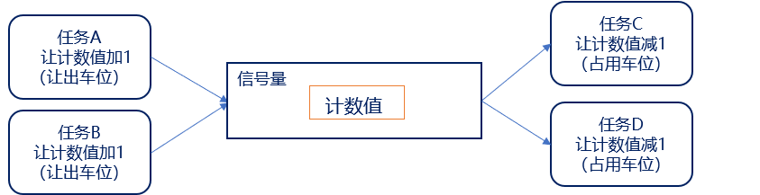
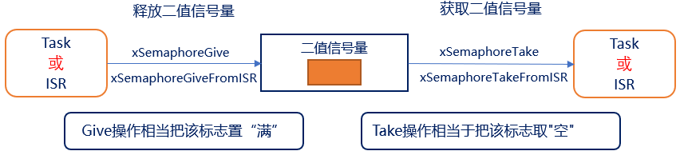
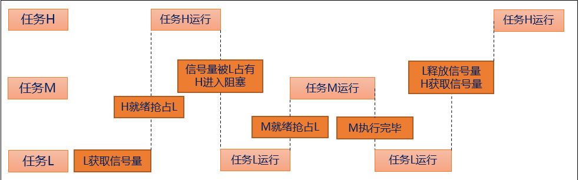
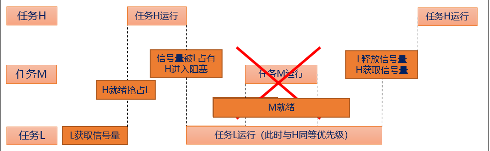

# 信号量
## 信号量的简介（了解）

信号量是一种解决同步问题的机制，可以实现对共享资源的有序访问 


假设有一个人需要在停车场停车

1. 首先判断停车场是否还有空车位（判断信号量是否有资源）； 
2. 停车场正好有空车位（信号量有资源），那么就可以直接将车开入空车位进行停车（获取信号量成功）； 
3. 停车场已经没有空车位了（信号量没有资源），那么这个人可以选择不停车（获取信号量失败）；
也可以选择等待（任务阻塞）其他人将车开出停车场（释放信号量资源）， 然后再将车停入空车位 。

| 生活类比       | 计数信号量操作逻辑               | 计数变化 |
| -------------- | -------------------------------- | -------- |
| 空停车位       | 信号量初始计数值 = 可用资源总数   | 初始值=N |
| 占用停车位     | 获取信号量（xSemaphoreTake）| 计数值-- |
| 让出占用车位   | 释放信号量（xSemaphoreGive）| 计数值++ |



当计数值大于0，代表有信号量资源

当释放信号量，信号量计数值（资源数）加一

当获取信号量，信号量计数值（资源数）减一

信号量的计数值都有限制：限定最大值。
如果最大值被限定为1，那么它就是二值信号量；
如果最大值不是1，它就是计数型信号量。

| 队列 | 信号量 |
| ---- | ------ |
| 可以容纳多个数据；<br>创建队列有两部分内存：队列结构体+队列项存储空间 | 仅存放计数值，无法存放其他数据；<br>创建信号量，只需分配信号量结构体 |
| 写入队列：当队列满时，可阻塞； | 释放信号量：不可阻塞，计数值++，<br>当计数值为最大值时，返回失败 |
| 读取队列：当队列为空时，可阻塞； | 获取信号量：计数值--，<br>当没有资源时，可阻塞 |

## 二值信号量（熟悉）
二值信号量的本质是一个队列长度为 1 的队列 ，该队列就只有空和满两种情况，这就是二值
二值信号量通常用于互斥访问或任务同步， 与互斥信号量比较类似，但是二值信号量有可能会导致优先级翻转的问题 ，所以二值信号量更适合用于同步！



使用二值信号量的过程：创建二值信号量 释放二值信号量 获取二值信号量    

| 函数                          | 描述                               |
| ----------------------------- | ---------------------------------- |
| xSemaphoreCreateBinary()      | 动态方式创建二值信号量             |
| xSemaphoreCreateBinaryStatic()| 静态方式创建二值信号量             |
| xSemaphoreGive()              | 任务上下文释放信号量               |
| xSemaphoreGiveFromISR()       | 中断服务函数中释放信号量           |
| xSemaphoreTake()              | 任务上下文获取信号量，支持阻塞等待 |
| xSemaphoreTakeFromISR()       | 中断服务函数中获取信号量（无阻塞） |

创建二值信号量函数：
```
SemaphoreHandle_t   xSemaphoreCreateBinary( void )
```

```
#define   xSemaphoreCreateBinary( )   					
 xQueueGenericCreate( 1,semSEMAPHORE_QUEUE_ITEM_LENGTH, queueQUEUE_TYPE_BINARY_SEMAPHORE)


#define  semSEMAPHORE_QUEUE_ITEM_LENGTH      ( ( uint8_t ) 0U )
```

```
#define queueQUEUE_TYPE_BASE                  			( ( uint8_t ) 0U )	/* 队列 */
#define queueQUEUE_TYPE_SET                  			( ( uint8_t ) 0U )	/* 队列集 */
#define queueQUEUE_TYPE_MUTEX                 			( ( uint8_t ) 1U )	/* 互斥信号量 */
#define queueQUEUE_TYPE_COUNTING_SEMAPHORE    	        ( ( uint8_t ) 2U )	/* 计数型信号量 */
#define queueQUEUE_TYPE_BINARY_SEMAPHORE     	        ( ( uint8_t ) 3U )	/* 二值信号量 */
#define queueQUEUE_TYPE_RECURSIVE_MUTEX       		    ( ( uint8_t ) 4U )	/* 递归互斥信号量 

```

 二值信号量创建函数返回值表
| 返回值   | 描述 |
| -------- | ---- |
| NULL     | 创建失败（动态创建堆内存不足；静态创建传入非法静态内存） |
| 其他非NULL值 | 创建成功，返回SemaphoreHandle_t类型二值信号量句柄，用于后续Take/Give操作 |

释放二值信号量函数：
```
BaseType_t   xSemaphoreGive( xSemaphore )

#define   xSemaphoreGive (  xSemaphore  )   
 						
xQueueGenericSend( ( QueueHandle_t ) ( xSemaphore ), NULL,semGIVE_BLOCK_TIME,queueSEND_TO_BACK )

#define   semGIVE_BLOCK_TIME     ( ( TickType_t ) 0U )


```
| 形参名      | 描述                 |
| ----------- | -------------------- |
| xSemaphore  | 待释放的信号量句柄   |

| 返回值        | 描述               |
| ------------- | ------------------ |
| pdPASS        | 信号量释放成功     |
| errQUEUE_FULL | 信号量释放失败     |

获取二值信号量函数：
```
BaseType_t   xSemaphoreTake( xSemaphore, xBlockTime ) 
```
| 形参名        | 描述                     |
| ------------- | ------------------------ |
| xSemaphore    | 需要获取的信号量句柄     |
| xBlockTime    | 无资源时的阻塞等待时间   |

| 返回值    | 描述                         |
| --------- | ---------------------------- |
| pdTRUE    | 成功获取到信号量，计数值减1  |
| pdFALSE   | 阻塞超时，始终无资源，获取失败 |
## 二值信号量实验（掌握）
1. 实验目的：学习 FreeRTOS 的二值信号量相关API函数的使用
2. 实验设计：将设计三个任务：start_task、task1、task2

| 函数/任务名 | 功能说明 |
| ----------- | -------- |
| start_task  | 程序入口函数，统一创建 task1、task2 两个业务任务，同时创建全局二值信号量 |
| task1       | 按键扫描任务；循环检测 KEY0 按键，按键按下时调用 xSemaphoreGive() 释放二值信号量，完成事件通知 |
| task2       | 事件处理任务；阻塞调用 xSemaphoreTake() 获取二值信号量，获取成功后打印提示信息 |


### 代码

```
void freertos_demo(void)
{
	 xTaskCreate((TaskFunction_t       ) start_task,
							(char *                ) "start_task",	
							(configSTACK_DEPTH_TYPE) START_TASK_STACK_SIZE,
							(void *                ) NULL,
							(UBaseType_t           ) START_TASK_PRIO,
							(TaskHandle_t *        ) &start_task_handler );
							
							vTaskStartScheduler();
	
}
void start_task( void * pvParameters )
{
	
	
	 taskENTER_CRITICAL();  //进入临界 关闭中断
	//vTaskSuspendAll(); //挂起任务调度器，不关闭中断；
	
	 semphore_handle = xSemaphoreCreateBinary();
	if(semphore_handle != NULL)
	{
		printf("sucessful\r\n");
	}
	 xTaskCreate((TaskFunction_t       ) task1,
							(char *                ) "task1",	
							(configSTACK_DEPTH_TYPE) TASK1_STACK_SIZE,
							(void *                ) NULL,
							(UBaseType_t           ) TASK1_PRIO,
							(TaskHandle_t *        ) &task1_handler );	
							
	 xTaskCreate((TaskFunction_t       ) task2,
							(char *                ) "task2",	
							(configSTACK_DEPTH_TYPE) TASK2_STACK_SIZE,
							(void *                ) NULL,
							(UBaseType_t           ) TASK2_PRIO,
							(TaskHandle_t *        ) &task2_handler );
														

	 taskEXIT_CRITICAL(); //退出临界区 				
 //xTaskResumeAll();						
   vTaskDelete(NULL);
}
/*释放二值信号量*/
void task1( void * pvParameters )
{

	 BaseType_t err;
	 while(1)
	 {	
		 
		 if(HAL_GPIO_ReadPin(GPIOE,KEY1_Pin) == GPIO_PIN_RESET)
		  {
         if(semphore_handle != NULL )
				 {
					 err = xSemaphoreGive( semphore_handle );
           if(err == pdPASS )
					 {
						  printf("free true\r\n");
					 }
					 else 
					 {
						  printf("free true");
					 }
				 }
				
//				while(HAL_GPIO_ReadPin(GPIOE,KEY1_Pin) == GPIO_PIN_RESET); 
			}
			
    

			vTaskDelay(10);

	 }
}

/*获取二值型号量*/
void task2( void * pvParameters )
{
	 BaseType_t err;
	 while(1)
	 {	
		 err = xSemaphoreTake( semphore_handle,
                      portMAX_DELAY);
		 if(err == pdTRUE){
				printf("get sucessful\r\n");
		 }
		 else{ 
			  printf("chao shi");

	     }
    }
}

```

## 计数型信号量（熟悉）
计数型信号量相当于队列长度大于1 的队列，因此计数型信号量能够容纳多个资源，这在计数型信号量被创建的时候确定的 

计数型信号量适用场合：
| 使用场景   | 核心逻辑                                                                 | 创建信号量参数设置                     | 典型业务场景                     |
| ---------- | ------------------------------------------------------------------------ | -------------------------------------- | -------------------------------- |
| 事件计数   | 事件发生 → Give(计数+1)；任务处理 → Take(计数-1)；可缓存多次事件           | 最大资源数按需设定，**初始计数值=0**   | 多次按键、连续中断脉冲、脉冲计数 |
| 资源管理   | 任务使用前Take(计数-1)，用完必须Give(计数+1)；计数=0代表资源全部占用        | 最大资源数=硬件/缓冲区总数，**初始计数值等于最大资源数** | 多串口、多缓冲区、多通道外设限流 |

使用计数型信号量的过程：创建计数型信号量  释放信号量  获取信号量

| 函数 | 描述 |
| ---- | ---- |
| xSemaphoreCreateCounting() | 动态分配堆内存，创建计数型信号量 |
| xSemaphoreCreateCountingStatic() | 使用用户预先定义的静态内存，创建计数型信号量 |
| uxSemaphoreGetCount() | 读取当前信号量剩余计数值 |

**计数型信号量的释放和获取与二值信号量相同 ！**

```
#define xSemaphoreCreateCounting(  uxMaxCount  ,uxInitialCount  ) 	      
        xQueueCreateCountingSemaphore( (  uxMaxCount  ) , (  uxInitialCount  ) ) 

```

| 形参名          | 描述                     |
| --------------- | ------------------------ |
| uxMaxCount      | 信号量计数值的最大上限    |
| uxInitialCount  | 信号量创建时的初始计数值 |

| 返回值   | 描述                                       |
| -------- | ------------------------------------------ |
| NULL     | 创建失败（堆内存不足/静态内存非法）|
| 其他非NULL值 | 创建成功，返回计数信号量句柄 |

计数型信号量创建API函数: 
```
#define 	uxSemaphoreGetCount( xSemaphore ) 						\
uxQueueMessagesWaiting( ( QueueHandle_t ) ( xSemaphore ) )

xSemaphore 信号量句柄

返回值 当前信号量的计数值大小
```


此函数用于获取信号量当前计数值大小

## 计数型信号量实验（掌握）

1. 实验目的：学习 FreeRTOS 的计数型信号量相关API函数的使用
2. 实验设计：将设计三个任务：start_task、task1、task2


| 任务名     | 功能说明 |
| ---------- | -------- |
| start_task | 程序初始化入口，创建计数型信号量，同时创建 task1、task2 两个业务任务 |
| task1      | 按键扫描任务；循环检测 KEY0，按键按下时执行 xSemaphoreGive，计数信号量数值+1，缓存按键事件 |
| task2      | 事件处理任务；固定1秒周期执行一次 xSemaphoreTake，获取成功后读取并打印当前信号量剩余计数值 |

### 代码
```
/*释放计数信号量*/
void start_task( void * pvParameters )
{
	 taskENTER_CRITICAL();  //进入临界 关闭中断
	//vTaskSuspendAll(); //挂起任务调度器，不关闭中断；
	
	 count_semphore_handle = xSemaphoreCreateCounting(100,100);//最大值和初始值
	if(count_semphore_handle != NULL)
	{
		printf("sucessful\r\n");
	}
	 xTaskCreate((TaskFunction_t       ) task1,
							(char *                ) "task1",	
							(configSTACK_DEPTH_TYPE) TASK1_STACK_SIZE,
							(void *                ) NULL,
							(UBaseType_t           ) TASK1_PRIO,
							(TaskHandle_t *        ) &task1_handler );	
							
	 xTaskCreate((TaskFunction_t       ) task2,
							(char *                ) "task2",	
							(configSTACK_DEPTH_TYPE) TASK2_STACK_SIZE,
							(void *                ) NULL,
							(UBaseType_t           ) TASK2_PRIO,
							(TaskHandle_t *        ) &task2_handler );
														

	 taskEXIT_CRITICAL(); //退出临界区 				
 //xTaskResumeAll();						
   vTaskDelete(NULL);
}

void task1( void * pvParameters )
{

//	 BaseType_t err;
	 while(1)
	 {	
		 
		 if(HAL_GPIO_ReadPin(GPIOE,KEY1_Pin) == GPIO_PIN_RESET)
		  {
         if(count_semphore_handle != NULL )
				 {
				   xSemaphoreGive( count_semphore_handle );  /* 释放信号量*/

				 }
				
				while(HAL_GPIO_ReadPin(GPIOE,KEY1_Pin) == GPIO_PIN_RESET); 
			}
			
    

			vTaskDelay(10);

	 }
}

/*获取计数型号量*/
void task2( void * pvParameters )
{
	 BaseType_t err;
	 while(1)
	 {	
			 err = xSemaphoreTake( count_semphore_handle,
												portMAX_DELAY);
			 if(err == pdTRUE){
					printf("get sucessful\r\n");
				 
				  printf(" sum = %d \r\n",(int)uxSemaphoreGetCount(count_semphore_handle));
			 }
			 else
			 { 
					printf("chao shi");
			 }
			 vTaskDelay(1000);
   }
	 
}

```

## 优先级翻转简介（熟悉）
优先级翻转：高优先级的任务反而慢执行，低优先级的任务反而优先执行
优先级翻转在抢占式内核中是非常常见的，但是在实时操作系统中是不允许出现优先级翻转的，因为优先级翻转会破坏任务的预期顺序，可能会导致未知的严重后果。 在使用二值信号量的时候，经常会遇到优先级翻转的问题。



高优先级任务被低优先级任务阻塞，导致高优先级任务迟迟得不到调度。但其他中等优先级的任务却能抢到CPU资源。从现象上看，就像是中优先级的任务比高优先级任务具有更高的优先权（即优先级翻转）

## 优先级翻转实验（掌握）
1. 实验目的：在使用二值信号量的时候会存在优先级翻转的问题，本实验通过模拟的方式实现优先级翻转，观察优先级翻转对抢占式内核的影响
2. 实验设计：将设计四个任务：start_task、high_task、 middle_task ， low_task

### 代码
```
void start_task( void * pvParameters )
{
	
	
	 taskENTER_CRITICAL();  //进入临界 关闭中断
	//vTaskSuspendAll(); //挂起任务调度器，不关闭中断；
	
	 semphore_handle = xSemaphoreCreateBinary();//最大值和初始值
	 if(semphore_handle != NULL)
	 {
		 printf("sucessful\r\n");
	 }
	 
	 xSemaphoreGive(semphore_handle); //释放一次
	 
	 xTaskCreate((TaskFunction_t       ) low_task,
							(char *                ) "task1",	
							(configSTACK_DEPTH_TYPE) TASK1_STACK_SIZE,
							(void *                ) NULL,
							(UBaseType_t           ) TASK1_PRIO,
							(TaskHandle_t *        ) &low_handler );	
							
	 xTaskCreate((TaskFunction_t       ) middle_task,
							(char *                ) "task2",	
							(configSTACK_DEPTH_TYPE) TASK2_STACK_SIZE,
							(void *                ) NULL,
							(UBaseType_t           ) TASK2_PRIO,
							(TaskHandle_t *        ) &middle_handler );
														
	 xTaskCreate((TaskFunction_t       ) high_task,
							(char *                ) "task3",	
							(configSTACK_DEPTH_TYPE) TASK3_STACK_SIZE,
							(void *                ) NULL,
							(UBaseType_t           ) TASK3_PRIO,
							(TaskHandle_t *        ) &high_handler );
	 taskEXIT_CRITICAL(); //退出临界区 				
 //xTaskResumeAll();						
   vTaskDelete(NULL);
							

}
/*低优先级任务*/
void low_task( void * pvParameters )
{

//	 BaseType_t err;
	 while(1)
	 {	
		 
		  printf("low_task takeing\r\n");
		  xSemaphoreTake(semphore_handle,portMAX_DELAY);
		  printf("low_task working\r\n");
		  delay_ms(3000);
			xSemaphoreGive(semphore_handle);
			printf("low_task Giving\r\n");
			vTaskDelay(1000);

	 }
}

/*中优先级*/
void middle_task( void * pvParameters )
{
//	 BaseType_t err;
	 while(1)
	 {	
       printf("middle working \r\n");
			 vTaskDelay(1000);
   }
	 
}

/* 高优先级任务*/
void high_task( void * pvParameters )
{
	 while(1)
	 {	
		  printf("high_task takeing\r\n");
		  xSemaphoreTake(semphore_handle,portMAX_DELAY);
		  printf("high_task working\r\n");
		  delay_ms(1000);
			xSemaphoreGive(semphore_handle);
			printf("high_task Giving\r\n");
			vTaskDelay(1000);
   }
	 
}
```

## 互斥信号量（熟悉）
互斥信号量其实就是一个拥有优先级继承的二值信号量，在同步的应用中二值信号量最适合。互斥信号量适合用于那些需要互斥访问的应用中！
优先级继承：当一个互斥信号量正在被一个低优先级的任务持有时， 如果此时有个高优先级的任务也尝试获取这个互斥信号量，那么这个高优先级的任务就会被阻塞。不过这个高优先级的任务会将低优先级任务的优先级提升到与自己相同的优先级。



优先级继承并不能完全的消除优先级翻转的问题，它只是尽可能的降低优先级翻转带来的影响 
注意：互斥信号量不能用于中断服务函数中，原因如下：
1. 互斥信号量有任务优先级继承的机制， 但是中断不是任务，没有任务优先级， 所以互斥信号量只能用与任务中，不能用于中断服务函数。
2. 中断服务函数中不能因为要等待互斥信号量而设置阻塞时间进入阻塞态。

使用互斥信号量：首先将宏configUSE_MUTEXES置一
使用流程：创建互斥信号量  （task）获取信号量 （give）释放信号量
创建互斥信号量函数： 

| 函数 | 描述 |
| ---- | ---- |
| xSemaphoreCreateMutex() | 动态分配堆内存，创建互斥信号量（互斥锁） |
| xSemaphoreCreateMutexStatic() | 使用预先定义的静态内存，创建互斥信号量 |


互斥信号量的释放和获取函数与二值信号量相同 ！只不过互斥信号量不支持中断中调用
注意：创建互斥信号量时，会主动释放一次信号量
```
#define   xSemaphoreCreateMutex()      xQueueCreateMutex( queueQUEUE_TYPE_MUTEX )
```
互斥量创建函数返回值表:
| 返回值 | 描述 |
| ------ | ---- |
| NULL   | 创建失败 |
| 其他非NULL值 | 创建成功，返回互斥信号量句柄 |


## 互斥信号量实验（掌握）
1. 实验目的：在优先级翻转实验的基础，加入互斥信号量，解决优先级翻转问题
2. 实验设计：将优先级翻转所用到的信号量函数，修改成互斥信号量即可，通过串口打印提示信息

