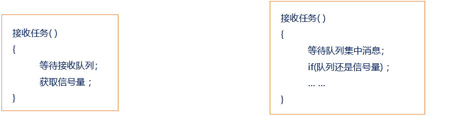

# 队列集

## 队列集简介（了解）
一个队列只允许任务间传递的消息为同一种数据类型，如果需要在任务间传递不同数据类型的消息时，那么就可以使用队列集 ！
作用：用于对多个队列或信号量进行“监听”，其中不管哪一个消息到来，都可让任务退出阻塞状态
假设：有个接收任务，使用到队列接收和信号量的获取，如下：




## 队列集相关API函数介绍（熟悉）

| 函数 | 功能描述 |
| ---- | -------- |
| xQueueCreateSet() | 创建一个队列集，指定可容纳的队列/信号量最大数量，返回队列集句柄 |
| xQueueAddToSet() | 将普通队列、二值信号量、计数信号量添加至队列集内 |
| xQueueRemoveFromSet() | 从队列集中移除已添加的队列/信号量 |
| xQueueSelectFromSet() | 任务上下文调用，阻塞等待，返回集合内第一条有数据/事件的队列句柄 |
| xQueueSelectFromSetFromISR() | 中断服务函数专用，非阻塞查询队列集，返回存在有效消息的队列句柄 |

```
QueueSetHandle_t     xQueueCreateSet( const  UBaseType_t   uxEventQueueLength ); 
```
此函数用于创建队列集。

| 形参 | 描述 |
| ---- | ---- |
| uxEventQueueLength | 队列集可容纳的队列数量 |

```
BaseType_t xQueueAddToSet( QueueSetMemberHandle_t   xQueueOrSemaphore ,
                           QueueSetHandle_t   		xQueueSet); 
```
此函数用于往队列集中添加队列，要注意的时，队列在被添加到队列集之前，队列中不能有有效的消息 

| 形参 | 描述 |
| ---- | ---- |
| xQueueOrSemaphore | 待添加的队列/信号量句柄 |
| xQueueSet | 目标队列集句柄 |


```
BaseType_t   xQueueRemoveFromSet( 
    QueueSetMemberHandle_t xQueueOrSemaphore ,						    
    QueueSetHandle_t   		xQueueSet ); 
```

| 形参 | 描述 |[]
| ---- | ---- |
| xQueueOrSemaphore | 待添加的队列/信号量句柄 |
| xQueueSet | 目标队列集句柄 |

```
QueueSetMemberHandle_t  xQueueSelectFromSet( QueueSetHandle_t 		xQueueSet,
                                             TickType_t const 		xTicksToWait )

```
此函数用于在任务中获取队列集中有有效消息的队列

| 形参 | 描述 |
| ---- | ---- |
| xQueueSet | 队列集句柄 |
| xTicksToWait | 阻塞超时时间（系统时钟节拍） |
## 队列集操作实验（掌握）
1. 实验目的：学习 FreeRTOS 的队列集相关API的使用。
2. 实验设计：将设计三个任务：start_task、task1、task2

| 任务名 | 功能说明 |
| ---- | ---- |
| start_task | 系统初始化入口：创建队列、二值信号量、队列集；将队列与信号量添加进队列集；最后创建task1、task2两个业务任务 |
| task1 | 按键扫描生产者任务：循环检测按键；KEY0按下向普通队列写入数据；KEY1按下释放二值信号量 |
| task2 | 多路事件消费任务：调用`xQueueSelectFromSet`阻塞监听队列集，识别产生事件的对象，读取消息并打印输出 |

### 代码
```
void start_task( void * pvParameters )
{
	
	
	 taskENTER_CRITICAL();  //进入临界 关闭中断
	//vTaskSuspendAll(); //挂起任务调度器，不关闭中断；
	
    queueset_handle = xQueueCreateSet( 2 );             /* 创建队列集，可以存放2个队列 */
    if(queueset_handle != NULL)
    {
        printf("suceccful\r\n");
    }
    queue_handle = xQueueCreate( 1, sizeof(uint8_t) );  /* 创建队列 */ 
    semphr_handle = xSemaphoreCreateBinary();   
		
		xQueueAddToSet( queue_handle,queueset_handle);
    xQueueAddToSet( semphr_handle,queueset_handle);
		/* 创建二值信号量 */
	 
	 xTaskCreate((TaskFunction_t       ) low_task,
							(char *                ) "task1",	
							(configSTACK_DEPTH_TYPE) TASK1_STACK_SIZE,
							(void *                ) NULL,
							(UBaseType_t           ) TASK1_PRIO,
							(TaskHandle_t *        ) &low_handler );	
							
	 xTaskCreate((TaskFunction_t       ) middle_task,
							(char *                ) "task2",	
							(configSTACK_DEPTH_TYPE) TASK2_STACK_SIZE,
							(void *                ) NULL,
							(UBaseType_t           ) TASK2_PRIO,
							(TaskHandle_t *        ) &middle_handler );
														
// xTaskCreate((TaskFunction_t       ) high_task,
//						(char *                ) "task3",	
//						(configSTACK_DEPTH_TYPE) TASK3_STACK_SIZE,
//						(void *                ) NULL,
//						(UBaseType_t           ) TASK3_PRIO,
//						(TaskHandle_t *        ) &high_handler );
	 taskEXIT_CRITICAL(); //退出临界区 				
 //xTaskResumeAll();						
   vTaskDelete(NULL);
							

}
/*低优先级任务*/
void low_task( void * pvParameters )
{

//	 BaseType_t err;
	 uint8_t key = 5;
   BaseType_t err = 0;
	 while(1)
	 {	
		 if(HAL_GPIO_ReadPin(GPIOE,KEY1_Pin) == RESET)
		 {
			  err = xQueueSend( queue_handle, &key, portMAX_DELAY );
         if(err == pdPASS)
         {
              printf("write \r\n");
          }
		 }
	   else if(HAL_GPIO_ReadPin(GPIOE,KEY2_Pin) == RESET)
     {
            err = xSemaphoreGive(semphr_handle);
            if(err == pdPASS)
            {
                printf("xinhao \r\n");
            }
     }
	 }

	 }

/*中优先级*/
void middle_task( void * pvParameters )
{
//	 BaseType_t err;
	 QueueSetMemberHandle_t member_handle;
   uint8_t key;
	 while(1)
	 {	
      member_handle = xQueueSelectFromSet( queueset_handle,portMAX_DELAY);
			if(member_handle == queue_handle)
			{
					xQueueReceive( member_handle,&key,portMAX_DELAY);
					printf("get %d\r\n",key);
			}else if(member_handle == semphr_handle)
			{
					xSemaphoreTake( member_handle, portMAX_DELAY );
					printf("get \r\n");
			} 
		 
   }
	 
}
```

