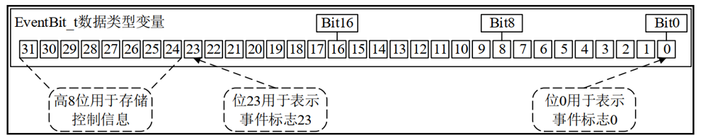

# 事件标志组
## 事件标志组简介（了解）
事件标志位：用一个位，来表示事件是否发生
事件标志组是一组事件标志位的集合， 可以简单的理解事件标志组，就是一个整数。
事件标志组的特点：
1. 它的每一个位表示一个事件（高8位不算）
2. 每一位事件的含义，由用户自己决定，如：bit0表示按键是否按下，bit1表示是否接受到消息，这些位的值为1：表示事件发生了；值为0：表示事件未发生
3. 任意任务或中断都可以读写这些位
4. 可以等待某一位成立，或者等待多位同时成立

一个事件组就包含了一个 EventBits_t 数据类型的变量，变量类型 EventBits_t 的定义如下所示： 

```
typedef TickType_t EventBits_t;
#if ( configUSE_16_BIT_TICKS  = =  1 )
	typedef   uint16_t   TickType_t;
#else
    typedef   uint32_t   TickType_t;
#endif
#define  configUSE_16_BIT_TICKS    0 

```
EventBits_t 实际上是一个 16 位或 32 位无符号的数据类型 

虽然使用了 32 位无符号的数据类型变量来存储事件标志， 但其中的高8位用作存储事件标志组的控制信息，低24位用作存储事件标志 ，所以说一个事件组最多可以存储 24 个事件标志！



事件标志组与队列、信号量的区别？

| 功能 | 唤醒对象 | 事件清除机制 |
| ---- | -------- | ------------ |
| 队列、信号量 | 事件产生后仅唤醒**一个**阻塞等待的任务 | 消耗型资源；队列数据读取后直接移除，信号量获取后计数值减一，事件一次性消耗 |
| 事件标志组 | 事件产生后**广播唤醒所有**满足等待条件的阻塞任务 | 可配置两种模式：1. 读取后自动清除对应标志；2. 读取后保留标志位，事件不消失 |


## 事件标志组相关API函数介绍（熟悉）
| 函数 | 描述 |
| ---- | ---- |
| xEventGroupCreate() | 动态分配堆内存，创建事件标志组 |
| xEventGroupCreateStatic() | 使用预先定义的静态内存，创建事件标志组 |
| xEventGroupClearBits() | 任务上下文清除指定事件标志位 |
| xEventGroupClearBitsFromISR() | 中断服务函数内清除指定事件标志位 |
| xEventGroupSetBits() | 任务上下文置位指定事件标志位 |
| xEventGroupSetBitsFromISR() | 中断服务函数内置位指定事件标志位 |
| xEventGroupWaitBits() | 阻塞等待匹配指定的事件标志位，支持自动清除/保留标志 |
| xEventGroupSync() | 同步函数：先设置自身标志，再等待一组标志全部到位，多用于多任务同步场景 |

动态方式创建事件标志组API函数
```
EventGroupHandle_t    xEventGroupCreate ( void ) ; 
```
| 返回值 | 描述 |
| ---- | ---- |
| NULL | 事件标志组创建失败 |
| 非NULL值 | 事件标志组创建成功，返回事件标志组句柄 |


清除事件标志位API函数
```
EventBits_t  xEventGroupClearBits(
     EventGroupHandle_t 	xEventGroup,				
     const EventBits_t 	    uxBitsToClear
)
``` 
| 形参 | 描述 |
| ---- | ---- |
| xEventGroup | 待操作的事件标志组句柄 |
| uxBitsToSet | 需要清零的事件标志位掩码 |

| 返回值 | 描述 |
| ---- | ---- |
| 整数 | 执行清零操作**之前**，事件标志组完整的标志位数值 |

设置事件标志位API函数
```
EventBits_t   xEventGroupSetBits( 
     EventGroupHandle_t 	xEventGroup,					 
     const EventBits_t 		uxBitsToSet    
) 
```
 形参
| 形参 | 描述 |
| ---- | ---- |
| xEventGroup | 待操作的事件标志组句柄 |
| uxBitsToSet | 需要置1的事件标志位掩码 |

 返回值
| 返回值 | 描述 |
| ---- | ---- |
| 整数 | 执行置位操作完成后，事件标志组当前完整标志位数值 |

```
EventBits_t   xEventGroupWaitBits(     

    EventGroupHandle_t 	xEventGroup,
    const EventBits_t 	uxBitsToWaitFor,
    const BaseType_t 	xClearOnExit,
    const BaseType_t 	xWaitForAllBits,
    TickType_t 		xTicksToWait        
 )
```

| 形参 | 描述 |
| ---- | ---- |
| xEventGroup | 等待操作对应的事件标志组句柄 |
| uxBitsToWaitFor | 需要等待的标志位掩码，支持多标志位按或组合 |
| xClearOnExit | 等待匹配成功后是否自动清除对应标志位<br>pdTRUE：清除uxBitsToWaitFor指定的位<br>pdFALSE：保留标志位不清除 |
| xWaitForAllBits | 等待匹配逻辑<br>pdTRUE：逻辑与，所有指定位全部置1才满足条件<br>pdFALSE：逻辑或，任意一位置1即满足条件 |
| xTicksToWait | 阻塞等待超时时间，单位系统时钟节拍 |

| 返回值情况 | 描述 |
| ---- | ---- |
| 包含目标等待位的数值 | 等待条件匹配成功，返回触发本次等待的标志位组合 |
| 其他数值 | 等待超时失败，返回超时瞬间事件组完整标志位状态 |

可以等待某一位、也可以等待多位,等到期望的事件后，还可以清除某些位

```
EventBits_t    xEventGroupSync(   
    EventGroupHandle_t 	xEventGroup,						
    const EventBits_t 	uxBitsToSet,
    const EventBits_t 	uxBitsToWaitFor,
    TickType_t 		xTicksToWait
) 
```
形参
| 形参 | 描述 |
| ---- | ---- |
| xEventGroup | 进行同步操作的事件标志组句柄 |
| uxBitsToSet | 本任务同步完成后需要置位的标志位掩码 |
| uxBitsToWaitFor | 需要等待的全部同步标志位（逻辑与，全部置1才算同步完成） |
| xTicksToWait | 阻塞等待的超时时间（系统时钟节拍） |

返回值
| 返回值情况 | 描述 |
| ---- | ---- |
| 包含等待标志位的数值 | 同步等待成功，返回当前事件标志状态 |
| 其他数值 | 等待超时失败，返回超时瞬间事件组完整标志位 |

Task1：做饭，
Task2：做菜，
Task1做好自己的事之后，需要等待菜也做好，大家在一起吃饭。
特点：同步！
## 事件标志组实验（掌握）
1. 实验目的：学习 FreeRTOS 的事件标志组API函数的使用。
2. 实验设计：将设计三个任务：start_task、task1、task2

| 任务名 | 功能说明 |
| ---- | ---- |
| start_task | 系统初始化入口函数：创建事件标志组，同时创建task1、task2两个业务任务 |
| task1 | 按键采集生产者任务：循环扫描按键，不同按键按下时调用`xEventGroupSetBits`置位对应事件标志位，模拟外部事件触发 |
| task2 | 事件处理消费任务：使用`xEventGroupWaitBits`以**逻辑与**模式阻塞等待多个指定标志位，所有标志全部置1后执行对应业务处理 |

### 代码
```
void start_task( void * pvParameters )
{
	
	
	 taskENTER_CRITICAL();  //进入临界 关闭中断
	//vTaskSuspendAll(); //挂起任务调度器，不关闭中断；
	
   eventgroup_handle_t = xEventGroupCreate();
	 if(eventgroup_handle_t != NULL)
	 {
		  printf("event sucessful\r\n");
	 }		 
	 
	 xTaskCreate((TaskFunction_t       ) low_task,
							(char *                ) "task1",	
							(configSTACK_DEPTH_TYPE) TASK1_STACK_SIZE,
							(void *                ) NULL,
							(UBaseType_t           ) TASK1_PRIO,
							(TaskHandle_t *        ) &low_handler );	
							
	 xTaskCreate((TaskFunction_t       ) middle_task,
							(char *                ) "task2",	
							(configSTACK_DEPTH_TYPE) TASK2_STACK_SIZE,
							(void *                ) NULL,
							(UBaseType_t           ) TASK2_PRIO,
							(TaskHandle_t *        ) &middle_handler );
//														
//	 xTaskCreate((TaskFunction_t       ) high_task,
//							(char *                ) "task3",	
//							(configSTACK_DEPTH_TYPE) TASK3_STACK_SIZE,
//							(void *                ) NULL,
//							(UBaseType_t           ) TASK3_PRIO,
//							(TaskHandle_t *        ) &high_handler );
	 taskEXIT_CRITICAL(); //退出临界区 				
 //xTaskResumeAll();						
   vTaskDelete(NULL);
							

}


/*低优先级任务*/
void low_task( void * pvParameters )
{

	 while(1)
	 {	
		 if(HAL_GPIO_ReadPin(GPIOE,KEY1_Pin) == GPIO_PIN_RESET)
		 {
			 
			  xEventGroupSetBits( eventgroup_handle_t,EVENTBIT_0);

		 }
		 else if(HAL_GPIO_ReadPin(GPIOE,KEY2_Pin) == GPIO_PIN_RESET)
		 {
			   xEventGroupSetBits( eventgroup_handle_t,EVENTBIT_1);
		 }
		 
			vTaskDelay(10);
	 }
}


/*中优先级*/
void middle_task( void * pvParameters )
{
//	 BaseType_t err;
	 EventBits_t event_bit = 0;
	 while(1)
	 {	
       event_bit = xEventGroupWaitBits(
											 eventgroup_handle_t, //标志组句柄
											 EVENTBIT_0 | EVENTBIT_1 , // 事件标志位
											 pdTRUE,                  //是否清除
											 pdTRUE,                  //全部为1
											 portMAX_DELAY );          //阻塞时间

		   printf("event_bit = %x",event_bit);
			 vTaskDelay(1000);
   }
	 
}

```