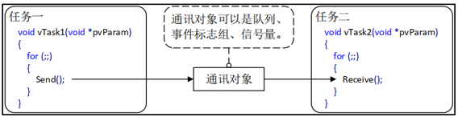
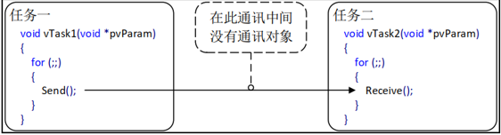

# FreeRTOS任务通知
## 任务通知的简介（了解）
任务通知：用来通知任务的，任务控制块中的结构体成员变量 ulNotifiedValue就是这个通知值。
1. 使用队列、信号量、事件标志组时都需另外创建一个结构体，通过中间的结构体进行间接通信！



2. 使用任务通知时，任务结构体TCB中就包含了内部对象，可以直接接收别人发过来的"通知"



**任务通知值的更新方式**
1. 不覆盖接受任务的通知值
2. 覆盖接受任务的通知值
3. 更新接受任务通知值的一个或多个bit
4. 增加接受任务的通知值

只要合理，灵活的利用任务通知的特点，可以在一些场合中替代队列、信号量、事件标志组！
**任务通知的优势及劣势**
任务通知的优势：

| 优势 | 说明 |
| ---- | ---- |
| 执行效率更高 | 向目标任务发送事件/数值，速度远快于队列、信号量、事件标志组 |
| 内存占用更小 | 通知变量内嵌在任务TCB结构体，无需额外创建独立内核对象（不用分配队列/信号量结构体） |

任务通知的劣势：

| 劣势 | 说明 |
| ---- | ---- |
| 无法向中断发送通知 | 中断没有任务TCB结构体，只能ISR主动发通知给任务，不能反向给ISR推送 |
| 不支持多任务广播 | 一次通知仅能指定单个接收任务，无法同时唤醒多个等待任务 |
| 仅单数据缓存 | TCB中只有1组通知值，新通知会覆盖未读取的旧通知，不能缓存多条消息 |
| 发送端无阻塞机制 | 发送通知操作永远立即返回，发送方不能阻塞等待接收方读完旧通知 |


## 任务通知值和通知状态（熟悉）

任务都有一个结构体：任务控制块TCB，它里边有两个结构体成员变量：

```
typedef  struct  tskTaskControlBlock 
{
    … …
        #if ( configUSE_TASK_NOTIFICATIONS  ==  1 )
            volatile  uint32_t    ulNotifiedValue [ configTASK_NOTIFICATION_ARRAY_ENTRIES ];
            volatile  uint8_t      ucNotifyState [ configTASK_NOTIFICATION_ARRAY_ENTRIES ];
        endif
    … …
} tskTCB;
#define  configTASK_NOTIFICATION_ARRAY_ENTRIES	1  	/* 定义任务通知数组的大小, 默认: 1 */
```
1. 一个是 uint32_t 类型，用来表示通知值
2. 一个是 uint8_t 类型，用来表示通知状态

**任务通知值**
任务通知值的更新方式有多种类型：
1. 计数值（数值累加，类似信号量）
2. 相应位置一（类似事件标志组）
3. 任意数值（支持覆写和不覆写，类似队列）

**任务通知状态**
其中任务通知状态共有3种取值：
```
#define	taskNOT_WAITING_NOTIFICATION  	( ( uint8_t ) 0 )		 /* 任务未等待通知 */
#define taskWAITING_NOTIFICATION		( ( uint8_t ) 1 )		 /* 任务在等待通知 */
#define taskNOTIFICATION_RECEIVED       ( ( uint8_t ) 2 )		 /* 任务在等待接收 */

```
1. 任务未等待通知 ：任务通知默认的初始化状态
2. 等待通知：接收方已经准备好了（调用了接收任务通知函数），等待发送方给个通知
3. 等待接收：发送方已经发送出去（调用了发送任务通知函数），等待接收方接收

## 任务通知相关API函数介绍（熟悉）
任务通知API函数主要有两类：①发送通知 ，②接收通知。
注意：发送通知API函数可以用于任务和中断服务函数中；接收通知API函数只能用在任务中。

**①发送通知相关API函数：**

| 函数 | 描述 |
| ---- | ---- |
| xTaskNotify() | 任务上下文发送通知，可携带自定义32位通知值，支持多种更新模式 |
| xTaskNotifyAndQuery() | 任务上下文发送通知并携带通知值，同时返回发送前目标任务原始通知值 |
| xTaskNotifyGive() | 任务上下文极简通知，不带自定义数值，仅用作信号量式计数通知 |
| xTaskNotifyFromISR() | 中断服务函数内发送带通知值的任务通知 |
| xTaskNotifyAndQueryFromISR() | 中断内发送通知，同时读取目标任务发送前原有通知值 |
| vTaskNotifyGiveFromISR() | 中断服务函数内发送无数据、仅计数式任务通知 |


```


define  xTaskNotifyAndQuery( xTaskToNotify,ulValue,eAction ,pulPreviousNotifyValue  )	 \   
        xTaskGenericNotify( ( xTaskToNotify ), 
                      ( tskDEFAULT_INDEX_TO_NOTIFY ), 
                      ( ulValue ), 
                      ( eAction ),
                      ( pulPreviousNotifyValue ) )
```

```
#define	xTaskNotify  (  xTaskToNotify ,  ulValue ,  eAction  ) 							\   
        xTaskGenericNotify( 
             ( xTaskToNotify ) ,  
             ( tskDEFAULT_INDEX_TO_NOTIFY ) , 
             ( ulValue ) ,  
             ( eAction ) , 
                 NULL )
```

```
#define xTaskNotifyGive( xTaskToNotify  )									 \   
        xTaskGenericNotify(  
            ( xTaskToNotify ) , 
            ( tskDEFAULT_INDEX_TO_NOTIFY ) , 
            ( 0 ) ,   
            eIncrement , 
            NULL )

```

| 形参 | 描述 |
| ---- | ---- |
| xTaskToNotify | 接收本次通知的目标任务句柄 |
| uxIndexToNotify | 任务通知数组下标，FreeRTOS多通知索引，常用0 |
| ulValue | 要写入的32位通知数值 |
| eAction | 通知更新模式（枚举，覆盖/置位/累加等） |
| pulPreviousNotificationValue | 输出指针，保存更新前原始通知值；传入NULL则不读取旧值 |

任务通知方式共有以下几种：
```
typedef  enum
{    
    eNoAction = 0, 			/* 无操作 */
    eSetBits				/* 更新指定bit */
    eIncrement				/* 通知值加一 */
    eSetValueWithOverwrite		/* 覆写的方式更新通知值 */
    eSetValueWithoutOverwrite	/* 不覆写通知值 */
} eNotifyAction;
```

**②接收通知相关API函数：**

| 函数 | 描述 |
| ---- | ---- |
| ulTaskNotifyTake() | 阻塞获取任务通知，退出时可选择将通知值清零或自减1；专门用于把任务通知模拟成二值信号量、计数信号量的场景 |
| xTaskNotifyWait() | 功能更复杂的通知接收函数，可以读取完整32位通知值，支持只清除指定bit位，适用于携带自定义数据、多标志位场景 |

1. 当任务通知用作于信号量时，使用函数获取信号量：ulTaskNotifyTake()
2. 当任务通知用作于事件标志组或队列时，使用此函数来获取： xTaskNotifyWait()

```
#define ulTaskNotifyTake( xClearCountOnExit  ,   xTicksToWait )     \
ulTaskGenericNotifyTake( ( tskDEFAULT_INDEX_TO_NOTIFY ),			\				
                         ( xClearCountOnExit ), 					\				
                         ( xTicksToWait ) ) 
```
此函数用于接收任务通知值，可以设置在退出此函数的时候将任务通知值清零或者减一

| 形参 | 描述 |
| ---- | ---- |
| uxIndexToWaitOn | 任务通知数组下标，多通知通道索引，常规使用0 |
| xClearCountOnExit | 接收成功后通知值处理方式<br>pdTRUE：直接将通知值清零（二值信号量模式）<br>pdFALSE：通知值自减1（计数信号量模式） |
| xTicksToWait | 阻塞等待的系统时钟节拍超时时间 |

| 返回值 | 描述 |
| ---- | ---- |
| 0 | 等待超时，接收通知失败 |
| 非0整数 | 成功获取通知，返回当前通知计数值 |

```
#define xTaskNotifyWait(	
            ulBitsToClearOnEntry, 			\				
            ulBitsToClearOnExit, 			\				
            pulNotificationValue, 			\				
            xTicksToWait) 				\

xTaskGenericNotifyWait( 	
            tskDEFAULT_INDEX_TO_NOTIFY, 	\				
            ( ulBitsToClearOnEntry ), 			\				
            ( ulBitsToClearOnExit ), 			\				
            ( pulNotificationValue ), 			\				
            ( xTicksToWait ) ) 
```
此函数用于获取通知值和清除通知值的指定位值，适用于模拟队列和事件标志组，使用该函数来获取任务通知 。 

```
BaseType_t    xTaskGenericNotifyWait( 	
                        UBaseType_t 	uxIndexToWaitOn,
                        uint32_t 		ulBitsToClearOnEntry,
                        uint32_t 		ulBitsToClearOnExit,
                        uint32_t * 		pulNotificationValue,
                        TickType_t 		xTicksToWai ); 


```

| 形参 | 描述 |
| ---- | ---- |
| uxIndexToWaitOn | 任务通知通道索引，多通知数组下标，常规填0 |
| ulBitsToClearOnEntry | 进入等待函数前，先清除通知值中指定bit掩码 |
| ulBitsToClearOnExit | 等待成功、退出函数前，清除当前通知值指定bit掩码 |
| pulNotificationValue | 输出指针，用于保存读到的完整通知值；不需要读取则传NULL |
| xTicksToWait | 阻塞等待超时时间，单位系统时钟节拍 |

| 返回值 | 描述 |
| ---- | ---- |
| pdTRUE | 阻塞等待成功，收到匹配的任务通知 |
| pdFALSE | 等待超时，未收到通知 |


## 任务通知模拟信号量实验（掌握）
1. 实验目的：学习使用 FreeRTOS 中的任务通知功能模拟二值信号量和计数型信号量
2. 实验设计：将设计三个任务：start_task、task1、task2

| 任务名 | 功能说明 |
| ---- | ---- |
| start_task | 系统初始化任务，负责创建task1按键扫描任务、task2通知接收打印任务 |
| task1 | 按键扫描生产者任务：循环检测按键状态，KEY0按下时调用任务通知发送函数，向task2发送通知 |
| task2 | 通知消费处理任务：阻塞等待task1发来的任务通知，收到通知后执行打印提示信息操作 |

### 任务通知模拟二值信号量代码

```
void start_task( void * pvParameters )
{
	
	
	 taskENTER_CRITICAL();  //进入临界 关闭中断
	//vTaskSuspendAll(); //挂起任务调度器，不关闭中断；
	
     eventgroup_handle_t = xEventGroupCreate();
	 if(eventgroup_handle_t != NULL)
	 {
		  printf("event sucessful\r\n");
	 }		 
	 
	 xTaskCreate((TaskFunction_t       ) low_task,
							(char *                ) "task1",	
							(configSTACK_DEPTH_TYPE) TASK1_STACK_SIZE,
							(void *                ) NULL,
							(UBaseType_t           ) TASK1_PRIO,
							(TaskHandle_t *        ) &low_handler );	
							
	 xTaskCreate((TaskFunction_t       ) middle_task,
							(char *                ) "task2",	
							(configSTACK_DEPTH_TYPE) TASK2_STACK_SIZE,
							(void *                ) NULL,
							(UBaseType_t           ) TASK2_PRIO,
							(TaskHandle_t *        ) &middle_handler );
	 taskEXIT_CRITICAL(); //退出临界区 				
 //xTaskResumeAll();						
   vTaskDelete(NULL);
							

}
/*发送任务通知值*/
void low_task( void * pvParameters )
{

	 while(1)
	 {	
		 if(HAL_GPIO_ReadPin(GPIOE,KEY1_Pin) == GPIO_PIN_RESET)
		 {
			  printf("模拟二值信号量\r\n");
			  xTaskNotifyGive(middle_handler);

		 }
		 
			vTaskDelay(10);
	 }
}
/*接收任务通知值*/
void middle_task( void * pvParameters )
{
   uint32_t rev = 0;
	 while(1)
	 {	
       rev = ulTaskNotifyTake(pdTRUE , portMAX_DELAY);   
			 if(rev != 0)
			 {
				  printf("模拟二值信号量获取成功\r\n");
			 }
   }
	 
}

```

### 任务通知模拟计数值信号量代码

```

void start_task( void * pvParameters )
{
    taskENTER_CRITICAL();               /* 进入临界区 */
    
    xTaskCreate((TaskFunction_t         )   task1,
                (char *                 )   "task1",
                (configSTACK_DEPTH_TYPE )   TASK1_STACK_SIZE,
                (void *                 )   NULL,
                (UBaseType_t            )   TASK1_PRIO,
                (TaskHandle_t *         )   &task1_handler );
                
    xTaskCreate((TaskFunction_t         )   task2,
                (char *                 )   "task2",
                (configSTACK_DEPTH_TYPE )   TASK2_STACK_SIZE,
                (void *                 )   NULL,
                (UBaseType_t            )   TASK2_PRIO,
                (TaskHandle_t *         )   &task2_handler );
                             
    vTaskDelete(NULL);
    taskEXIT_CRITICAL();                /* 退出临界区 */
}

/* 任务一，发送任务通知值 */
void task1( void * pvParameters )
{
    uint8_t key = 0;
    
    while(1) 
    {
        key = key_scan(0);
        if(key == KEY0_PRES)
        {
            printf("任务通知模拟计数型信号量释放！\r\n");
            xTaskNotifyGive(task2_handler);
        }
        vTaskDelay(10);
    }
}

/* 任务二，接收任务通知值 */
void task2( void * pvParameters )
{
    uint32_t rev = 0;
    while(1)
    {
        rev = ulTaskNotifyTake(pdFALSE , portMAX_DELAY);
        if(rev != 0)
        {
            printf("rev：%d\r\n",rev);
        }
        vTaskDelay(1000);
    }
}

```

## 任务通知模拟消息邮箱实验（掌握）
1. 实验目的：学习使用 FreeRTOS 中的任务通知功能模拟消息邮箱
2. 实验设计：将设计三个任务：start_task、task1、task2

| 任务名 | 功能说明 |
| ---- | ---- |
| start_task | 初始化任务，负责创建task1按键扫描任务、task2通知处理任务 |
| task1 | 按键采集发送任务：循环扫描按键，检测到按键按下后，调用`xTaskNotify`将键值作为通知数值发送给task2 |
| task2 | 通知接收处理任务：使用`xTaskNotifyWait`阻塞等待通知，读取携带的键值数据，根据不同键值执行对应业务动作 |


```
void start_task( void * pvParameters )
{
	
	
	 taskENTER_CRITICAL();  //进入临界 关闭中断
	 xTaskCreate((TaskFunction_t       ) low_task,
							(char *                ) "task1",	
							(configSTACK_DEPTH_TYPE) TASK1_STACK_SIZE,
							(void *                ) NULL,
							(UBaseType_t           ) TASK1_PRIO,
							(TaskHandle_t *        ) &low_handler );	
							
	 xTaskCreate((TaskFunction_t       ) middle_task,
							(char *                ) "task2",	
							(configSTACK_DEPTH_TYPE) TASK2_STACK_SIZE,
							(void *                ) NULL,
							(UBaseType_t           ) TASK2_PRIO,
							(TaskHandle_t *        ) &middle_handler );
	 taskEXIT_CRITICAL(); //退出临界区 				
 //xTaskResumeAll();						
   vTaskDelete(NULL);
							

}
/*发送任务通知值*/
void low_task( void * pvParameters )
{
   uint8_t key =0 ;
	 while(1)
	 {	
		 if(HAL_GPIO_ReadPin(GPIOE,KEY1_Pin) == GPIO_PIN_RESET)
		 {
			  key = 1;
			  printf("send data %d\r\n",key);
			  xTaskNotify(middle_handler,key,eSetValueWithOverwrite);  // 接收任务句柄，值，不覆写
        while(HAL_GPIO_ReadPin(GPIOE,KEY1_Pin) == GPIO_PIN_RESET);
		 }
		 		 if(HAL_GPIO_ReadPin(GPIOE,KEY2_Pin) == GPIO_PIN_RESET)
		 {
			  key = 2;
			  printf("send data %d\r\n",key);
			  xTaskNotify(middle_handler,key,eSetValueWithOverwrite);  // 接收任务句柄，值，不覆写
        while(HAL_GPIO_ReadPin(GPIOE,KEY2_Pin) == GPIO_PIN_RESET);
		 }
			vTaskDelay(10);
	 }
}
/*接收任务通知值*/
void middle_task( void * pvParameters )
{
	 uint32_t noyify_val = 0;
	 while(1)
	 {	
		  xTaskNotifyWait(0,0xFFFFFFFF,&noyify_val,portMAX_DELAY);
		  switch(noyify_val)
			{
				case 1:printf("get data %d\r\n",noyify_val);HAL_GPIO_TogglePin(GPIOF, LED0_Pin);break;
				case 2:printf("get data %d\r\n",noyify_val);HAL_GPIO_TogglePin(GPIOF, LED1_Pin);break;
			}
			//vTaskDelay(1000);
   }
}

```
## 任务通知模拟事件标志组实验（掌握）
1. 实验目的：学习使用 FreeRTOS 中的任务通知功能模拟事件标志组
2. 实验设计：将设计三个任务：start_task、task1、task2

| 任务名 | 功能说明 |
| ---- | ---- |
| start_task | 初始化任务，负责创建task1按键扫描任务与task2通知处理任务 |
| task1 | 按键扫描生产者任务：循环检测按键，不同按键按下时调用`xTaskNotify`，以`eSetBits`模式设置对应bit标志位，模拟多事件标记 |
| task2 | 通知消费任务：调用`xTaskNotifyWait`阻塞等待通知，读取32位标志值，判断触发的按键bit并打印对应提示信息 |

```
void start_task( void * pvParameters )
{
	 taskENTER_CRITICAL();  //进入临界 关闭中断
	 xTaskCreate((TaskFunction_t       ) low_task,
							(char *                ) "task1",	
							(configSTACK_DEPTH_TYPE) TASK1_STACK_SIZE,
							(void *                ) NULL,
							(UBaseType_t           ) TASK1_PRIO,
							(TaskHandle_t *        ) &low_handler );	
							
	 xTaskCreate((TaskFunction_t       ) middle_task,
							(char *                ) "task2",	
							(configSTACK_DEPTH_TYPE) TASK2_STACK_SIZE,
							(void *                ) NULL,
							(UBaseType_t           ) TASK2_PRIO,
							(TaskHandle_t *        ) &middle_handler );						
   vTaskDelete(NULL);
}
/*发送任务通知值*/
void low_task( void * pvParameters )
{

	 while(1)
	 {	
		 if(HAL_GPIO_ReadPin(GPIOE,KEY1_Pin) == GPIO_PIN_RESET)
		 {
			 printf(" updata bit0 \r\n");
			 xTaskNotify(middle_handler,EVENTBIT_0,eSetBits); //任务句柄//指定bit//更新方式
			
		 }
		 else if(HAL_GPIO_ReadPin(GPIOE,KEY2_Pin) == GPIO_PIN_RESET)
		 {
			 printf(" updata bit1 \r\n");
			 xTaskNotify(middle_handler,EVENTBIT_1,eSetBits); //任务句柄//指定bit//更新方式
		 }
		 
			vTaskDelay(10);
	 }
}

/*接收任务通知值*/
void middle_task( void * pvParameters )
{
   uint32_t rev = 0,event_bit = 0;   
	 while(1)
	 {	
       xTaskNotifyWait(0,0xffffffff,&rev,portMAX_DELAY);
		   if(rev & EVENTBIT_0)
			 {
				  event_bit |=  EVENTBIT_0;
			 }
			 if(rev & EVENTBIT_1)
			 {
				  event_bit |=  EVENTBIT_1;
			 }
			 if(event_bit == (EVENTBIT_0|EVENTBIT_1))
			 { 
				 printf("suscceful\r\n");
				 event_bit=0;
			 }
			 vTaskDelay(1000);
   } 
}
```