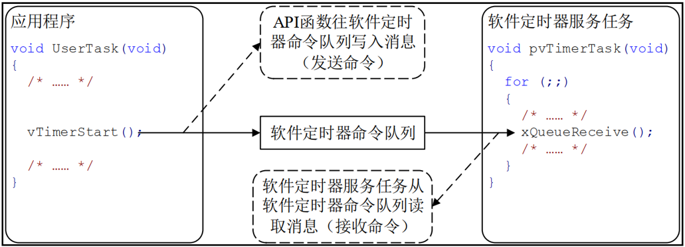
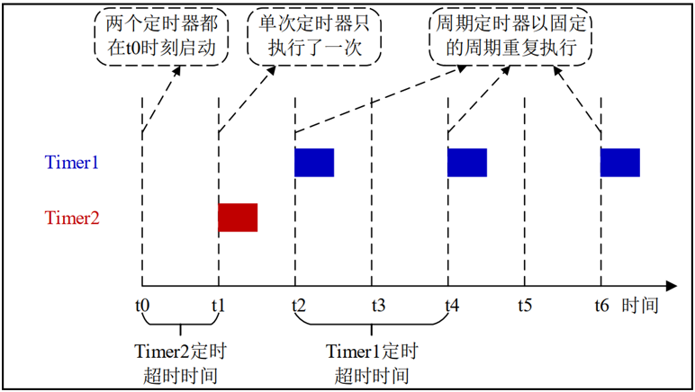
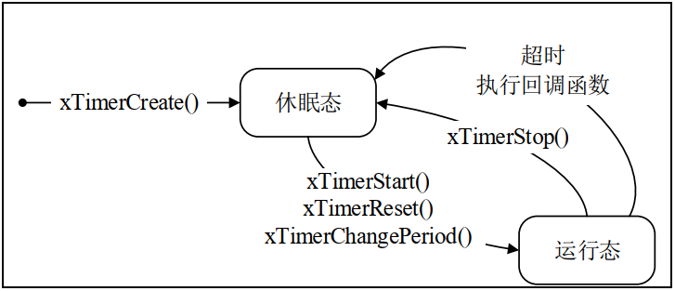
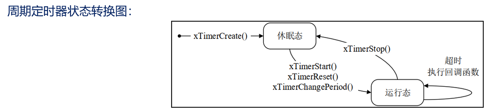
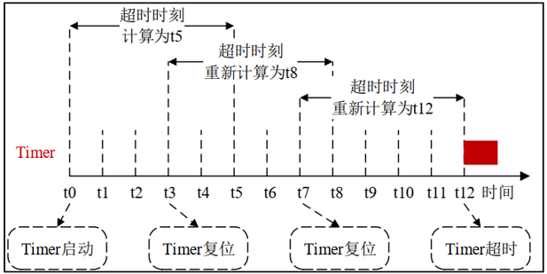

# FreeRTOS软件定时器
## 软件定时器的简介（了解）
1. 定时器：从指定的时刻开始，经过一个指定时间，然后触发一个超时事件，用户可自定义定时器的周期
2. 硬件定时器：芯片本身自带的定时器模块，硬件定时器的精度一般很高，每次在定时时间到达之后就会自动触发一个中断，用户在中断服务函数中处理信息。
3. 软件定时器：是指具有定时功能的软件，可设置定时周期，当指定时间到达后要调用回调函数（也称超时函数），用户在回调函数中处理信息
### 软件定时器优缺点？
优点：硬件定时器数量有限，而软件定时器理论上只需有足够内存，就可以创建多个；
使用简单、成本低

缺点：软件定时器相对硬件定时器来说，精度没有那么高（因为它以系统时钟为基准，系统时钟中断优先级又是最低，容易被打断）。 对于需要高精度要求的场合，不建议使用软件定时器。
### FreeRTOS软件定时器特点
1. 可裁剪：软件定时器是可裁剪可配置的功能， 如果要使能软件定时器，需将configUSE_TIMERS 配置项配置成 1 
2. 单次和周期： 软件定时器支持设置成：单次定时器或周期定时器 

注意：软件定时器的超时回调函数是由软件定时器服务任务调用的，软件定时器的超时回调函数本身不是任务，因此不能在该回调函数中使用可能会导致任务阻塞的 API 函数。

软件定时器服务任务：在调用函数 vTaskStartScheduler()开启任务调度器的时候，会创建一个用于管理软件定时器的任务，这个任务就叫做软件定时器服务任务。

软件定时器服务任务作用
1. 负责软件定时器超时的逻辑判断 
2. 调用超时软件定时器的超时回调函数 
3. 处理软件定时器命令队列 

**软件定时器的命令队列**
FreeRTOS 提供了许多软件定时器相关的 API 函数，这些 API 函数大多都是往定时器的队列中写入消息（发送命令），这个队列叫做软件定时器命令队列，是提供给 FreeRTOS 中的软件定时器使用的，用户是不能直接访问的。 



**软件定时器的相关配置**
1. 当FreeRTOS 的配置项 configUSE_TIMERS 设置为1，在启动任务调度器时，会自动创建软件定时器的服务/守护任务prvTimerTask( ) ；
2. 软件定时器服务任务的优先级为 configTIMER_TASK_PRIORITY  =  31；
3. 定时器的命令队列长度为 configTIMER_QUEUE_LENGTH  = 5 ；

注意：软件定时器的超时回调函数是在软件定时器服务任务中被调用的，服务任务不是专为某个定时器服务的，它还要处理其他定时器。所以，定时器的回调函数不要影响其他“人”：

回调函数要尽快实行，不能进入阻塞状态，即不能调用那些会阻塞任务的 API 函数，如：vTaskDelay() 

访问队列或者信号量的非零阻塞时间的 API 函数也不能调用。 
## 软件定时器的状态（熟悉）
软件定时器共有两种状态：

休眠态 ：软件定时器可以通过其句柄被引用，但因为没有运行，所以其定时超时回调函数不会被执行
运行态 ：运行态的定时器，当指定时间到达之后，它的超时回调函数会被调用
注意：新创建的软件定时器处于休眠状态 ，也就是未运行的！ 
问题：如何让软件定时器从休眠态转变为运行态？
发送命令队列 
## 单次定时器和周期定时器（熟悉）
FreeRTOS 提供了两种软件定时器：
单次定时器：单次定时器的一旦定时超时，只会执行一次其软件定时器超时回调函数，不会自动重新开启定时，不过可以被手动重新开启。
周期定时器: 周期定时器的一旦启动以后就会在执行完回调函数以后自动的重新启动 ，从而周期地执行其软件定时器回调函数



软件定时器的状态转换图（熟悉）
单次定时器状态转换图：



周期定时器状态转换图：



## 软件定时器结构体成员介绍（熟悉）
```
typedef    struct
    {
        const char * 					pcTimerName		/* 软件定时器名字 */
        ListItem_t 					xTimerListItem		/* 软件定时器列表项 */
        TickType_t 					xTimerPeriodInTicks;        	/* 软件定时器的周期 */     
        void * 						pvTimerID			/* 软件定时器的ID */
        TimerCallbackFunction_t	 		pxCallbackFunction; 	/* 软件定时器的回调函数 */
        #if ( configUSE_TRACE_FACILITY == 1 )
         UBaseType_t 					uxTimerNumber		/*  软件定时器的编号，调试用  */
        #endif
        uint8_t 						ucStatus;                     		/*  软件定时器的状态  */
    } xTIMER;

```

## FreeRTOS软件定时器相关API函数（熟悉） 

| 函数 | 描述 |
| ---- | ---- |
| xTimerCreate() | 动态方式创建软件定时器 |
| xTimerCreateStatic() | 静态方式创建软件定时器 |
| xTimerStart() | 开启软件定时器定时 |
| xTimerStartFromISR() | 在中断中开启软件定时器定时 |
| xTimerStop() | 停止软件定时器定时 |
| xTimerStopFromISR() | 在中断中停止软件定时器定时 |
| xTimerReset() | 复位软件定时器定时 |
| xTimerResetFromISR() | 在中断中复位软件定时器定时 |
| xTimerChangePeriod() | 更改软件定时器的定时超时时间 |
| xTimerChangePeriodFromISR() | 在中断中更改定时超时时间 |

```
TimerHandle_t   xTimerCreate(   
                        const char * const 		    pcTimerName,
                        const TickType_t 		    xTimerPeriodInTicks,
                        const UBaseType_t 	    uxAutoReload,
                        void * const 			    pvTimerID,
                        TimerCallbackFunction_t     pxCallbackFunction  
); 

```
| 形参 | 描述 |
| ---- | ---- |
| pcTimerName | 软件定时器名 |
| xTimerPeriodInTicks | 定时超时时间，单位：系统时钟节拍 |
| uxAutoReload | 定时器模式，pdTRUE：周期定时器，pdFALSE：单次定时器 |
| pvTimerID | 软件定时器 ID，用于多个软件定时器公用一个超时回调函数 |
| pxCallbackFunction | 软件定时器超时回调函数 |

| 返回值 | 描述 |
| ---- | ---- |
| NULL | 软件定时器创建失败 |
| 其他值 | 软件定时器创建成功，返回其句柄 |

开启软件定时器API函数

```
BaseType_t   xTimerStart(TimerHandle_t 	   xTimer,
				         const TickType_t  xTicksToWait  ); 

```

| 形参 | 描述 |
| ---- | ---- |
| xTimer | 待开启的软件定时器的句柄 |
| xTickToWait | 发送命令到软件定时器命令队列的最大等待时间 |

| 返回值 | 描述 |
| ---- | ---- |
| pdPASS | 软件定时器开启成功 |
| pdFAIL | 软件定时器开启失败 |


停止软件定时器API函数
```
BaseType_t   xTimerStop( TimerHandle_t 	    xTimer,
				        const TickType_t 	xTicksToWait);
```
| 形参 | 描述 |
| ---- | ---- |
| xTimer | 待停止的软件定时器的句柄 |
| xTickToWait | 发送命令到软件定时器命令队列的最大等待时间 |

| 返回值 | 描述 |
| ---- | ---- |
| pdPASS | 软件定时器停止成功 |
| pdFAIL | 软件定时器停止失败 |

复位软件定时器API函数
```
BaseType_t  xTimerReset( TimerHandle_t 	xTimer,
				         const TickType_t 	xTicksToWait); 
```
该功能将使软件定时器的重新开启定时，复位后的软件定时器以复位时的时刻作为开启时刻重新定时

| 形参 | 描述 |
| ---- | ---- |
| xTimer | 待复位的软件定时器的句柄 |
| xTickToWait | 发送命令到软件定时器命令队列的最大等待时间 |

| 返回值 | 描述 |
| ---- | ---- |
| pdPASS | 软件定时器复位成功 |
| pdFAIL | 软件定时器复位失败 |




更改软件定时器超时时间API函数
```
BaseType_t  xTimerChangePeriod( 
                                TimerHandle_t 		xTimer,
                                const TickType_t 	xNewPeriod,
                                const TickType_t 	xTicksToWait); 
```
| 形参 | 描述 |
| ---- | ---- |
| xTimer | 待更新的软件定时器的句柄 |
| xNewPeriod | 新的定时超时时间，单位：系统时钟节拍 |
| xTickToWait | 发送命令到软件定时器命令队列的最大等待时间 |

| 返回值 | 描述 |
| ---- | ---- |
| pdPASS | 软件定时器定时超时时间更改成功 |
| pdFAIL | 软件定时器定时超时时间更改失败 |
## FreeRTOS软件定时器实验（掌握）
1. 实验目的：学习 FreeRTOS 的软件定时器相关API函数的使用 。
2. 实验设计：将设计两个任务：start_task、task1

| 任务名 | 功能描述 |
| ---- | ---- |
| start_task | 用来创建task1任务，并创建两个定时器（单次和周期） |
| task1 | 用于按键扫描，并对软件定时器进行开启、停止操作 |

### 代码
```
TimerHandle_t timer1_handle = 0;//单次
TimerHandle_t timer2_handle = 0;//周期
void timer1_Callback( TimerHandle_t xTimer );
void timer2_Callback( TimerHandle_t xTimer );
void start_task( void * pvParameters )
{
	
	
	 taskENTER_CRITICAL();  //进入临界 关闭中断
	//vTaskSuspendAll(); //挂起任务调度器，不关闭中断；
	/*单次定时器*/
	timer1_handle = xTimerCreate(
                                    "timer1" ,  //名称
                                    1000,      //1s
                                    pdFALSE,   //单次
                                    (void *)1,  //ID
                                    &timer1_Callback
                                );
	timer2_handle = xTimerCreate(
                                    "timer2" ,  //名称
                                    1000,      //1s
                                    pdTRUE,   //周期
                                    (void *)2, //ID
                                    &timer2_Callback
                                );
																
	 xTaskCreate((TaskFunction_t       ) low_task,
							(char *                ) "task1",	
							(configSTACK_DEPTH_TYPE) TASK1_STACK_SIZE,
							(void *                ) NULL,
							(UBaseType_t           ) TASK1_PRIO,
							(TaskHandle_t *        ) &low_handler );	
							
	 taskEXIT_CRITICAL(); //退出临界区 				
 //xTaskResumeAll();						
   vTaskDelete(NULL);
							

}

/*按键扫描控制软件定时器*/
void low_task( void * pvParameters )
{

	 while(1)
	 {	
		 if(HAL_GPIO_ReadPin(GPIOE,KEY1_Pin) == GPIO_PIN_RESET)
		 {
		     xTimerStart(timer1_handle,portMAX_DELAY);
         xTimerStart(timer2_handle,portMAX_DELAY);
		 }
		 else if(HAL_GPIO_ReadPin(GPIOE,KEY2_Pin) == GPIO_PIN_RESET)
		 {
			   xTimerStop(timer1_handle,portMAX_DELAY);
         xTimerStop(timer2_handle,portMAX_DELAY);
		 }
		 
			vTaskDelay(10);
	 }
}
//timer1超时回调函数
void timer1_Callback( TimerHandle_t xTimer )
{
	 static uint32_t timer = 0;
	 printf("timer1 count %d\r\n",++timer);
}
//timer2超时回调函数
void timer2_Callback( TimerHandle_t xTimer )
{
	 static uint32_t timer = 0; 
	 printf("timer2 count %d\r\n",++timer);
}
```