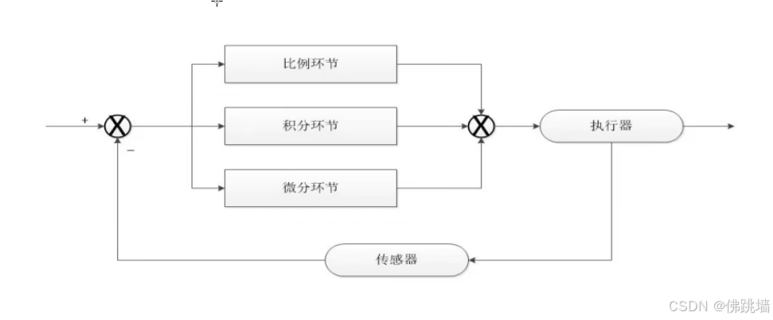
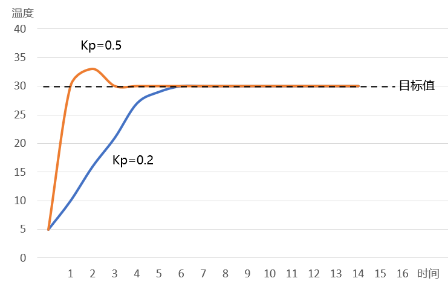
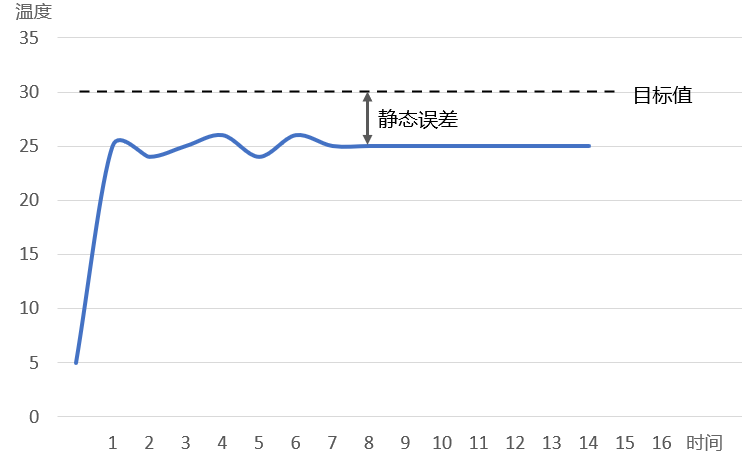
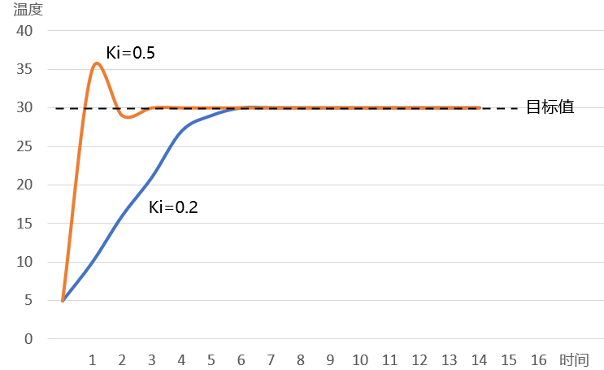
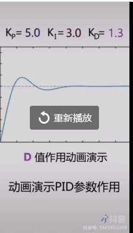

# PID
## 定义理解
PID,就是“比例（proportional）、积分（integral）、微分（derivative）”

PID控制器就是根据系统误差，利用比例、积分、微分计算出控制量进行控制。




## KP-比例环节

$$u = K_p \cdot e$$

- $u$ — 输出
- $K_p$ — 比例系数
- $e$ — 偏差

假设我们现在需要调节棚内温度为 $30^\circ\text{C}$，而实际温度为 $10^\circ\text{C}$，此时的偏差 $e=20$，由比例环节的公式可知，当 $e$ 确定时，$K_p$ 越大则输出 $u$ 越大，也就是温控系统的调节力度越大，这样就可以更快地达到目标温度；而当 $K_p$ 确定时，偏差 $e$ 越大则输出 $u$ 越大。

由此可见，在比例环节中，比例系数 $K_p$ 和偏差 $e$ 越大则系统消除偏差的时间越短



当Kp值越大时，其对应的橙色曲线达到目标值的时间就越短，与此同时，橙色曲线出现了一定幅度的超调和振荡，这会使得系统的稳定性下降，因此，我们在设置比例系数的时候，并不是越大越好，而是要兼顾消除偏差的时间以及整个系统的稳定性

## KI-积分环节

在实际的应用中，如果仅有比例环节的控制，可能会给系统带来一个问题：静态误差。静态误差是指系统控制过程趋于稳定时，目标值与实测值之间的偏差



积分环节可以对偏差 e 进行积分，只要存在偏差，积分环节就会不断起作用，主要用于消除静态误差，提高系统的无差度。引入积分环节后，比例+积分环节的公式如下：

$$u = K_p \cdot e + K_i \cdot \sum e$$

从上述公式中可以得知，当积分系数Ki或者累计偏差越大时，输出就越大，系统消除静态误差的时间就越短



只要系统还存在偏差，积分环节就会不断地累计偏差。当系统偏差为 0的时候，说明已经达到目标值，此时的累计偏差不再变化，但是积分环节依旧在发挥作用（此时往往作用最大），这就很容易产生超调的现象了。因此，我们需要**引入微分环节**，提前减弱输出，抑制超调的发生。

## KD-微分环节

微分环节的作用是反应系统偏差的一个变化趋势，也可以说是变化率，可以在误差来临之前提前引入一个有效的修正信号，有利于提高输出响应的快速性, 减小被控量的超调和增加系统的稳定性。引入微分环节后，比例+积分+微分环节的公式如下：

$$u_k = K_p \cdot e_k + K_i \cdot \sum_{j=0}^{k} e_j + K_d \left(e_k - e_{k-1}\right)$$

减小调节时间，从而改善了系统的动态性能，但微分时间常数过大，会使系统出现不稳定。微分控制作用一个很大的缺陷是容易引入高频噪声，所有在干扰信号比较严重的流量控制系统中不宜引入微分控制作用。



## 增量式PID
K和K-1时刻位置式PID输出：

$$
u_k = K_p e_k + K_i \sum_{j=0}^{k} e_j + K_d \left(e_k - e_{k-1}\right)
$$

$$
u_{k-1} = K_p e_{k-1} + K_i \sum_{j=0}^{k-1} e_j + K_d \left(e_{k-1} - e_{k-2}\right)
$$

### 2. 输出增量定义
$$\Delta u_k = u_k - u_{k-1}$$

### 3. 两式相减化简
$$
\begin{align*}
\Delta u_k
&= K_p\left(e_k - e_{k-1}\right) + K_i e_k + K_d\left(e_k - 2e_{k-1} + e_{k-2}\right) \\
&= \left(K_p+K_i+K_d\right)e_k + \left(-K_p-2K_d\right)e_{k-1} + K_d e_{k-2}
\end{align*}
$$

### 4. 工程简化写法
$$
\begin{cases}
A = K_p + K_i + K_d \\
B = -K_p - 2K_d \\
C = K_d
\end{cases}
$$
$$\Delta u_k = A e_k + B e_{k-1} + C e_{k-2}$$

1. 无误差累加存储，不存在积分饱和；
2. 上电、故障时输出增量为 0，电机不会突然猛转，安全； 
3. 无积分饱和，长时间带载不会出现电流顶满、震荡。
4. 自带手动 / 自动无扰切换特性。

### 原理

```
输出差值 = 本次输出 - 上次输出
本次输出 = 上次输出 + 输出差值

/* “今天要花多少钱” = “昨天没买的（比例） + 今天的零碎（积分） + 价格涨跌（微分）”。
每天只加上变化的那一部分，不用重新算总账。*/
```


#### 典型适用场景
| 控制器 | 输出含义 | 典型适用场景 | 核心优势 |
|--------|----------|--------------|----------|
| 增量PID | 输出变化量 $\Delta u_k$ | 伺服速度环、步进电机、变频器、风机水泵、小型MCU、工艺阀门 | 无积分饱和、上电无冲击、内存占用小、安全 |
| 位置PID | 输出绝对目标 $u_k$ | 温控加热、电磁阀、液位定点控制、开关执行机构 | 直接给定目标值，稳态消除静差逻辑直观 |